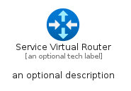
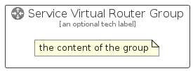

# ServiceVirtualRouter


```text
azure-6/Item/Networking/ServiceVirtualRouter
```

```text
include('azure-6/Item/Networking/ServiceVirtualRouter')
```


| Illustration | ServiceVirtualRouter | ServiceVirtualRouterCard | ServiceVirtualRouterGroup |
| :---: | :---: | :---: | :---: |
|  |  |  |  |


## ServiceVirtualRouter

### Load remotely
```plantuml
@startuml
' configures the library
!global $LIB_BASE_LOCATION="https://raw.githubusercontent.com/tmorin/plantuml-libs/master/distribution"

' loads the library's bootstrap
!include $LIB_BASE_LOCATION/bootstrap.puml

' loads the package bootstrap
include('azure-6/bootstrap')

' loads the Item which embeds the element ServiceVirtualRouter
include('azure-6/Item/Networking/ServiceVirtualRouter')

' renders the element
ServiceVirtualRouter('ServiceVirtualRouter', 'Service Virtual Router', 'an optional tech label', 'an optional description')
@enduml
```

### Load locally
```plantuml
@startuml
' configures the library
!global $INCLUSION_MODE="local"
!global $LIB_BASE_LOCATION="../../.."

' loads the library's bootstrap
!include $LIB_BASE_LOCATION/bootstrap.puml

' loads the package bootstrap
include('azure-6/bootstrap')

' loads the Item which embeds the element ServiceVirtualRouter
include('azure-6/Item/Networking/ServiceVirtualRouter')

' renders the element
ServiceVirtualRouter('ServiceVirtualRouter', 'Service Virtual Router', 'an optional tech label', 'an optional description')
@enduml
```

## ServiceVirtualRouterCard

### Load remotely
```plantuml
@startuml
' configures the library
!global $LIB_BASE_LOCATION="https://raw.githubusercontent.com/tmorin/plantuml-libs/master/distribution"

' loads the library's bootstrap
!include $LIB_BASE_LOCATION/bootstrap.puml

' loads the package bootstrap
include('azure-6/bootstrap')

' loads the Item which embeds the element ServiceVirtualRouterCard
include('azure-6/Item/Networking/ServiceVirtualRouter')

' renders the element
ServiceVirtualRouterCard('ServiceVirtualRouterCard', 'Service Virtual Router Card', 'an optional description')
@enduml
```

### Load locally
```plantuml
@startuml
' configures the library
!global $INCLUSION_MODE="local"
!global $LIB_BASE_LOCATION="../../.."

' loads the library's bootstrap
!include $LIB_BASE_LOCATION/bootstrap.puml

' loads the package bootstrap
include('azure-6/bootstrap')

' loads the Item which embeds the element ServiceVirtualRouterCard
include('azure-6/Item/Networking/ServiceVirtualRouter')

' renders the element
ServiceVirtualRouterCard('ServiceVirtualRouterCard', 'Service Virtual Router Card', 'an optional description')
@enduml
```

## ServiceVirtualRouterGroup

### Load remotely
```plantuml
@startuml
' configures the library
!global $LIB_BASE_LOCATION="https://raw.githubusercontent.com/tmorin/plantuml-libs/master/distribution"

' loads the library's bootstrap
!include $LIB_BASE_LOCATION/bootstrap.puml

' loads the package bootstrap
include('azure-6/bootstrap')

' loads the Item which embeds the element ServiceVirtualRouterGroup
include('azure-6/Item/Networking/ServiceVirtualRouter')

' renders the element
ServiceVirtualRouterGroup('ServiceVirtualRouterGroup', 'Service Virtual Router Group', 'an optional tech label') {
    note as note
        the content of the group
    end note
}
@enduml
```

### Load locally
```plantuml
@startuml
' configures the library
!global $INCLUSION_MODE="local"
!global $LIB_BASE_LOCATION="../../.."

' loads the library's bootstrap
!include $LIB_BASE_LOCATION/bootstrap.puml

' loads the package bootstrap
include('azure-6/bootstrap')

' loads the Item which embeds the element ServiceVirtualRouterGroup
include('azure-6/Item/Networking/ServiceVirtualRouter')

' renders the element
ServiceVirtualRouterGroup('ServiceVirtualRouterGroup', 'Service Virtual Router Group', 'an optional tech label') {
    note as note
        the content of the group
    end note
}
@enduml
```

