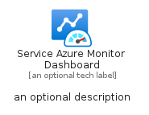
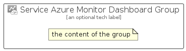

# ServiceAzureMonitorDashboard


```text
azure-6/Item/NewIcons/ServiceAzureMonitorDashboard
```

```text
include('azure-6/Item/NewIcons/ServiceAzureMonitorDashboard')
```


| Illustration | ServiceAzureMonitorDashboard | ServiceAzureMonitorDashboardCard | ServiceAzureMonitorDashboardGroup |
| :---: | :---: | :---: | :---: |
|  |  |  |  |


## ServiceAzureMonitorDashboard

### Load remotely
```plantuml
@startuml
' configures the library
!global $LIB_BASE_LOCATION="https://raw.githubusercontent.com/tmorin/plantuml-libs/master/distribution"

' loads the library's bootstrap
!include $LIB_BASE_LOCATION/bootstrap.puml

' loads the package bootstrap
include('azure-6/bootstrap')

' loads the Item which embeds the element ServiceAzureMonitorDashboard
include('azure-6/Item/NewIcons/ServiceAzureMonitorDashboard')

' renders the element
ServiceAzureMonitorDashboard('ServiceAzureMonitorDashboard', 'Service Azure Monitor Dashboard', 'an optional tech label', 'an optional description')
@enduml
```

### Load locally
```plantuml
@startuml
' configures the library
!global $INCLUSION_MODE="local"
!global $LIB_BASE_LOCATION="../../.."

' loads the library's bootstrap
!include $LIB_BASE_LOCATION/bootstrap.puml

' loads the package bootstrap
include('azure-6/bootstrap')

' loads the Item which embeds the element ServiceAzureMonitorDashboard
include('azure-6/Item/NewIcons/ServiceAzureMonitorDashboard')

' renders the element
ServiceAzureMonitorDashboard('ServiceAzureMonitorDashboard', 'Service Azure Monitor Dashboard', 'an optional tech label', 'an optional description')
@enduml
```

## ServiceAzureMonitorDashboardCard

### Load remotely
```plantuml
@startuml
' configures the library
!global $LIB_BASE_LOCATION="https://raw.githubusercontent.com/tmorin/plantuml-libs/master/distribution"

' loads the library's bootstrap
!include $LIB_BASE_LOCATION/bootstrap.puml

' loads the package bootstrap
include('azure-6/bootstrap')

' loads the Item which embeds the element ServiceAzureMonitorDashboardCard
include('azure-6/Item/NewIcons/ServiceAzureMonitorDashboard')

' renders the element
ServiceAzureMonitorDashboardCard('ServiceAzureMonitorDashboardCard', 'Service Azure Monitor Dashboard Card', 'an optional description')
@enduml
```

### Load locally
```plantuml
@startuml
' configures the library
!global $INCLUSION_MODE="local"
!global $LIB_BASE_LOCATION="../../.."

' loads the library's bootstrap
!include $LIB_BASE_LOCATION/bootstrap.puml

' loads the package bootstrap
include('azure-6/bootstrap')

' loads the Item which embeds the element ServiceAzureMonitorDashboardCard
include('azure-6/Item/NewIcons/ServiceAzureMonitorDashboard')

' renders the element
ServiceAzureMonitorDashboardCard('ServiceAzureMonitorDashboardCard', 'Service Azure Monitor Dashboard Card', 'an optional description')
@enduml
```

## ServiceAzureMonitorDashboardGroup

### Load remotely
```plantuml
@startuml
' configures the library
!global $LIB_BASE_LOCATION="https://raw.githubusercontent.com/tmorin/plantuml-libs/master/distribution"

' loads the library's bootstrap
!include $LIB_BASE_LOCATION/bootstrap.puml

' loads the package bootstrap
include('azure-6/bootstrap')

' loads the Item which embeds the element ServiceAzureMonitorDashboardGroup
include('azure-6/Item/NewIcons/ServiceAzureMonitorDashboard')

' renders the element
ServiceAzureMonitorDashboardGroup('ServiceAzureMonitorDashboardGroup', 'Service Azure Monitor Dashboard Group', 'an optional tech label') {
    note as note
        the content of the group
    end note
}
@enduml
```

### Load locally
```plantuml
@startuml
' configures the library
!global $INCLUSION_MODE="local"
!global $LIB_BASE_LOCATION="../../.."

' loads the library's bootstrap
!include $LIB_BASE_LOCATION/bootstrap.puml

' loads the package bootstrap
include('azure-6/bootstrap')

' loads the Item which embeds the element ServiceAzureMonitorDashboardGroup
include('azure-6/Item/NewIcons/ServiceAzureMonitorDashboard')

' renders the element
ServiceAzureMonitorDashboardGroup('ServiceAzureMonitorDashboardGroup', 'Service Azure Monitor Dashboard Group', 'an optional tech label') {
    note as note
        the content of the group
    end note
}
@enduml
```

