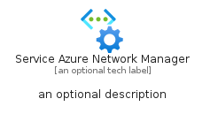
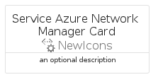

# ServiceAzureNetworkManager


```text
azure-6/Item/NewIcons/ServiceAzureNetworkManager
```

```text
include('azure-6/Item/NewIcons/ServiceAzureNetworkManager')
```


| Illustration | ServiceAzureNetworkManager | ServiceAzureNetworkManagerCard | ServiceAzureNetworkManagerGroup |
| :---: | :---: | :---: | :---: |
|  |  |  |  |


## ServiceAzureNetworkManager

### Load remotely
```plantuml
@startuml
' configures the library
!global $LIB_BASE_LOCATION="https://raw.githubusercontent.com/tmorin/plantuml-libs/master/distribution"

' loads the library's bootstrap
!include $LIB_BASE_LOCATION/bootstrap.puml

' loads the package bootstrap
include('azure-6/bootstrap')

' loads the Item which embeds the element ServiceAzureNetworkManager
include('azure-6/Item/NewIcons/ServiceAzureNetworkManager')

' renders the element
ServiceAzureNetworkManager('ServiceAzureNetworkManager', 'Service Azure Network Manager', 'an optional tech label', 'an optional description')
@enduml
```

### Load locally
```plantuml
@startuml
' configures the library
!global $INCLUSION_MODE="local"
!global $LIB_BASE_LOCATION="../../.."

' loads the library's bootstrap
!include $LIB_BASE_LOCATION/bootstrap.puml

' loads the package bootstrap
include('azure-6/bootstrap')

' loads the Item which embeds the element ServiceAzureNetworkManager
include('azure-6/Item/NewIcons/ServiceAzureNetworkManager')

' renders the element
ServiceAzureNetworkManager('ServiceAzureNetworkManager', 'Service Azure Network Manager', 'an optional tech label', 'an optional description')
@enduml
```

## ServiceAzureNetworkManagerCard

### Load remotely
```plantuml
@startuml
' configures the library
!global $LIB_BASE_LOCATION="https://raw.githubusercontent.com/tmorin/plantuml-libs/master/distribution"

' loads the library's bootstrap
!include $LIB_BASE_LOCATION/bootstrap.puml

' loads the package bootstrap
include('azure-6/bootstrap')

' loads the Item which embeds the element ServiceAzureNetworkManagerCard
include('azure-6/Item/NewIcons/ServiceAzureNetworkManager')

' renders the element
ServiceAzureNetworkManagerCard('ServiceAzureNetworkManagerCard', 'Service Azure Network Manager Card', 'an optional description')
@enduml
```

### Load locally
```plantuml
@startuml
' configures the library
!global $INCLUSION_MODE="local"
!global $LIB_BASE_LOCATION="../../.."

' loads the library's bootstrap
!include $LIB_BASE_LOCATION/bootstrap.puml

' loads the package bootstrap
include('azure-6/bootstrap')

' loads the Item which embeds the element ServiceAzureNetworkManagerCard
include('azure-6/Item/NewIcons/ServiceAzureNetworkManager')

' renders the element
ServiceAzureNetworkManagerCard('ServiceAzureNetworkManagerCard', 'Service Azure Network Manager Card', 'an optional description')
@enduml
```

## ServiceAzureNetworkManagerGroup

### Load remotely
```plantuml
@startuml
' configures the library
!global $LIB_BASE_LOCATION="https://raw.githubusercontent.com/tmorin/plantuml-libs/master/distribution"

' loads the library's bootstrap
!include $LIB_BASE_LOCATION/bootstrap.puml

' loads the package bootstrap
include('azure-6/bootstrap')

' loads the Item which embeds the element ServiceAzureNetworkManagerGroup
include('azure-6/Item/NewIcons/ServiceAzureNetworkManager')

' renders the element
ServiceAzureNetworkManagerGroup('ServiceAzureNetworkManagerGroup', 'Service Azure Network Manager Group', 'an optional tech label') {
    note as note
        the content of the group
    end note
}
@enduml
```

### Load locally
```plantuml
@startuml
' configures the library
!global $INCLUSION_MODE="local"
!global $LIB_BASE_LOCATION="../../.."

' loads the library's bootstrap
!include $LIB_BASE_LOCATION/bootstrap.puml

' loads the package bootstrap
include('azure-6/bootstrap')

' loads the Item which embeds the element ServiceAzureNetworkManagerGroup
include('azure-6/Item/NewIcons/ServiceAzureNetworkManager')

' renders the element
ServiceAzureNetworkManagerGroup('ServiceAzureNetworkManagerGroup', 'Service Azure Network Manager Group', 'an optional tech label') {
    note as note
        the content of the group
    end note
}
@enduml
```

