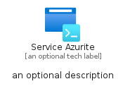
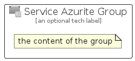

# ServiceAzurite


```text
azure-6/Item/NewIcons/ServiceAzurite
```

```text
include('azure-6/Item/NewIcons/ServiceAzurite')
```


| Illustration | ServiceAzurite | ServiceAzuriteCard | ServiceAzuriteGroup |
| :---: | :---: | :---: | :---: |
|  |  |  |  |


## ServiceAzurite

### Load remotely
```plantuml
@startuml
' configures the library
!global $LIB_BASE_LOCATION="https://raw.githubusercontent.com/tmorin/plantuml-libs/master/distribution"

' loads the library's bootstrap
!include $LIB_BASE_LOCATION/bootstrap.puml

' loads the package bootstrap
include('azure-6/bootstrap')

' loads the Item which embeds the element ServiceAzurite
include('azure-6/Item/NewIcons/ServiceAzurite')

' renders the element
ServiceAzurite('ServiceAzurite', 'Service Azurite', 'an optional tech label', 'an optional description')
@enduml
```

### Load locally
```plantuml
@startuml
' configures the library
!global $INCLUSION_MODE="local"
!global $LIB_BASE_LOCATION="../../.."

' loads the library's bootstrap
!include $LIB_BASE_LOCATION/bootstrap.puml

' loads the package bootstrap
include('azure-6/bootstrap')

' loads the Item which embeds the element ServiceAzurite
include('azure-6/Item/NewIcons/ServiceAzurite')

' renders the element
ServiceAzurite('ServiceAzurite', 'Service Azurite', 'an optional tech label', 'an optional description')
@enduml
```

## ServiceAzuriteCard

### Load remotely
```plantuml
@startuml
' configures the library
!global $LIB_BASE_LOCATION="https://raw.githubusercontent.com/tmorin/plantuml-libs/master/distribution"

' loads the library's bootstrap
!include $LIB_BASE_LOCATION/bootstrap.puml

' loads the package bootstrap
include('azure-6/bootstrap')

' loads the Item which embeds the element ServiceAzuriteCard
include('azure-6/Item/NewIcons/ServiceAzurite')

' renders the element
ServiceAzuriteCard('ServiceAzuriteCard', 'Service Azurite Card', 'an optional description')
@enduml
```

### Load locally
```plantuml
@startuml
' configures the library
!global $INCLUSION_MODE="local"
!global $LIB_BASE_LOCATION="../../.."

' loads the library's bootstrap
!include $LIB_BASE_LOCATION/bootstrap.puml

' loads the package bootstrap
include('azure-6/bootstrap')

' loads the Item which embeds the element ServiceAzuriteCard
include('azure-6/Item/NewIcons/ServiceAzurite')

' renders the element
ServiceAzuriteCard('ServiceAzuriteCard', 'Service Azurite Card', 'an optional description')
@enduml
```

## ServiceAzuriteGroup

### Load remotely
```plantuml
@startuml
' configures the library
!global $LIB_BASE_LOCATION="https://raw.githubusercontent.com/tmorin/plantuml-libs/master/distribution"

' loads the library's bootstrap
!include $LIB_BASE_LOCATION/bootstrap.puml

' loads the package bootstrap
include('azure-6/bootstrap')

' loads the Item which embeds the element ServiceAzuriteGroup
include('azure-6/Item/NewIcons/ServiceAzurite')

' renders the element
ServiceAzuriteGroup('ServiceAzuriteGroup', 'Service Azurite Group', 'an optional tech label') {
    note as note
        the content of the group
    end note
}
@enduml
```

### Load locally
```plantuml
@startuml
' configures the library
!global $INCLUSION_MODE="local"
!global $LIB_BASE_LOCATION="../../.."

' loads the library's bootstrap
!include $LIB_BASE_LOCATION/bootstrap.puml

' loads the package bootstrap
include('azure-6/bootstrap')

' loads the Item which embeds the element ServiceAzuriteGroup
include('azure-6/Item/NewIcons/ServiceAzurite')

' renders the element
ServiceAzuriteGroup('ServiceAzuriteGroup', 'Service Azurite Group', 'an optional tech label') {
    note as note
        the content of the group
    end note
}
@enduml
```

