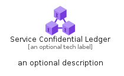
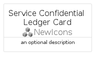
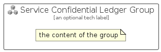

# ServiceConfidentialLedger


```text
azure-6/Item/NewIcons/ServiceConfidentialLedger
```

```text
include('azure-6/Item/NewIcons/ServiceConfidentialLedger')
```


| Illustration | ServiceConfidentialLedger | ServiceConfidentialLedgerCard | ServiceConfidentialLedgerGroup |
| :---: | :---: | :---: | :---: |
|  |  |  |  |


## ServiceConfidentialLedger

### Load remotely
```plantuml
@startuml
' configures the library
!global $LIB_BASE_LOCATION="https://raw.githubusercontent.com/tmorin/plantuml-libs/master/distribution"

' loads the library's bootstrap
!include $LIB_BASE_LOCATION/bootstrap.puml

' loads the package bootstrap
include('azure-6/bootstrap')

' loads the Item which embeds the element ServiceConfidentialLedger
include('azure-6/Item/NewIcons/ServiceConfidentialLedger')

' renders the element
ServiceConfidentialLedger('ServiceConfidentialLedger', 'Service Confidential Ledger', 'an optional tech label', 'an optional description')
@enduml
```

### Load locally
```plantuml
@startuml
' configures the library
!global $INCLUSION_MODE="local"
!global $LIB_BASE_LOCATION="../../.."

' loads the library's bootstrap
!include $LIB_BASE_LOCATION/bootstrap.puml

' loads the package bootstrap
include('azure-6/bootstrap')

' loads the Item which embeds the element ServiceConfidentialLedger
include('azure-6/Item/NewIcons/ServiceConfidentialLedger')

' renders the element
ServiceConfidentialLedger('ServiceConfidentialLedger', 'Service Confidential Ledger', 'an optional tech label', 'an optional description')
@enduml
```

## ServiceConfidentialLedgerCard

### Load remotely
```plantuml
@startuml
' configures the library
!global $LIB_BASE_LOCATION="https://raw.githubusercontent.com/tmorin/plantuml-libs/master/distribution"

' loads the library's bootstrap
!include $LIB_BASE_LOCATION/bootstrap.puml

' loads the package bootstrap
include('azure-6/bootstrap')

' loads the Item which embeds the element ServiceConfidentialLedgerCard
include('azure-6/Item/NewIcons/ServiceConfidentialLedger')

' renders the element
ServiceConfidentialLedgerCard('ServiceConfidentialLedgerCard', 'Service Confidential Ledger Card', 'an optional description')
@enduml
```

### Load locally
```plantuml
@startuml
' configures the library
!global $INCLUSION_MODE="local"
!global $LIB_BASE_LOCATION="../../.."

' loads the library's bootstrap
!include $LIB_BASE_LOCATION/bootstrap.puml

' loads the package bootstrap
include('azure-6/bootstrap')

' loads the Item which embeds the element ServiceConfidentialLedgerCard
include('azure-6/Item/NewIcons/ServiceConfidentialLedger')

' renders the element
ServiceConfidentialLedgerCard('ServiceConfidentialLedgerCard', 'Service Confidential Ledger Card', 'an optional description')
@enduml
```

## ServiceConfidentialLedgerGroup

### Load remotely
```plantuml
@startuml
' configures the library
!global $LIB_BASE_LOCATION="https://raw.githubusercontent.com/tmorin/plantuml-libs/master/distribution"

' loads the library's bootstrap
!include $LIB_BASE_LOCATION/bootstrap.puml

' loads the package bootstrap
include('azure-6/bootstrap')

' loads the Item which embeds the element ServiceConfidentialLedgerGroup
include('azure-6/Item/NewIcons/ServiceConfidentialLedger')

' renders the element
ServiceConfidentialLedgerGroup('ServiceConfidentialLedgerGroup', 'Service Confidential Ledger Group', 'an optional tech label') {
    note as note
        the content of the group
    end note
}
@enduml
```

### Load locally
```plantuml
@startuml
' configures the library
!global $INCLUSION_MODE="local"
!global $LIB_BASE_LOCATION="../../.."

' loads the library's bootstrap
!include $LIB_BASE_LOCATION/bootstrap.puml

' loads the package bootstrap
include('azure-6/bootstrap')

' loads the Item which embeds the element ServiceConfidentialLedgerGroup
include('azure-6/Item/NewIcons/ServiceConfidentialLedger')

' renders the element
ServiceConfidentialLedgerGroup('ServiceConfidentialLedgerGroup', 'Service Confidential Ledger Group', 'an optional tech label') {
    note as note
        the content of the group
    end note
}
@enduml
```

