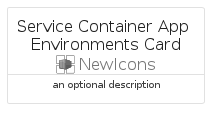

# ServiceContainerAppEnvironments


```text
azure-6/Item/NewIcons/ServiceContainerAppEnvironments
```

```text
include('azure-6/Item/NewIcons/ServiceContainerAppEnvironments')
```


| Illustration | ServiceContainerAppEnvironments | ServiceContainerAppEnvironmentsCard | ServiceContainerAppEnvironmentsGroup |
| :---: | :---: | :---: | :---: |
|  |  |  |  |


## ServiceContainerAppEnvironments

### Load remotely
```plantuml
@startuml
' configures the library
!global $LIB_BASE_LOCATION="https://raw.githubusercontent.com/tmorin/plantuml-libs/master/distribution"

' loads the library's bootstrap
!include $LIB_BASE_LOCATION/bootstrap.puml

' loads the package bootstrap
include('azure-6/bootstrap')

' loads the Item which embeds the element ServiceContainerAppEnvironments
include('azure-6/Item/NewIcons/ServiceContainerAppEnvironments')

' renders the element
ServiceContainerAppEnvironments('ServiceContainerAppEnvironments', 'Service Container App Environments', 'an optional tech label', 'an optional description')
@enduml
```

### Load locally
```plantuml
@startuml
' configures the library
!global $INCLUSION_MODE="local"
!global $LIB_BASE_LOCATION="../../.."

' loads the library's bootstrap
!include $LIB_BASE_LOCATION/bootstrap.puml

' loads the package bootstrap
include('azure-6/bootstrap')

' loads the Item which embeds the element ServiceContainerAppEnvironments
include('azure-6/Item/NewIcons/ServiceContainerAppEnvironments')

' renders the element
ServiceContainerAppEnvironments('ServiceContainerAppEnvironments', 'Service Container App Environments', 'an optional tech label', 'an optional description')
@enduml
```

## ServiceContainerAppEnvironmentsCard

### Load remotely
```plantuml
@startuml
' configures the library
!global $LIB_BASE_LOCATION="https://raw.githubusercontent.com/tmorin/plantuml-libs/master/distribution"

' loads the library's bootstrap
!include $LIB_BASE_LOCATION/bootstrap.puml

' loads the package bootstrap
include('azure-6/bootstrap')

' loads the Item which embeds the element ServiceContainerAppEnvironmentsCard
include('azure-6/Item/NewIcons/ServiceContainerAppEnvironments')

' renders the element
ServiceContainerAppEnvironmentsCard('ServiceContainerAppEnvironmentsCard', 'Service Container App Environments Card', 'an optional description')
@enduml
```

### Load locally
```plantuml
@startuml
' configures the library
!global $INCLUSION_MODE="local"
!global $LIB_BASE_LOCATION="../../.."

' loads the library's bootstrap
!include $LIB_BASE_LOCATION/bootstrap.puml

' loads the package bootstrap
include('azure-6/bootstrap')

' loads the Item which embeds the element ServiceContainerAppEnvironmentsCard
include('azure-6/Item/NewIcons/ServiceContainerAppEnvironments')

' renders the element
ServiceContainerAppEnvironmentsCard('ServiceContainerAppEnvironmentsCard', 'Service Container App Environments Card', 'an optional description')
@enduml
```

## ServiceContainerAppEnvironmentsGroup

### Load remotely
```plantuml
@startuml
' configures the library
!global $LIB_BASE_LOCATION="https://raw.githubusercontent.com/tmorin/plantuml-libs/master/distribution"

' loads the library's bootstrap
!include $LIB_BASE_LOCATION/bootstrap.puml

' loads the package bootstrap
include('azure-6/bootstrap')

' loads the Item which embeds the element ServiceContainerAppEnvironmentsGroup
include('azure-6/Item/NewIcons/ServiceContainerAppEnvironments')

' renders the element
ServiceContainerAppEnvironmentsGroup('ServiceContainerAppEnvironmentsGroup', 'Service Container App Environments Group', 'an optional tech label') {
    note as note
        the content of the group
    end note
}
@enduml
```

### Load locally
```plantuml
@startuml
' configures the library
!global $INCLUSION_MODE="local"
!global $LIB_BASE_LOCATION="../../.."

' loads the library's bootstrap
!include $LIB_BASE_LOCATION/bootstrap.puml

' loads the package bootstrap
include('azure-6/bootstrap')

' loads the Item which embeds the element ServiceContainerAppEnvironmentsGroup
include('azure-6/Item/NewIcons/ServiceContainerAppEnvironments')

' renders the element
ServiceContainerAppEnvironmentsGroup('ServiceContainerAppEnvironmentsGroup', 'Service Container App Environments Group', 'an optional tech label') {
    note as note
        the content of the group
    end note
}
@enduml
```

