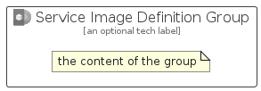

# ServiceImageDefinition


```text
azure-6/Item/NewIcons/ServiceImageDefinition
```

```text
include('azure-6/Item/NewIcons/ServiceImageDefinition')
```


| Illustration | ServiceImageDefinition | ServiceImageDefinitionCard | ServiceImageDefinitionGroup |
| :---: | :---: | :---: | :---: |
|  |  |  |  |


## ServiceImageDefinition

### Load remotely
```plantuml
@startuml
' configures the library
!global $LIB_BASE_LOCATION="https://raw.githubusercontent.com/tmorin/plantuml-libs/master/distribution"

' loads the library's bootstrap
!include $LIB_BASE_LOCATION/bootstrap.puml

' loads the package bootstrap
include('azure-6/bootstrap')

' loads the Item which embeds the element ServiceImageDefinition
include('azure-6/Item/NewIcons/ServiceImageDefinition')

' renders the element
ServiceImageDefinition('ServiceImageDefinition', 'Service Image Definition', 'an optional tech label', 'an optional description')
@enduml
```

### Load locally
```plantuml
@startuml
' configures the library
!global $INCLUSION_MODE="local"
!global $LIB_BASE_LOCATION="../../.."

' loads the library's bootstrap
!include $LIB_BASE_LOCATION/bootstrap.puml

' loads the package bootstrap
include('azure-6/bootstrap')

' loads the Item which embeds the element ServiceImageDefinition
include('azure-6/Item/NewIcons/ServiceImageDefinition')

' renders the element
ServiceImageDefinition('ServiceImageDefinition', 'Service Image Definition', 'an optional tech label', 'an optional description')
@enduml
```

## ServiceImageDefinitionCard

### Load remotely
```plantuml
@startuml
' configures the library
!global $LIB_BASE_LOCATION="https://raw.githubusercontent.com/tmorin/plantuml-libs/master/distribution"

' loads the library's bootstrap
!include $LIB_BASE_LOCATION/bootstrap.puml

' loads the package bootstrap
include('azure-6/bootstrap')

' loads the Item which embeds the element ServiceImageDefinitionCard
include('azure-6/Item/NewIcons/ServiceImageDefinition')

' renders the element
ServiceImageDefinitionCard('ServiceImageDefinitionCard', 'Service Image Definition Card', 'an optional description')
@enduml
```

### Load locally
```plantuml
@startuml
' configures the library
!global $INCLUSION_MODE="local"
!global $LIB_BASE_LOCATION="../../.."

' loads the library's bootstrap
!include $LIB_BASE_LOCATION/bootstrap.puml

' loads the package bootstrap
include('azure-6/bootstrap')

' loads the Item which embeds the element ServiceImageDefinitionCard
include('azure-6/Item/NewIcons/ServiceImageDefinition')

' renders the element
ServiceImageDefinitionCard('ServiceImageDefinitionCard', 'Service Image Definition Card', 'an optional description')
@enduml
```

## ServiceImageDefinitionGroup

### Load remotely
```plantuml
@startuml
' configures the library
!global $LIB_BASE_LOCATION="https://raw.githubusercontent.com/tmorin/plantuml-libs/master/distribution"

' loads the library's bootstrap
!include $LIB_BASE_LOCATION/bootstrap.puml

' loads the package bootstrap
include('azure-6/bootstrap')

' loads the Item which embeds the element ServiceImageDefinitionGroup
include('azure-6/Item/NewIcons/ServiceImageDefinition')

' renders the element
ServiceImageDefinitionGroup('ServiceImageDefinitionGroup', 'Service Image Definition Group', 'an optional tech label') {
    note as note
        the content of the group
    end note
}
@enduml
```

### Load locally
```plantuml
@startuml
' configures the library
!global $INCLUSION_MODE="local"
!global $LIB_BASE_LOCATION="../../.."

' loads the library's bootstrap
!include $LIB_BASE_LOCATION/bootstrap.puml

' loads the package bootstrap
include('azure-6/bootstrap')

' loads the Item which embeds the element ServiceImageDefinitionGroup
include('azure-6/Item/NewIcons/ServiceImageDefinition')

' renders the element
ServiceImageDefinitionGroup('ServiceImageDefinitionGroup', 'Service Image Definition Group', 'an optional tech label') {
    note as note
        the content of the group
    end note
}
@enduml
```

