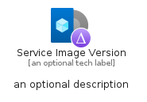

# ServiceImageVersion


```text
azure-6/Item/NewIcons/ServiceImageVersion
```

```text
include('azure-6/Item/NewIcons/ServiceImageVersion')
```


| Illustration | ServiceImageVersion | ServiceImageVersionCard | ServiceImageVersionGroup |
| :---: | :---: | :---: | :---: |
|  |  |  |  |


## ServiceImageVersion

### Load remotely
```plantuml
@startuml
' configures the library
!global $LIB_BASE_LOCATION="https://raw.githubusercontent.com/tmorin/plantuml-libs/master/distribution"

' loads the library's bootstrap
!include $LIB_BASE_LOCATION/bootstrap.puml

' loads the package bootstrap
include('azure-6/bootstrap')

' loads the Item which embeds the element ServiceImageVersion
include('azure-6/Item/NewIcons/ServiceImageVersion')

' renders the element
ServiceImageVersion('ServiceImageVersion', 'Service Image Version', 'an optional tech label', 'an optional description')
@enduml
```

### Load locally
```plantuml
@startuml
' configures the library
!global $INCLUSION_MODE="local"
!global $LIB_BASE_LOCATION="../../.."

' loads the library's bootstrap
!include $LIB_BASE_LOCATION/bootstrap.puml

' loads the package bootstrap
include('azure-6/bootstrap')

' loads the Item which embeds the element ServiceImageVersion
include('azure-6/Item/NewIcons/ServiceImageVersion')

' renders the element
ServiceImageVersion('ServiceImageVersion', 'Service Image Version', 'an optional tech label', 'an optional description')
@enduml
```

## ServiceImageVersionCard

### Load remotely
```plantuml
@startuml
' configures the library
!global $LIB_BASE_LOCATION="https://raw.githubusercontent.com/tmorin/plantuml-libs/master/distribution"

' loads the library's bootstrap
!include $LIB_BASE_LOCATION/bootstrap.puml

' loads the package bootstrap
include('azure-6/bootstrap')

' loads the Item which embeds the element ServiceImageVersionCard
include('azure-6/Item/NewIcons/ServiceImageVersion')

' renders the element
ServiceImageVersionCard('ServiceImageVersionCard', 'Service Image Version Card', 'an optional description')
@enduml
```

### Load locally
```plantuml
@startuml
' configures the library
!global $INCLUSION_MODE="local"
!global $LIB_BASE_LOCATION="../../.."

' loads the library's bootstrap
!include $LIB_BASE_LOCATION/bootstrap.puml

' loads the package bootstrap
include('azure-6/bootstrap')

' loads the Item which embeds the element ServiceImageVersionCard
include('azure-6/Item/NewIcons/ServiceImageVersion')

' renders the element
ServiceImageVersionCard('ServiceImageVersionCard', 'Service Image Version Card', 'an optional description')
@enduml
```

## ServiceImageVersionGroup

### Load remotely
```plantuml
@startuml
' configures the library
!global $LIB_BASE_LOCATION="https://raw.githubusercontent.com/tmorin/plantuml-libs/master/distribution"

' loads the library's bootstrap
!include $LIB_BASE_LOCATION/bootstrap.puml

' loads the package bootstrap
include('azure-6/bootstrap')

' loads the Item which embeds the element ServiceImageVersionGroup
include('azure-6/Item/NewIcons/ServiceImageVersion')

' renders the element
ServiceImageVersionGroup('ServiceImageVersionGroup', 'Service Image Version Group', 'an optional tech label') {
    note as note
        the content of the group
    end note
}
@enduml
```

### Load locally
```plantuml
@startuml
' configures the library
!global $INCLUSION_MODE="local"
!global $LIB_BASE_LOCATION="../../.."

' loads the library's bootstrap
!include $LIB_BASE_LOCATION/bootstrap.puml

' loads the package bootstrap
include('azure-6/bootstrap')

' loads the Item which embeds the element ServiceImageVersionGroup
include('azure-6/Item/NewIcons/ServiceImageVersion')

' renders the element
ServiceImageVersionGroup('ServiceImageVersionGroup', 'Service Image Version Group', 'an optional tech label') {
    note as note
        the content of the group
    end note
}
@enduml
```

