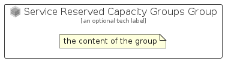

# ServiceReservedCapacityGroups


```text
azure-6/Item/NewIcons/ServiceReservedCapacityGroups
```

```text
include('azure-6/Item/NewIcons/ServiceReservedCapacityGroups')
```


| Illustration | ServiceReservedCapacityGroups | ServiceReservedCapacityGroupsCard | ServiceReservedCapacityGroupsGroup |
| :---: | :---: | :---: | :---: |
|  |  |  |  |


## ServiceReservedCapacityGroups

### Load remotely
```plantuml
@startuml
' configures the library
!global $LIB_BASE_LOCATION="https://raw.githubusercontent.com/tmorin/plantuml-libs/master/distribution"

' loads the library's bootstrap
!include $LIB_BASE_LOCATION/bootstrap.puml

' loads the package bootstrap
include('azure-6/bootstrap')

' loads the Item which embeds the element ServiceReservedCapacityGroups
include('azure-6/Item/NewIcons/ServiceReservedCapacityGroups')

' renders the element
ServiceReservedCapacityGroups('ServiceReservedCapacityGroups', 'Service Reserved Capacity Groups', 'an optional tech label', 'an optional description')
@enduml
```

### Load locally
```plantuml
@startuml
' configures the library
!global $INCLUSION_MODE="local"
!global $LIB_BASE_LOCATION="../../.."

' loads the library's bootstrap
!include $LIB_BASE_LOCATION/bootstrap.puml

' loads the package bootstrap
include('azure-6/bootstrap')

' loads the Item which embeds the element ServiceReservedCapacityGroups
include('azure-6/Item/NewIcons/ServiceReservedCapacityGroups')

' renders the element
ServiceReservedCapacityGroups('ServiceReservedCapacityGroups', 'Service Reserved Capacity Groups', 'an optional tech label', 'an optional description')
@enduml
```

## ServiceReservedCapacityGroupsCard

### Load remotely
```plantuml
@startuml
' configures the library
!global $LIB_BASE_LOCATION="https://raw.githubusercontent.com/tmorin/plantuml-libs/master/distribution"

' loads the library's bootstrap
!include $LIB_BASE_LOCATION/bootstrap.puml

' loads the package bootstrap
include('azure-6/bootstrap')

' loads the Item which embeds the element ServiceReservedCapacityGroupsCard
include('azure-6/Item/NewIcons/ServiceReservedCapacityGroups')

' renders the element
ServiceReservedCapacityGroupsCard('ServiceReservedCapacityGroupsCard', 'Service Reserved Capacity Groups Card', 'an optional description')
@enduml
```

### Load locally
```plantuml
@startuml
' configures the library
!global $INCLUSION_MODE="local"
!global $LIB_BASE_LOCATION="../../.."

' loads the library's bootstrap
!include $LIB_BASE_LOCATION/bootstrap.puml

' loads the package bootstrap
include('azure-6/bootstrap')

' loads the Item which embeds the element ServiceReservedCapacityGroupsCard
include('azure-6/Item/NewIcons/ServiceReservedCapacityGroups')

' renders the element
ServiceReservedCapacityGroupsCard('ServiceReservedCapacityGroupsCard', 'Service Reserved Capacity Groups Card', 'an optional description')
@enduml
```

## ServiceReservedCapacityGroupsGroup

### Load remotely
```plantuml
@startuml
' configures the library
!global $LIB_BASE_LOCATION="https://raw.githubusercontent.com/tmorin/plantuml-libs/master/distribution"

' loads the library's bootstrap
!include $LIB_BASE_LOCATION/bootstrap.puml

' loads the package bootstrap
include('azure-6/bootstrap')

' loads the Item which embeds the element ServiceReservedCapacityGroupsGroup
include('azure-6/Item/NewIcons/ServiceReservedCapacityGroups')

' renders the element
ServiceReservedCapacityGroupsGroup('ServiceReservedCapacityGroupsGroup', 'Service Reserved Capacity Groups Group', 'an optional tech label') {
    note as note
        the content of the group
    end note
}
@enduml
```

### Load locally
```plantuml
@startuml
' configures the library
!global $INCLUSION_MODE="local"
!global $LIB_BASE_LOCATION="../../.."

' loads the library's bootstrap
!include $LIB_BASE_LOCATION/bootstrap.puml

' loads the package bootstrap
include('azure-6/bootstrap')

' loads the Item which embeds the element ServiceReservedCapacityGroupsGroup
include('azure-6/Item/NewIcons/ServiceReservedCapacityGroups')

' renders the element
ServiceReservedCapacityGroupsGroup('ServiceReservedCapacityGroupsGroup', 'Service Reserved Capacity Groups Group', 'an optional tech label') {
    note as note
        the content of the group
    end note
}
@enduml
```

