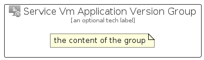

# ServiceVmApplicationVersion


```text
azure-6/Item/NewIcons/ServiceVmApplicationVersion
```

```text
include('azure-6/Item/NewIcons/ServiceVmApplicationVersion')
```


| Illustration | ServiceVmApplicationVersion | ServiceVmApplicationVersionCard | ServiceVmApplicationVersionGroup |
| :---: | :---: | :---: | :---: |
|  |  |  |  |


## ServiceVmApplicationVersion

### Load remotely
```plantuml
@startuml
' configures the library
!global $LIB_BASE_LOCATION="https://raw.githubusercontent.com/tmorin/plantuml-libs/master/distribution"

' loads the library's bootstrap
!include $LIB_BASE_LOCATION/bootstrap.puml

' loads the package bootstrap
include('azure-6/bootstrap')

' loads the Item which embeds the element ServiceVmApplicationVersion
include('azure-6/Item/NewIcons/ServiceVmApplicationVersion')

' renders the element
ServiceVmApplicationVersion('ServiceVmApplicationVersion', 'Service Vm Application Version', 'an optional tech label', 'an optional description')
@enduml
```

### Load locally
```plantuml
@startuml
' configures the library
!global $INCLUSION_MODE="local"
!global $LIB_BASE_LOCATION="../../.."

' loads the library's bootstrap
!include $LIB_BASE_LOCATION/bootstrap.puml

' loads the package bootstrap
include('azure-6/bootstrap')

' loads the Item which embeds the element ServiceVmApplicationVersion
include('azure-6/Item/NewIcons/ServiceVmApplicationVersion')

' renders the element
ServiceVmApplicationVersion('ServiceVmApplicationVersion', 'Service Vm Application Version', 'an optional tech label', 'an optional description')
@enduml
```

## ServiceVmApplicationVersionCard

### Load remotely
```plantuml
@startuml
' configures the library
!global $LIB_BASE_LOCATION="https://raw.githubusercontent.com/tmorin/plantuml-libs/master/distribution"

' loads the library's bootstrap
!include $LIB_BASE_LOCATION/bootstrap.puml

' loads the package bootstrap
include('azure-6/bootstrap')

' loads the Item which embeds the element ServiceVmApplicationVersionCard
include('azure-6/Item/NewIcons/ServiceVmApplicationVersion')

' renders the element
ServiceVmApplicationVersionCard('ServiceVmApplicationVersionCard', 'Service Vm Application Version Card', 'an optional description')
@enduml
```

### Load locally
```plantuml
@startuml
' configures the library
!global $INCLUSION_MODE="local"
!global $LIB_BASE_LOCATION="../../.."

' loads the library's bootstrap
!include $LIB_BASE_LOCATION/bootstrap.puml

' loads the package bootstrap
include('azure-6/bootstrap')

' loads the Item which embeds the element ServiceVmApplicationVersionCard
include('azure-6/Item/NewIcons/ServiceVmApplicationVersion')

' renders the element
ServiceVmApplicationVersionCard('ServiceVmApplicationVersionCard', 'Service Vm Application Version Card', 'an optional description')
@enduml
```

## ServiceVmApplicationVersionGroup

### Load remotely
```plantuml
@startuml
' configures the library
!global $LIB_BASE_LOCATION="https://raw.githubusercontent.com/tmorin/plantuml-libs/master/distribution"

' loads the library's bootstrap
!include $LIB_BASE_LOCATION/bootstrap.puml

' loads the package bootstrap
include('azure-6/bootstrap')

' loads the Item which embeds the element ServiceVmApplicationVersionGroup
include('azure-6/Item/NewIcons/ServiceVmApplicationVersion')

' renders the element
ServiceVmApplicationVersionGroup('ServiceVmApplicationVersionGroup', 'Service Vm Application Version Group', 'an optional tech label') {
    note as note
        the content of the group
    end note
}
@enduml
```

### Load locally
```plantuml
@startuml
' configures the library
!global $INCLUSION_MODE="local"
!global $LIB_BASE_LOCATION="../../.."

' loads the library's bootstrap
!include $LIB_BASE_LOCATION/bootstrap.puml

' loads the package bootstrap
include('azure-6/bootstrap')

' loads the Item which embeds the element ServiceVmApplicationVersionGroup
include('azure-6/Item/NewIcons/ServiceVmApplicationVersion')

' renders the element
ServiceVmApplicationVersionGroup('ServiceVmApplicationVersionGroup', 'Service Vm Application Version Group', 'an optional tech label') {
    note as note
        the content of the group
    end note
}
@enduml
```

