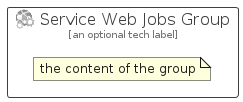

# ServiceWebJobs


```text
azure-6/Item/NewIcons/ServiceWebJobs
```

```text
include('azure-6/Item/NewIcons/ServiceWebJobs')
```


| Illustration | ServiceWebJobs | ServiceWebJobsCard | ServiceWebJobsGroup |
| :---: | :---: | :---: | :---: |
|  |  |  |  |


## ServiceWebJobs

### Load remotely
```plantuml
@startuml
' configures the library
!global $LIB_BASE_LOCATION="https://raw.githubusercontent.com/tmorin/plantuml-libs/master/distribution"

' loads the library's bootstrap
!include $LIB_BASE_LOCATION/bootstrap.puml

' loads the package bootstrap
include('azure-6/bootstrap')

' loads the Item which embeds the element ServiceWebJobs
include('azure-6/Item/NewIcons/ServiceWebJobs')

' renders the element
ServiceWebJobs('ServiceWebJobs', 'Service Web Jobs', 'an optional tech label', 'an optional description')
@enduml
```

### Load locally
```plantuml
@startuml
' configures the library
!global $INCLUSION_MODE="local"
!global $LIB_BASE_LOCATION="../../.."

' loads the library's bootstrap
!include $LIB_BASE_LOCATION/bootstrap.puml

' loads the package bootstrap
include('azure-6/bootstrap')

' loads the Item which embeds the element ServiceWebJobs
include('azure-6/Item/NewIcons/ServiceWebJobs')

' renders the element
ServiceWebJobs('ServiceWebJobs', 'Service Web Jobs', 'an optional tech label', 'an optional description')
@enduml
```

## ServiceWebJobsCard

### Load remotely
```plantuml
@startuml
' configures the library
!global $LIB_BASE_LOCATION="https://raw.githubusercontent.com/tmorin/plantuml-libs/master/distribution"

' loads the library's bootstrap
!include $LIB_BASE_LOCATION/bootstrap.puml

' loads the package bootstrap
include('azure-6/bootstrap')

' loads the Item which embeds the element ServiceWebJobsCard
include('azure-6/Item/NewIcons/ServiceWebJobs')

' renders the element
ServiceWebJobsCard('ServiceWebJobsCard', 'Service Web Jobs Card', 'an optional description')
@enduml
```

### Load locally
```plantuml
@startuml
' configures the library
!global $INCLUSION_MODE="local"
!global $LIB_BASE_LOCATION="../../.."

' loads the library's bootstrap
!include $LIB_BASE_LOCATION/bootstrap.puml

' loads the package bootstrap
include('azure-6/bootstrap')

' loads the Item which embeds the element ServiceWebJobsCard
include('azure-6/Item/NewIcons/ServiceWebJobs')

' renders the element
ServiceWebJobsCard('ServiceWebJobsCard', 'Service Web Jobs Card', 'an optional description')
@enduml
```

## ServiceWebJobsGroup

### Load remotely
```plantuml
@startuml
' configures the library
!global $LIB_BASE_LOCATION="https://raw.githubusercontent.com/tmorin/plantuml-libs/master/distribution"

' loads the library's bootstrap
!include $LIB_BASE_LOCATION/bootstrap.puml

' loads the package bootstrap
include('azure-6/bootstrap')

' loads the Item which embeds the element ServiceWebJobsGroup
include('azure-6/Item/NewIcons/ServiceWebJobs')

' renders the element
ServiceWebJobsGroup('ServiceWebJobsGroup', 'Service Web Jobs Group', 'an optional tech label') {
    note as note
        the content of the group
    end note
}
@enduml
```

### Load locally
```plantuml
@startuml
' configures the library
!global $INCLUSION_MODE="local"
!global $LIB_BASE_LOCATION="../../.."

' loads the library's bootstrap
!include $LIB_BASE_LOCATION/bootstrap.puml

' loads the package bootstrap
include('azure-6/bootstrap')

' loads the Item which embeds the element ServiceWebJobsGroup
include('azure-6/Item/NewIcons/ServiceWebJobs')

' renders the element
ServiceWebJobsGroup('ServiceWebJobsGroup', 'Service Web Jobs Group', 'an optional tech label') {
    note as note
        the content of the group
    end note
}
@enduml
```

