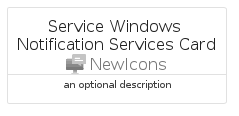

# ServiceWindowsNotificationServices


```text
azure-6/Item/NewIcons/ServiceWindowsNotificationServices
```

```text
include('azure-6/Item/NewIcons/ServiceWindowsNotificationServices')
```


| Illustration | ServiceWindowsNotificationServices | ServiceWindowsNotificationServicesCard | ServiceWindowsNotificationServicesGroup |
| :---: | :---: | :---: | :---: |
|  |  |  |  |


## ServiceWindowsNotificationServices

### Load remotely
```plantuml
@startuml
' configures the library
!global $LIB_BASE_LOCATION="https://raw.githubusercontent.com/tmorin/plantuml-libs/master/distribution"

' loads the library's bootstrap
!include $LIB_BASE_LOCATION/bootstrap.puml

' loads the package bootstrap
include('azure-6/bootstrap')

' loads the Item which embeds the element ServiceWindowsNotificationServices
include('azure-6/Item/NewIcons/ServiceWindowsNotificationServices')

' renders the element
ServiceWindowsNotificationServices('ServiceWindowsNotificationServices', 'Service Windows Notification Services', 'an optional tech label', 'an optional description')
@enduml
```

### Load locally
```plantuml
@startuml
' configures the library
!global $INCLUSION_MODE="local"
!global $LIB_BASE_LOCATION="../../.."

' loads the library's bootstrap
!include $LIB_BASE_LOCATION/bootstrap.puml

' loads the package bootstrap
include('azure-6/bootstrap')

' loads the Item which embeds the element ServiceWindowsNotificationServices
include('azure-6/Item/NewIcons/ServiceWindowsNotificationServices')

' renders the element
ServiceWindowsNotificationServices('ServiceWindowsNotificationServices', 'Service Windows Notification Services', 'an optional tech label', 'an optional description')
@enduml
```

## ServiceWindowsNotificationServicesCard

### Load remotely
```plantuml
@startuml
' configures the library
!global $LIB_BASE_LOCATION="https://raw.githubusercontent.com/tmorin/plantuml-libs/master/distribution"

' loads the library's bootstrap
!include $LIB_BASE_LOCATION/bootstrap.puml

' loads the package bootstrap
include('azure-6/bootstrap')

' loads the Item which embeds the element ServiceWindowsNotificationServicesCard
include('azure-6/Item/NewIcons/ServiceWindowsNotificationServices')

' renders the element
ServiceWindowsNotificationServicesCard('ServiceWindowsNotificationServicesCard', 'Service Windows Notification Services Card', 'an optional description')
@enduml
```

### Load locally
```plantuml
@startuml
' configures the library
!global $INCLUSION_MODE="local"
!global $LIB_BASE_LOCATION="../../.."

' loads the library's bootstrap
!include $LIB_BASE_LOCATION/bootstrap.puml

' loads the package bootstrap
include('azure-6/bootstrap')

' loads the Item which embeds the element ServiceWindowsNotificationServicesCard
include('azure-6/Item/NewIcons/ServiceWindowsNotificationServices')

' renders the element
ServiceWindowsNotificationServicesCard('ServiceWindowsNotificationServicesCard', 'Service Windows Notification Services Card', 'an optional description')
@enduml
```

## ServiceWindowsNotificationServicesGroup

### Load remotely
```plantuml
@startuml
' configures the library
!global $LIB_BASE_LOCATION="https://raw.githubusercontent.com/tmorin/plantuml-libs/master/distribution"

' loads the library's bootstrap
!include $LIB_BASE_LOCATION/bootstrap.puml

' loads the package bootstrap
include('azure-6/bootstrap')

' loads the Item which embeds the element ServiceWindowsNotificationServicesGroup
include('azure-6/Item/NewIcons/ServiceWindowsNotificationServices')

' renders the element
ServiceWindowsNotificationServicesGroup('ServiceWindowsNotificationServicesGroup', 'Service Windows Notification Services Group', 'an optional tech label') {
    note as note
        the content of the group
    end note
}
@enduml
```

### Load locally
```plantuml
@startuml
' configures the library
!global $INCLUSION_MODE="local"
!global $LIB_BASE_LOCATION="../../.."

' loads the library's bootstrap
!include $LIB_BASE_LOCATION/bootstrap.puml

' loads the package bootstrap
include('azure-6/bootstrap')

' loads the Item which embeds the element ServiceWindowsNotificationServicesGroup
include('azure-6/Item/NewIcons/ServiceWindowsNotificationServices')

' renders the element
ServiceWindowsNotificationServicesGroup('ServiceWindowsNotificationServicesGroup', 'Service Windows Notification Services Group', 'an optional tech label') {
    note as note
        the content of the group
    end note
}
@enduml
```

