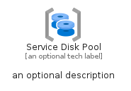

# ServiceDiskPool


```text
azure-6/Item/Other/ServiceDiskPool
```

```text
include('azure-6/Item/Other/ServiceDiskPool')
```


| Illustration | ServiceDiskPool | ServiceDiskPoolCard | ServiceDiskPoolGroup |
| :---: | :---: | :---: | :---: |
|  |  |  |  |


## ServiceDiskPool

### Load remotely
```plantuml
@startuml
' configures the library
!global $LIB_BASE_LOCATION="https://raw.githubusercontent.com/tmorin/plantuml-libs/master/distribution"

' loads the library's bootstrap
!include $LIB_BASE_LOCATION/bootstrap.puml

' loads the package bootstrap
include('azure-6/bootstrap')

' loads the Item which embeds the element ServiceDiskPool
include('azure-6/Item/Other/ServiceDiskPool')

' renders the element
ServiceDiskPool('ServiceDiskPool', 'Service Disk Pool', 'an optional tech label', 'an optional description')
@enduml
```

### Load locally
```plantuml
@startuml
' configures the library
!global $INCLUSION_MODE="local"
!global $LIB_BASE_LOCATION="../../.."

' loads the library's bootstrap
!include $LIB_BASE_LOCATION/bootstrap.puml

' loads the package bootstrap
include('azure-6/bootstrap')

' loads the Item which embeds the element ServiceDiskPool
include('azure-6/Item/Other/ServiceDiskPool')

' renders the element
ServiceDiskPool('ServiceDiskPool', 'Service Disk Pool', 'an optional tech label', 'an optional description')
@enduml
```

## ServiceDiskPoolCard

### Load remotely
```plantuml
@startuml
' configures the library
!global $LIB_BASE_LOCATION="https://raw.githubusercontent.com/tmorin/plantuml-libs/master/distribution"

' loads the library's bootstrap
!include $LIB_BASE_LOCATION/bootstrap.puml

' loads the package bootstrap
include('azure-6/bootstrap')

' loads the Item which embeds the element ServiceDiskPoolCard
include('azure-6/Item/Other/ServiceDiskPool')

' renders the element
ServiceDiskPoolCard('ServiceDiskPoolCard', 'Service Disk Pool Card', 'an optional description')
@enduml
```

### Load locally
```plantuml
@startuml
' configures the library
!global $INCLUSION_MODE="local"
!global $LIB_BASE_LOCATION="../../.."

' loads the library's bootstrap
!include $LIB_BASE_LOCATION/bootstrap.puml

' loads the package bootstrap
include('azure-6/bootstrap')

' loads the Item which embeds the element ServiceDiskPoolCard
include('azure-6/Item/Other/ServiceDiskPool')

' renders the element
ServiceDiskPoolCard('ServiceDiskPoolCard', 'Service Disk Pool Card', 'an optional description')
@enduml
```

## ServiceDiskPoolGroup

### Load remotely
```plantuml
@startuml
' configures the library
!global $LIB_BASE_LOCATION="https://raw.githubusercontent.com/tmorin/plantuml-libs/master/distribution"

' loads the library's bootstrap
!include $LIB_BASE_LOCATION/bootstrap.puml

' loads the package bootstrap
include('azure-6/bootstrap')

' loads the Item which embeds the element ServiceDiskPoolGroup
include('azure-6/Item/Other/ServiceDiskPool')

' renders the element
ServiceDiskPoolGroup('ServiceDiskPoolGroup', 'Service Disk Pool Group', 'an optional tech label') {
    note as note
        the content of the group
    end note
}
@enduml
```

### Load locally
```plantuml
@startuml
' configures the library
!global $INCLUSION_MODE="local"
!global $LIB_BASE_LOCATION="../../.."

' loads the library's bootstrap
!include $LIB_BASE_LOCATION/bootstrap.puml

' loads the package bootstrap
include('azure-6/bootstrap')

' loads the Item which embeds the element ServiceDiskPoolGroup
include('azure-6/Item/Other/ServiceDiskPool')

' renders the element
ServiceDiskPoolGroup('ServiceDiskPoolGroup', 'Service Disk Pool Group', 'an optional tech label') {
    note as note
        the content of the group
    end note
}
@enduml
```

