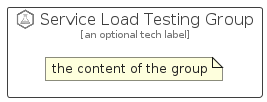

# ServiceLoadTesting


```text
azure-6/Item/Other/ServiceLoadTesting
```

```text
include('azure-6/Item/Other/ServiceLoadTesting')
```


| Illustration | ServiceLoadTesting | ServiceLoadTestingCard | ServiceLoadTestingGroup |
| :---: | :---: | :---: | :---: |
|  |  |  |  |


## ServiceLoadTesting

### Load remotely
```plantuml
@startuml
' configures the library
!global $LIB_BASE_LOCATION="https://raw.githubusercontent.com/tmorin/plantuml-libs/master/distribution"

' loads the library's bootstrap
!include $LIB_BASE_LOCATION/bootstrap.puml

' loads the package bootstrap
include('azure-6/bootstrap')

' loads the Item which embeds the element ServiceLoadTesting
include('azure-6/Item/Other/ServiceLoadTesting')

' renders the element
ServiceLoadTesting('ServiceLoadTesting', 'Service Load Testing', 'an optional tech label', 'an optional description')
@enduml
```

### Load locally
```plantuml
@startuml
' configures the library
!global $INCLUSION_MODE="local"
!global $LIB_BASE_LOCATION="../../.."

' loads the library's bootstrap
!include $LIB_BASE_LOCATION/bootstrap.puml

' loads the package bootstrap
include('azure-6/bootstrap')

' loads the Item which embeds the element ServiceLoadTesting
include('azure-6/Item/Other/ServiceLoadTesting')

' renders the element
ServiceLoadTesting('ServiceLoadTesting', 'Service Load Testing', 'an optional tech label', 'an optional description')
@enduml
```

## ServiceLoadTestingCard

### Load remotely
```plantuml
@startuml
' configures the library
!global $LIB_BASE_LOCATION="https://raw.githubusercontent.com/tmorin/plantuml-libs/master/distribution"

' loads the library's bootstrap
!include $LIB_BASE_LOCATION/bootstrap.puml

' loads the package bootstrap
include('azure-6/bootstrap')

' loads the Item which embeds the element ServiceLoadTestingCard
include('azure-6/Item/Other/ServiceLoadTesting')

' renders the element
ServiceLoadTestingCard('ServiceLoadTestingCard', 'Service Load Testing Card', 'an optional description')
@enduml
```

### Load locally
```plantuml
@startuml
' configures the library
!global $INCLUSION_MODE="local"
!global $LIB_BASE_LOCATION="../../.."

' loads the library's bootstrap
!include $LIB_BASE_LOCATION/bootstrap.puml

' loads the package bootstrap
include('azure-6/bootstrap')

' loads the Item which embeds the element ServiceLoadTestingCard
include('azure-6/Item/Other/ServiceLoadTesting')

' renders the element
ServiceLoadTestingCard('ServiceLoadTestingCard', 'Service Load Testing Card', 'an optional description')
@enduml
```

## ServiceLoadTestingGroup

### Load remotely
```plantuml
@startuml
' configures the library
!global $LIB_BASE_LOCATION="https://raw.githubusercontent.com/tmorin/plantuml-libs/master/distribution"

' loads the library's bootstrap
!include $LIB_BASE_LOCATION/bootstrap.puml

' loads the package bootstrap
include('azure-6/bootstrap')

' loads the Item which embeds the element ServiceLoadTestingGroup
include('azure-6/Item/Other/ServiceLoadTesting')

' renders the element
ServiceLoadTestingGroup('ServiceLoadTestingGroup', 'Service Load Testing Group', 'an optional tech label') {
    note as note
        the content of the group
    end note
}
@enduml
```

### Load locally
```plantuml
@startuml
' configures the library
!global $INCLUSION_MODE="local"
!global $LIB_BASE_LOCATION="../../.."

' loads the library's bootstrap
!include $LIB_BASE_LOCATION/bootstrap.puml

' loads the package bootstrap
include('azure-6/bootstrap')

' loads the Item which embeds the element ServiceLoadTestingGroup
include('azure-6/Item/Other/ServiceLoadTesting')

' renders the element
ServiceLoadTestingGroup('ServiceLoadTestingGroup', 'Service Load Testing Group', 'an optional tech label') {
    note as note
        the content of the group
    end note
}
@enduml
```

