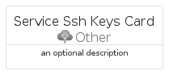

# ServiceSshKeys


```text
azure-6/Item/Other/ServiceSshKeys
```

```text
include('azure-6/Item/Other/ServiceSshKeys')
```


| Illustration | ServiceSshKeys | ServiceSshKeysCard | ServiceSshKeysGroup |
| :---: | :---: | :---: | :---: |
|  |  |  |  |


## ServiceSshKeys

### Load remotely
```plantuml
@startuml
' configures the library
!global $LIB_BASE_LOCATION="https://raw.githubusercontent.com/tmorin/plantuml-libs/master/distribution"

' loads the library's bootstrap
!include $LIB_BASE_LOCATION/bootstrap.puml

' loads the package bootstrap
include('azure-6/bootstrap')

' loads the Item which embeds the element ServiceSshKeys
include('azure-6/Item/Other/ServiceSshKeys')

' renders the element
ServiceSshKeys('ServiceSshKeys', 'Service Ssh Keys', 'an optional tech label', 'an optional description')
@enduml
```

### Load locally
```plantuml
@startuml
' configures the library
!global $INCLUSION_MODE="local"
!global $LIB_BASE_LOCATION="../../.."

' loads the library's bootstrap
!include $LIB_BASE_LOCATION/bootstrap.puml

' loads the package bootstrap
include('azure-6/bootstrap')

' loads the Item which embeds the element ServiceSshKeys
include('azure-6/Item/Other/ServiceSshKeys')

' renders the element
ServiceSshKeys('ServiceSshKeys', 'Service Ssh Keys', 'an optional tech label', 'an optional description')
@enduml
```

## ServiceSshKeysCard

### Load remotely
```plantuml
@startuml
' configures the library
!global $LIB_BASE_LOCATION="https://raw.githubusercontent.com/tmorin/plantuml-libs/master/distribution"

' loads the library's bootstrap
!include $LIB_BASE_LOCATION/bootstrap.puml

' loads the package bootstrap
include('azure-6/bootstrap')

' loads the Item which embeds the element ServiceSshKeysCard
include('azure-6/Item/Other/ServiceSshKeys')

' renders the element
ServiceSshKeysCard('ServiceSshKeysCard', 'Service Ssh Keys Card', 'an optional description')
@enduml
```

### Load locally
```plantuml
@startuml
' configures the library
!global $INCLUSION_MODE="local"
!global $LIB_BASE_LOCATION="../../.."

' loads the library's bootstrap
!include $LIB_BASE_LOCATION/bootstrap.puml

' loads the package bootstrap
include('azure-6/bootstrap')

' loads the Item which embeds the element ServiceSshKeysCard
include('azure-6/Item/Other/ServiceSshKeys')

' renders the element
ServiceSshKeysCard('ServiceSshKeysCard', 'Service Ssh Keys Card', 'an optional description')
@enduml
```

## ServiceSshKeysGroup

### Load remotely
```plantuml
@startuml
' configures the library
!global $LIB_BASE_LOCATION="https://raw.githubusercontent.com/tmorin/plantuml-libs/master/distribution"

' loads the library's bootstrap
!include $LIB_BASE_LOCATION/bootstrap.puml

' loads the package bootstrap
include('azure-6/bootstrap')

' loads the Item which embeds the element ServiceSshKeysGroup
include('azure-6/Item/Other/ServiceSshKeys')

' renders the element
ServiceSshKeysGroup('ServiceSshKeysGroup', 'Service Ssh Keys Group', 'an optional tech label') {
    note as note
        the content of the group
    end note
}
@enduml
```

### Load locally
```plantuml
@startuml
' configures the library
!global $INCLUSION_MODE="local"
!global $LIB_BASE_LOCATION="../../.."

' loads the library's bootstrap
!include $LIB_BASE_LOCATION/bootstrap.puml

' loads the package bootstrap
include('azure-6/bootstrap')

' loads the Item which embeds the element ServiceSshKeysGroup
include('azure-6/Item/Other/ServiceSshKeys')

' renders the element
ServiceSshKeysGroup('ServiceSshKeysGroup', 'Service Ssh Keys Group', 'an optional tech label') {
    note as note
        the content of the group
    end note
}
@enduml
```

