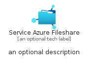
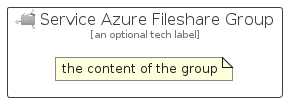

# ServiceAzureFileshare


```text
azure-6/Item/Storage/ServiceAzureFileshare
```

```text
include('azure-6/Item/Storage/ServiceAzureFileshare')
```


| Illustration | ServiceAzureFileshare | ServiceAzureFileshareCard | ServiceAzureFileshareGroup |
| :---: | :---: | :---: | :---: |
|  |  |  |  |


## ServiceAzureFileshare

### Load remotely
```plantuml
@startuml
' configures the library
!global $LIB_BASE_LOCATION="https://raw.githubusercontent.com/tmorin/plantuml-libs/master/distribution"

' loads the library's bootstrap
!include $LIB_BASE_LOCATION/bootstrap.puml

' loads the package bootstrap
include('azure-6/bootstrap')

' loads the Item which embeds the element ServiceAzureFileshare
include('azure-6/Item/Storage/ServiceAzureFileshare')

' renders the element
ServiceAzureFileshare('ServiceAzureFileshare', 'Service Azure Fileshare', 'an optional tech label', 'an optional description')
@enduml
```

### Load locally
```plantuml
@startuml
' configures the library
!global $INCLUSION_MODE="local"
!global $LIB_BASE_LOCATION="../../.."

' loads the library's bootstrap
!include $LIB_BASE_LOCATION/bootstrap.puml

' loads the package bootstrap
include('azure-6/bootstrap')

' loads the Item which embeds the element ServiceAzureFileshare
include('azure-6/Item/Storage/ServiceAzureFileshare')

' renders the element
ServiceAzureFileshare('ServiceAzureFileshare', 'Service Azure Fileshare', 'an optional tech label', 'an optional description')
@enduml
```

## ServiceAzureFileshareCard

### Load remotely
```plantuml
@startuml
' configures the library
!global $LIB_BASE_LOCATION="https://raw.githubusercontent.com/tmorin/plantuml-libs/master/distribution"

' loads the library's bootstrap
!include $LIB_BASE_LOCATION/bootstrap.puml

' loads the package bootstrap
include('azure-6/bootstrap')

' loads the Item which embeds the element ServiceAzureFileshareCard
include('azure-6/Item/Storage/ServiceAzureFileshare')

' renders the element
ServiceAzureFileshareCard('ServiceAzureFileshareCard', 'Service Azure Fileshare Card', 'an optional description')
@enduml
```

### Load locally
```plantuml
@startuml
' configures the library
!global $INCLUSION_MODE="local"
!global $LIB_BASE_LOCATION="../../.."

' loads the library's bootstrap
!include $LIB_BASE_LOCATION/bootstrap.puml

' loads the package bootstrap
include('azure-6/bootstrap')

' loads the Item which embeds the element ServiceAzureFileshareCard
include('azure-6/Item/Storage/ServiceAzureFileshare')

' renders the element
ServiceAzureFileshareCard('ServiceAzureFileshareCard', 'Service Azure Fileshare Card', 'an optional description')
@enduml
```

## ServiceAzureFileshareGroup

### Load remotely
```plantuml
@startuml
' configures the library
!global $LIB_BASE_LOCATION="https://raw.githubusercontent.com/tmorin/plantuml-libs/master/distribution"

' loads the library's bootstrap
!include $LIB_BASE_LOCATION/bootstrap.puml

' loads the package bootstrap
include('azure-6/bootstrap')

' loads the Item which embeds the element ServiceAzureFileshareGroup
include('azure-6/Item/Storage/ServiceAzureFileshare')

' renders the element
ServiceAzureFileshareGroup('ServiceAzureFileshareGroup', 'Service Azure Fileshare Group', 'an optional tech label') {
    note as note
        the content of the group
    end note
}
@enduml
```

### Load locally
```plantuml
@startuml
' configures the library
!global $INCLUSION_MODE="local"
!global $LIB_BASE_LOCATION="../../.."

' loads the library's bootstrap
!include $LIB_BASE_LOCATION/bootstrap.puml

' loads the package bootstrap
include('azure-6/bootstrap')

' loads the Item which embeds the element ServiceAzureFileshareGroup
include('azure-6/Item/Storage/ServiceAzureFileshare')

' renders the element
ServiceAzureFileshareGroup('ServiceAzureFileshareGroup', 'Service Azure Fileshare Group', 'an optional tech label') {
    note as note
        the content of the group
    end note
}
@enduml
```

