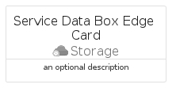
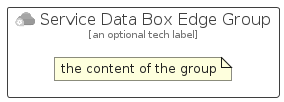

# ServiceDataBoxEdge


```text
azure-6/Item/Storage/ServiceDataBoxEdge
```

```text
include('azure-6/Item/Storage/ServiceDataBoxEdge')
```


| Illustration | ServiceDataBoxEdge | ServiceDataBoxEdgeCard | ServiceDataBoxEdgeGroup |
| :---: | :---: | :---: | :---: |
|  |  |  |  |


## ServiceDataBoxEdge

### Load remotely
```plantuml
@startuml
' configures the library
!global $LIB_BASE_LOCATION="https://raw.githubusercontent.com/tmorin/plantuml-libs/master/distribution"

' loads the library's bootstrap
!include $LIB_BASE_LOCATION/bootstrap.puml

' loads the package bootstrap
include('azure-6/bootstrap')

' loads the Item which embeds the element ServiceDataBoxEdge
include('azure-6/Item/Storage/ServiceDataBoxEdge')

' renders the element
ServiceDataBoxEdge('ServiceDataBoxEdge', 'Service Data Box Edge', 'an optional tech label', 'an optional description')
@enduml
```

### Load locally
```plantuml
@startuml
' configures the library
!global $INCLUSION_MODE="local"
!global $LIB_BASE_LOCATION="../../.."

' loads the library's bootstrap
!include $LIB_BASE_LOCATION/bootstrap.puml

' loads the package bootstrap
include('azure-6/bootstrap')

' loads the Item which embeds the element ServiceDataBoxEdge
include('azure-6/Item/Storage/ServiceDataBoxEdge')

' renders the element
ServiceDataBoxEdge('ServiceDataBoxEdge', 'Service Data Box Edge', 'an optional tech label', 'an optional description')
@enduml
```

## ServiceDataBoxEdgeCard

### Load remotely
```plantuml
@startuml
' configures the library
!global $LIB_BASE_LOCATION="https://raw.githubusercontent.com/tmorin/plantuml-libs/master/distribution"

' loads the library's bootstrap
!include $LIB_BASE_LOCATION/bootstrap.puml

' loads the package bootstrap
include('azure-6/bootstrap')

' loads the Item which embeds the element ServiceDataBoxEdgeCard
include('azure-6/Item/Storage/ServiceDataBoxEdge')

' renders the element
ServiceDataBoxEdgeCard('ServiceDataBoxEdgeCard', 'Service Data Box Edge Card', 'an optional description')
@enduml
```

### Load locally
```plantuml
@startuml
' configures the library
!global $INCLUSION_MODE="local"
!global $LIB_BASE_LOCATION="../../.."

' loads the library's bootstrap
!include $LIB_BASE_LOCATION/bootstrap.puml

' loads the package bootstrap
include('azure-6/bootstrap')

' loads the Item which embeds the element ServiceDataBoxEdgeCard
include('azure-6/Item/Storage/ServiceDataBoxEdge')

' renders the element
ServiceDataBoxEdgeCard('ServiceDataBoxEdgeCard', 'Service Data Box Edge Card', 'an optional description')
@enduml
```

## ServiceDataBoxEdgeGroup

### Load remotely
```plantuml
@startuml
' configures the library
!global $LIB_BASE_LOCATION="https://raw.githubusercontent.com/tmorin/plantuml-libs/master/distribution"

' loads the library's bootstrap
!include $LIB_BASE_LOCATION/bootstrap.puml

' loads the package bootstrap
include('azure-6/bootstrap')

' loads the Item which embeds the element ServiceDataBoxEdgeGroup
include('azure-6/Item/Storage/ServiceDataBoxEdge')

' renders the element
ServiceDataBoxEdgeGroup('ServiceDataBoxEdgeGroup', 'Service Data Box Edge Group', 'an optional tech label') {
    note as note
        the content of the group
    end note
}
@enduml
```

### Load locally
```plantuml
@startuml
' configures the library
!global $INCLUSION_MODE="local"
!global $LIB_BASE_LOCATION="../../.."

' loads the library's bootstrap
!include $LIB_BASE_LOCATION/bootstrap.puml

' loads the package bootstrap
include('azure-6/bootstrap')

' loads the Item which embeds the element ServiceDataBoxEdgeGroup
include('azure-6/Item/Storage/ServiceDataBoxEdge')

' renders the element
ServiceDataBoxEdgeGroup('ServiceDataBoxEdgeGroup', 'Service Data Box Edge Group', 'an optional tech label') {
    note as note
        the content of the group
    end note
}
@enduml
```

