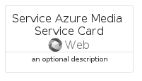

# ServiceAzureMediaService


```text
azure-6/Item/Web/ServiceAzureMediaService
```

```text
include('azure-6/Item/Web/ServiceAzureMediaService')
```


| Illustration | ServiceAzureMediaService | ServiceAzureMediaServiceCard | ServiceAzureMediaServiceGroup |
| :---: | :---: | :---: | :---: |
|  |  |  |  |


## ServiceAzureMediaService

### Load remotely
```plantuml
@startuml
' configures the library
!global $LIB_BASE_LOCATION="https://raw.githubusercontent.com/tmorin/plantuml-libs/master/distribution"

' loads the library's bootstrap
!include $LIB_BASE_LOCATION/bootstrap.puml

' loads the package bootstrap
include('azure-6/bootstrap')

' loads the Item which embeds the element ServiceAzureMediaService
include('azure-6/Item/Web/ServiceAzureMediaService')

' renders the element
ServiceAzureMediaService('ServiceAzureMediaService', 'Service Azure Media Service', 'an optional tech label', 'an optional description')
@enduml
```

### Load locally
```plantuml
@startuml
' configures the library
!global $INCLUSION_MODE="local"
!global $LIB_BASE_LOCATION="../../.."

' loads the library's bootstrap
!include $LIB_BASE_LOCATION/bootstrap.puml

' loads the package bootstrap
include('azure-6/bootstrap')

' loads the Item which embeds the element ServiceAzureMediaService
include('azure-6/Item/Web/ServiceAzureMediaService')

' renders the element
ServiceAzureMediaService('ServiceAzureMediaService', 'Service Azure Media Service', 'an optional tech label', 'an optional description')
@enduml
```

## ServiceAzureMediaServiceCard

### Load remotely
```plantuml
@startuml
' configures the library
!global $LIB_BASE_LOCATION="https://raw.githubusercontent.com/tmorin/plantuml-libs/master/distribution"

' loads the library's bootstrap
!include $LIB_BASE_LOCATION/bootstrap.puml

' loads the package bootstrap
include('azure-6/bootstrap')

' loads the Item which embeds the element ServiceAzureMediaServiceCard
include('azure-6/Item/Web/ServiceAzureMediaService')

' renders the element
ServiceAzureMediaServiceCard('ServiceAzureMediaServiceCard', 'Service Azure Media Service Card', 'an optional description')
@enduml
```

### Load locally
```plantuml
@startuml
' configures the library
!global $INCLUSION_MODE="local"
!global $LIB_BASE_LOCATION="../../.."

' loads the library's bootstrap
!include $LIB_BASE_LOCATION/bootstrap.puml

' loads the package bootstrap
include('azure-6/bootstrap')

' loads the Item which embeds the element ServiceAzureMediaServiceCard
include('azure-6/Item/Web/ServiceAzureMediaService')

' renders the element
ServiceAzureMediaServiceCard('ServiceAzureMediaServiceCard', 'Service Azure Media Service Card', 'an optional description')
@enduml
```

## ServiceAzureMediaServiceGroup

### Load remotely
```plantuml
@startuml
' configures the library
!global $LIB_BASE_LOCATION="https://raw.githubusercontent.com/tmorin/plantuml-libs/master/distribution"

' loads the library's bootstrap
!include $LIB_BASE_LOCATION/bootstrap.puml

' loads the package bootstrap
include('azure-6/bootstrap')

' loads the Item which embeds the element ServiceAzureMediaServiceGroup
include('azure-6/Item/Web/ServiceAzureMediaService')

' renders the element
ServiceAzureMediaServiceGroup('ServiceAzureMediaServiceGroup', 'Service Azure Media Service Group', 'an optional tech label') {
    note as note
        the content of the group
    end note
}
@enduml
```

### Load locally
```plantuml
@startuml
' configures the library
!global $INCLUSION_MODE="local"
!global $LIB_BASE_LOCATION="../../.."

' loads the library's bootstrap
!include $LIB_BASE_LOCATION/bootstrap.puml

' loads the package bootstrap
include('azure-6/bootstrap')

' loads the Item which embeds the element ServiceAzureMediaServiceGroup
include('azure-6/Item/Web/ServiceAzureMediaService')

' renders the element
ServiceAzureMediaServiceGroup('ServiceAzureMediaServiceGroup', 'Service Azure Media Service Group', 'an optional tech label') {
    note as note
        the content of the group
    end note
}
@enduml
```

