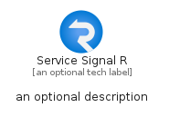
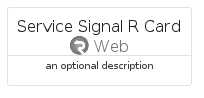
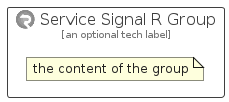

# ServiceSignalR


```text
azure-6/Item/Web/ServiceSignalR
```

```text
include('azure-6/Item/Web/ServiceSignalR')
```


| Illustration | ServiceSignalR | ServiceSignalRCard | ServiceSignalRGroup |
| :---: | :---: | :---: | :---: |
|  |  |  |  |


## ServiceSignalR

### Load remotely
```plantuml
@startuml
' configures the library
!global $LIB_BASE_LOCATION="https://raw.githubusercontent.com/tmorin/plantuml-libs/master/distribution"

' loads the library's bootstrap
!include $LIB_BASE_LOCATION/bootstrap.puml

' loads the package bootstrap
include('azure-6/bootstrap')

' loads the Item which embeds the element ServiceSignalR
include('azure-6/Item/Web/ServiceSignalR')

' renders the element
ServiceSignalR('ServiceSignalR', 'Service Signal R', 'an optional tech label', 'an optional description')
@enduml
```

### Load locally
```plantuml
@startuml
' configures the library
!global $INCLUSION_MODE="local"
!global $LIB_BASE_LOCATION="../../.."

' loads the library's bootstrap
!include $LIB_BASE_LOCATION/bootstrap.puml

' loads the package bootstrap
include('azure-6/bootstrap')

' loads the Item which embeds the element ServiceSignalR
include('azure-6/Item/Web/ServiceSignalR')

' renders the element
ServiceSignalR('ServiceSignalR', 'Service Signal R', 'an optional tech label', 'an optional description')
@enduml
```

## ServiceSignalRCard

### Load remotely
```plantuml
@startuml
' configures the library
!global $LIB_BASE_LOCATION="https://raw.githubusercontent.com/tmorin/plantuml-libs/master/distribution"

' loads the library's bootstrap
!include $LIB_BASE_LOCATION/bootstrap.puml

' loads the package bootstrap
include('azure-6/bootstrap')

' loads the Item which embeds the element ServiceSignalRCard
include('azure-6/Item/Web/ServiceSignalR')

' renders the element
ServiceSignalRCard('ServiceSignalRCard', 'Service Signal R Card', 'an optional description')
@enduml
```

### Load locally
```plantuml
@startuml
' configures the library
!global $INCLUSION_MODE="local"
!global $LIB_BASE_LOCATION="../../.."

' loads the library's bootstrap
!include $LIB_BASE_LOCATION/bootstrap.puml

' loads the package bootstrap
include('azure-6/bootstrap')

' loads the Item which embeds the element ServiceSignalRCard
include('azure-6/Item/Web/ServiceSignalR')

' renders the element
ServiceSignalRCard('ServiceSignalRCard', 'Service Signal R Card', 'an optional description')
@enduml
```

## ServiceSignalRGroup

### Load remotely
```plantuml
@startuml
' configures the library
!global $LIB_BASE_LOCATION="https://raw.githubusercontent.com/tmorin/plantuml-libs/master/distribution"

' loads the library's bootstrap
!include $LIB_BASE_LOCATION/bootstrap.puml

' loads the package bootstrap
include('azure-6/bootstrap')

' loads the Item which embeds the element ServiceSignalRGroup
include('azure-6/Item/Web/ServiceSignalR')

' renders the element
ServiceSignalRGroup('ServiceSignalRGroup', 'Service Signal R Group', 'an optional tech label') {
    note as note
        the content of the group
    end note
}
@enduml
```

### Load locally
```plantuml
@startuml
' configures the library
!global $INCLUSION_MODE="local"
!global $LIB_BASE_LOCATION="../../.."

' loads the library's bootstrap
!include $LIB_BASE_LOCATION/bootstrap.puml

' loads the package bootstrap
include('azure-6/bootstrap')

' loads the Item which embeds the element ServiceSignalRGroup
include('azure-6/Item/Web/ServiceSignalR')

' renders the element
ServiceSignalRGroup('ServiceSignalRGroup', 'Service Signal R Group', 'an optional tech label') {
    note as note
        the content of the group
    end note
}
@enduml
```

