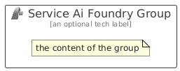

# ServiceAiFoundry


```text
azure/Item/AiMachineLearning/ServiceAiFoundry
```

```text
include('azure/Item/AiMachineLearning/ServiceAiFoundry')
```


| Illustration | ServiceAiFoundry | ServiceAiFoundryCard | ServiceAiFoundryGroup |
| :---: | :---: | :---: | :---: |
|  |  |  |  |


## Sprites
The item provides the following sriptes:

- `<$ServiceAiFoundryXs>`
- `<$ServiceAiFoundrySm>`
- `<$ServiceAiFoundryMd>`
- `<$ServiceAiFoundryLg>`


## ServiceAiFoundry

### Load remotely
```plantuml
@startuml
' configures the library
!global $LIB_BASE_LOCATION="https://raw.githubusercontent.com/tmorin/plantuml-libs/master/distribution"

' loads the library's bootstrap
!include $LIB_BASE_LOCATION/bootstrap.puml

' loads the package bootstrap
include('azure/bootstrap')

' loads the Item which embeds the element ServiceAiFoundry
include('azure/Item/AiMachineLearning/ServiceAiFoundry')

' renders the element
ServiceAiFoundry('ServiceAiFoundry', 'Service Ai Foundry', 'an optional tech label', 'an optional description')
@enduml
```

### Load locally
```plantuml
@startuml
' configures the library
!global $INCLUSION_MODE="local"
!global $LIB_BASE_LOCATION="../../.."

' loads the library's bootstrap
!include $LIB_BASE_LOCATION/bootstrap.puml

' loads the package bootstrap
include('azure/bootstrap')

' loads the Item which embeds the element ServiceAiFoundry
include('azure/Item/AiMachineLearning/ServiceAiFoundry')

' renders the element
ServiceAiFoundry('ServiceAiFoundry', 'Service Ai Foundry', 'an optional tech label', 'an optional description')
@enduml
```

## ServiceAiFoundryCard

### Load remotely
```plantuml
@startuml
' configures the library
!global $LIB_BASE_LOCATION="https://raw.githubusercontent.com/tmorin/plantuml-libs/master/distribution"

' loads the library's bootstrap
!include $LIB_BASE_LOCATION/bootstrap.puml

' loads the package bootstrap
include('azure/bootstrap')

' loads the Item which embeds the element ServiceAiFoundryCard
include('azure/Item/AiMachineLearning/ServiceAiFoundry')

' renders the element
ServiceAiFoundryCard('ServiceAiFoundryCard', 'Service Ai Foundry Card', 'an optional description')
@enduml
```

### Load locally
```plantuml
@startuml
' configures the library
!global $INCLUSION_MODE="local"
!global $LIB_BASE_LOCATION="../../.."

' loads the library's bootstrap
!include $LIB_BASE_LOCATION/bootstrap.puml

' loads the package bootstrap
include('azure/bootstrap')

' loads the Item which embeds the element ServiceAiFoundryCard
include('azure/Item/AiMachineLearning/ServiceAiFoundry')

' renders the element
ServiceAiFoundryCard('ServiceAiFoundryCard', 'Service Ai Foundry Card', 'an optional description')
@enduml
```

## ServiceAiFoundryGroup

### Load remotely
```plantuml
@startuml
' configures the library
!global $LIB_BASE_LOCATION="https://raw.githubusercontent.com/tmorin/plantuml-libs/master/distribution"

' loads the library's bootstrap
!include $LIB_BASE_LOCATION/bootstrap.puml

' loads the package bootstrap
include('azure/bootstrap')

' loads the Item which embeds the element ServiceAiFoundryGroup
include('azure/Item/AiMachineLearning/ServiceAiFoundry')

' renders the element
ServiceAiFoundryGroup('ServiceAiFoundryGroup', 'Service Ai Foundry Group', 'an optional tech label') {
    note as note
        the content of the group
    end note
}
@enduml
```

### Load locally
```plantuml
@startuml
' configures the library
!global $INCLUSION_MODE="local"
!global $LIB_BASE_LOCATION="../../.."

' loads the library's bootstrap
!include $LIB_BASE_LOCATION/bootstrap.puml

' loads the package bootstrap
include('azure/bootstrap')

' loads the Item which embeds the element ServiceAiFoundryGroup
include('azure/Item/AiMachineLearning/ServiceAiFoundry')

' renders the element
ServiceAiFoundryGroup('ServiceAiFoundryGroup', 'Service Ai Foundry Group', 'an optional tech label') {
    note as note
        the content of the group
    end note
}
@enduml
```

