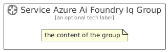

# ServiceAzureAiFoundryIq


```text
azure/Item/AiMachineLearning/ServiceAzureAiFoundryIq
```

```text
include('azure/Item/AiMachineLearning/ServiceAzureAiFoundryIq')
```


| Illustration | ServiceAzureAiFoundryIq | ServiceAzureAiFoundryIqCard | ServiceAzureAiFoundryIqGroup |
| :---: | :---: | :---: | :---: |
|  |  |  |  |


## Sprites
The item provides the following sriptes:

- `<$ServiceAzureAiFoundryIqXs>`
- `<$ServiceAzureAiFoundryIqSm>`
- `<$ServiceAzureAiFoundryIqMd>`
- `<$ServiceAzureAiFoundryIqLg>`


## ServiceAzureAiFoundryIq

### Load remotely
```plantuml
@startuml
' configures the library
!global $LIB_BASE_LOCATION="https://raw.githubusercontent.com/tmorin/plantuml-libs/master/distribution"

' loads the library's bootstrap
!include $LIB_BASE_LOCATION/bootstrap.puml

' loads the package bootstrap
include('azure/bootstrap')

' loads the Item which embeds the element ServiceAzureAiFoundryIq
include('azure/Item/AiMachineLearning/ServiceAzureAiFoundryIq')

' renders the element
ServiceAzureAiFoundryIq('ServiceAzureAiFoundryIq', 'Service Azure Ai Foundry Iq', 'an optional tech label', 'an optional description')
@enduml
```

### Load locally
```plantuml
@startuml
' configures the library
!global $INCLUSION_MODE="local"
!global $LIB_BASE_LOCATION="../../.."

' loads the library's bootstrap
!include $LIB_BASE_LOCATION/bootstrap.puml

' loads the package bootstrap
include('azure/bootstrap')

' loads the Item which embeds the element ServiceAzureAiFoundryIq
include('azure/Item/AiMachineLearning/ServiceAzureAiFoundryIq')

' renders the element
ServiceAzureAiFoundryIq('ServiceAzureAiFoundryIq', 'Service Azure Ai Foundry Iq', 'an optional tech label', 'an optional description')
@enduml
```

## ServiceAzureAiFoundryIqCard

### Load remotely
```plantuml
@startuml
' configures the library
!global $LIB_BASE_LOCATION="https://raw.githubusercontent.com/tmorin/plantuml-libs/master/distribution"

' loads the library's bootstrap
!include $LIB_BASE_LOCATION/bootstrap.puml

' loads the package bootstrap
include('azure/bootstrap')

' loads the Item which embeds the element ServiceAzureAiFoundryIqCard
include('azure/Item/AiMachineLearning/ServiceAzureAiFoundryIq')

' renders the element
ServiceAzureAiFoundryIqCard('ServiceAzureAiFoundryIqCard', 'Service Azure Ai Foundry Iq Card', 'an optional description')
@enduml
```

### Load locally
```plantuml
@startuml
' configures the library
!global $INCLUSION_MODE="local"
!global $LIB_BASE_LOCATION="../../.."

' loads the library's bootstrap
!include $LIB_BASE_LOCATION/bootstrap.puml

' loads the package bootstrap
include('azure/bootstrap')

' loads the Item which embeds the element ServiceAzureAiFoundryIqCard
include('azure/Item/AiMachineLearning/ServiceAzureAiFoundryIq')

' renders the element
ServiceAzureAiFoundryIqCard('ServiceAzureAiFoundryIqCard', 'Service Azure Ai Foundry Iq Card', 'an optional description')
@enduml
```

## ServiceAzureAiFoundryIqGroup

### Load remotely
```plantuml
@startuml
' configures the library
!global $LIB_BASE_LOCATION="https://raw.githubusercontent.com/tmorin/plantuml-libs/master/distribution"

' loads the library's bootstrap
!include $LIB_BASE_LOCATION/bootstrap.puml

' loads the package bootstrap
include('azure/bootstrap')

' loads the Item which embeds the element ServiceAzureAiFoundryIqGroup
include('azure/Item/AiMachineLearning/ServiceAzureAiFoundryIq')

' renders the element
ServiceAzureAiFoundryIqGroup('ServiceAzureAiFoundryIqGroup', 'Service Azure Ai Foundry Iq Group', 'an optional tech label') {
    note as note
        the content of the group
    end note
}
@enduml
```

### Load locally
```plantuml
@startuml
' configures the library
!global $INCLUSION_MODE="local"
!global $LIB_BASE_LOCATION="../../.."

' loads the library's bootstrap
!include $LIB_BASE_LOCATION/bootstrap.puml

' loads the package bootstrap
include('azure/bootstrap')

' loads the Item which embeds the element ServiceAzureAiFoundryIqGroup
include('azure/Item/AiMachineLearning/ServiceAzureAiFoundryIq')

' renders the element
ServiceAzureAiFoundryIqGroup('ServiceAzureAiFoundryIqGroup', 'Service Azure Ai Foundry Iq Group', 'an optional tech label') {
    note as note
        the content of the group
    end note
}
@enduml
```

