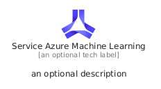
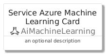
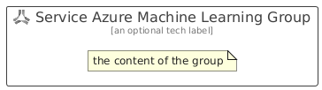

# ServiceAzureMachineLearning


```text
azure/Item/AiMachineLearning/ServiceAzureMachineLearning
```

```text
include('azure/Item/AiMachineLearning/ServiceAzureMachineLearning')
```


| Illustration | ServiceAzureMachineLearning | ServiceAzureMachineLearningCard | ServiceAzureMachineLearningGroup |
| :---: | :---: | :---: | :---: |
|  |  |  |  |


## Sprites
The item provides the following sriptes:

- `<$ServiceAzureMachineLearningXs>`
- `<$ServiceAzureMachineLearningSm>`
- `<$ServiceAzureMachineLearningMd>`
- `<$ServiceAzureMachineLearningLg>`


## ServiceAzureMachineLearning

### Load remotely
```plantuml
@startuml
' configures the library
!global $LIB_BASE_LOCATION="https://raw.githubusercontent.com/tmorin/plantuml-libs/master/distribution"

' loads the library's bootstrap
!include $LIB_BASE_LOCATION/bootstrap.puml

' loads the package bootstrap
include('azure/bootstrap')

' loads the Item which embeds the element ServiceAzureMachineLearning
include('azure/Item/AiMachineLearning/ServiceAzureMachineLearning')

' renders the element
ServiceAzureMachineLearning('ServiceAzureMachineLearning', 'Service Azure Machine Learning', 'an optional tech label', 'an optional description')
@enduml
```

### Load locally
```plantuml
@startuml
' configures the library
!global $INCLUSION_MODE="local"
!global $LIB_BASE_LOCATION="../../.."

' loads the library's bootstrap
!include $LIB_BASE_LOCATION/bootstrap.puml

' loads the package bootstrap
include('azure/bootstrap')

' loads the Item which embeds the element ServiceAzureMachineLearning
include('azure/Item/AiMachineLearning/ServiceAzureMachineLearning')

' renders the element
ServiceAzureMachineLearning('ServiceAzureMachineLearning', 'Service Azure Machine Learning', 'an optional tech label', 'an optional description')
@enduml
```

## ServiceAzureMachineLearningCard

### Load remotely
```plantuml
@startuml
' configures the library
!global $LIB_BASE_LOCATION="https://raw.githubusercontent.com/tmorin/plantuml-libs/master/distribution"

' loads the library's bootstrap
!include $LIB_BASE_LOCATION/bootstrap.puml

' loads the package bootstrap
include('azure/bootstrap')

' loads the Item which embeds the element ServiceAzureMachineLearningCard
include('azure/Item/AiMachineLearning/ServiceAzureMachineLearning')

' renders the element
ServiceAzureMachineLearningCard('ServiceAzureMachineLearningCard', 'Service Azure Machine Learning Card', 'an optional description')
@enduml
```

### Load locally
```plantuml
@startuml
' configures the library
!global $INCLUSION_MODE="local"
!global $LIB_BASE_LOCATION="../../.."

' loads the library's bootstrap
!include $LIB_BASE_LOCATION/bootstrap.puml

' loads the package bootstrap
include('azure/bootstrap')

' loads the Item which embeds the element ServiceAzureMachineLearningCard
include('azure/Item/AiMachineLearning/ServiceAzureMachineLearning')

' renders the element
ServiceAzureMachineLearningCard('ServiceAzureMachineLearningCard', 'Service Azure Machine Learning Card', 'an optional description')
@enduml
```

## ServiceAzureMachineLearningGroup

### Load remotely
```plantuml
@startuml
' configures the library
!global $LIB_BASE_LOCATION="https://raw.githubusercontent.com/tmorin/plantuml-libs/master/distribution"

' loads the library's bootstrap
!include $LIB_BASE_LOCATION/bootstrap.puml

' loads the package bootstrap
include('azure/bootstrap')

' loads the Item which embeds the element ServiceAzureMachineLearningGroup
include('azure/Item/AiMachineLearning/ServiceAzureMachineLearning')

' renders the element
ServiceAzureMachineLearningGroup('ServiceAzureMachineLearningGroup', 'Service Azure Machine Learning Group', 'an optional tech label') {
    note as note
        the content of the group
    end note
}
@enduml
```

### Load locally
```plantuml
@startuml
' configures the library
!global $INCLUSION_MODE="local"
!global $LIB_BASE_LOCATION="../../.."

' loads the library's bootstrap
!include $LIB_BASE_LOCATION/bootstrap.puml

' loads the package bootstrap
include('azure/bootstrap')

' loads the Item which embeds the element ServiceAzureMachineLearningGroup
include('azure/Item/AiMachineLearning/ServiceAzureMachineLearning')

' renders the element
ServiceAzureMachineLearningGroup('ServiceAzureMachineLearningGroup', 'Service Azure Machine Learning Group', 'an optional tech label') {
    note as note
        the content of the group
    end note
}
@enduml
```

