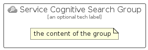

# ServiceCognitiveSearch


```text
azure/Item/AiMachineLearning/ServiceCognitiveSearch
```

```text
include('azure/Item/AiMachineLearning/ServiceCognitiveSearch')
```


| Illustration | ServiceCognitiveSearch | ServiceCognitiveSearchCard | ServiceCognitiveSearchGroup |
| :---: | :---: | :---: | :---: |
|  |  |  |  |


## Sprites
The item provides the following sriptes:

- `<$ServiceCognitiveSearchXs>`
- `<$ServiceCognitiveSearchSm>`
- `<$ServiceCognitiveSearchMd>`
- `<$ServiceCognitiveSearchLg>`


## ServiceCognitiveSearch

### Load remotely
```plantuml
@startuml
' configures the library
!global $LIB_BASE_LOCATION="https://raw.githubusercontent.com/tmorin/plantuml-libs/master/distribution"

' loads the library's bootstrap
!include $LIB_BASE_LOCATION/bootstrap.puml

' loads the package bootstrap
include('azure/bootstrap')

' loads the Item which embeds the element ServiceCognitiveSearch
include('azure/Item/AiMachineLearning/ServiceCognitiveSearch')

' renders the element
ServiceCognitiveSearch('ServiceCognitiveSearch', 'Service Cognitive Search', 'an optional tech label', 'an optional description')
@enduml
```

### Load locally
```plantuml
@startuml
' configures the library
!global $INCLUSION_MODE="local"
!global $LIB_BASE_LOCATION="../../.."

' loads the library's bootstrap
!include $LIB_BASE_LOCATION/bootstrap.puml

' loads the package bootstrap
include('azure/bootstrap')

' loads the Item which embeds the element ServiceCognitiveSearch
include('azure/Item/AiMachineLearning/ServiceCognitiveSearch')

' renders the element
ServiceCognitiveSearch('ServiceCognitiveSearch', 'Service Cognitive Search', 'an optional tech label', 'an optional description')
@enduml
```

## ServiceCognitiveSearchCard

### Load remotely
```plantuml
@startuml
' configures the library
!global $LIB_BASE_LOCATION="https://raw.githubusercontent.com/tmorin/plantuml-libs/master/distribution"

' loads the library's bootstrap
!include $LIB_BASE_LOCATION/bootstrap.puml

' loads the package bootstrap
include('azure/bootstrap')

' loads the Item which embeds the element ServiceCognitiveSearchCard
include('azure/Item/AiMachineLearning/ServiceCognitiveSearch')

' renders the element
ServiceCognitiveSearchCard('ServiceCognitiveSearchCard', 'Service Cognitive Search Card', 'an optional description')
@enduml
```

### Load locally
```plantuml
@startuml
' configures the library
!global $INCLUSION_MODE="local"
!global $LIB_BASE_LOCATION="../../.."

' loads the library's bootstrap
!include $LIB_BASE_LOCATION/bootstrap.puml

' loads the package bootstrap
include('azure/bootstrap')

' loads the Item which embeds the element ServiceCognitiveSearchCard
include('azure/Item/AiMachineLearning/ServiceCognitiveSearch')

' renders the element
ServiceCognitiveSearchCard('ServiceCognitiveSearchCard', 'Service Cognitive Search Card', 'an optional description')
@enduml
```

## ServiceCognitiveSearchGroup

### Load remotely
```plantuml
@startuml
' configures the library
!global $LIB_BASE_LOCATION="https://raw.githubusercontent.com/tmorin/plantuml-libs/master/distribution"

' loads the library's bootstrap
!include $LIB_BASE_LOCATION/bootstrap.puml

' loads the package bootstrap
include('azure/bootstrap')

' loads the Item which embeds the element ServiceCognitiveSearchGroup
include('azure/Item/AiMachineLearning/ServiceCognitiveSearch')

' renders the element
ServiceCognitiveSearchGroup('ServiceCognitiveSearchGroup', 'Service Cognitive Search Group', 'an optional tech label') {
    note as note
        the content of the group
    end note
}
@enduml
```

### Load locally
```plantuml
@startuml
' configures the library
!global $INCLUSION_MODE="local"
!global $LIB_BASE_LOCATION="../../.."

' loads the library's bootstrap
!include $LIB_BASE_LOCATION/bootstrap.puml

' loads the package bootstrap
include('azure/bootstrap')

' loads the Item which embeds the element ServiceCognitiveSearchGroup
include('azure/Item/AiMachineLearning/ServiceCognitiveSearch')

' renders the element
ServiceCognitiveSearchGroup('ServiceCognitiveSearchGroup', 'Service Cognitive Search Group', 'an optional tech label') {
    note as note
        the content of the group
    end note
}
@enduml
```

