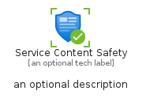
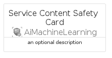
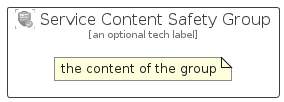

# ServiceContentSafety


```text
azure/Item/AiMachineLearning/ServiceContentSafety
```

```text
include('azure/Item/AiMachineLearning/ServiceContentSafety')
```


| Illustration | ServiceContentSafety | ServiceContentSafetyCard | ServiceContentSafetyGroup |
| :---: | :---: | :---: | :---: |
|  |  |  |  |


## Sprites
The item provides the following sriptes:

- `<$ServiceContentSafetyXs>`
- `<$ServiceContentSafetySm>`
- `<$ServiceContentSafetyMd>`
- `<$ServiceContentSafetyLg>`


## ServiceContentSafety

### Load remotely
```plantuml
@startuml
' configures the library
!global $LIB_BASE_LOCATION="https://raw.githubusercontent.com/tmorin/plantuml-libs/master/distribution"

' loads the library's bootstrap
!include $LIB_BASE_LOCATION/bootstrap.puml

' loads the package bootstrap
include('azure/bootstrap')

' loads the Item which embeds the element ServiceContentSafety
include('azure/Item/AiMachineLearning/ServiceContentSafety')

' renders the element
ServiceContentSafety('ServiceContentSafety', 'Service Content Safety', 'an optional tech label', 'an optional description')
@enduml
```

### Load locally
```plantuml
@startuml
' configures the library
!global $INCLUSION_MODE="local"
!global $LIB_BASE_LOCATION="../../.."

' loads the library's bootstrap
!include $LIB_BASE_LOCATION/bootstrap.puml

' loads the package bootstrap
include('azure/bootstrap')

' loads the Item which embeds the element ServiceContentSafety
include('azure/Item/AiMachineLearning/ServiceContentSafety')

' renders the element
ServiceContentSafety('ServiceContentSafety', 'Service Content Safety', 'an optional tech label', 'an optional description')
@enduml
```

## ServiceContentSafetyCard

### Load remotely
```plantuml
@startuml
' configures the library
!global $LIB_BASE_LOCATION="https://raw.githubusercontent.com/tmorin/plantuml-libs/master/distribution"

' loads the library's bootstrap
!include $LIB_BASE_LOCATION/bootstrap.puml

' loads the package bootstrap
include('azure/bootstrap')

' loads the Item which embeds the element ServiceContentSafetyCard
include('azure/Item/AiMachineLearning/ServiceContentSafety')

' renders the element
ServiceContentSafetyCard('ServiceContentSafetyCard', 'Service Content Safety Card', 'an optional description')
@enduml
```

### Load locally
```plantuml
@startuml
' configures the library
!global $INCLUSION_MODE="local"
!global $LIB_BASE_LOCATION="../../.."

' loads the library's bootstrap
!include $LIB_BASE_LOCATION/bootstrap.puml

' loads the package bootstrap
include('azure/bootstrap')

' loads the Item which embeds the element ServiceContentSafetyCard
include('azure/Item/AiMachineLearning/ServiceContentSafety')

' renders the element
ServiceContentSafetyCard('ServiceContentSafetyCard', 'Service Content Safety Card', 'an optional description')
@enduml
```

## ServiceContentSafetyGroup

### Load remotely
```plantuml
@startuml
' configures the library
!global $LIB_BASE_LOCATION="https://raw.githubusercontent.com/tmorin/plantuml-libs/master/distribution"

' loads the library's bootstrap
!include $LIB_BASE_LOCATION/bootstrap.puml

' loads the package bootstrap
include('azure/bootstrap')

' loads the Item which embeds the element ServiceContentSafetyGroup
include('azure/Item/AiMachineLearning/ServiceContentSafety')

' renders the element
ServiceContentSafetyGroup('ServiceContentSafetyGroup', 'Service Content Safety Group', 'an optional tech label') {
    note as note
        the content of the group
    end note
}
@enduml
```

### Load locally
```plantuml
@startuml
' configures the library
!global $INCLUSION_MODE="local"
!global $LIB_BASE_LOCATION="../../.."

' loads the library's bootstrap
!include $LIB_BASE_LOCATION/bootstrap.puml

' loads the package bootstrap
include('azure/bootstrap')

' loads the Item which embeds the element ServiceContentSafetyGroup
include('azure/Item/AiMachineLearning/ServiceContentSafety')

' renders the element
ServiceContentSafetyGroup('ServiceContentSafetyGroup', 'Service Content Safety Group', 'an optional tech label') {
    note as note
        the content of the group
    end note
}
@enduml
```

