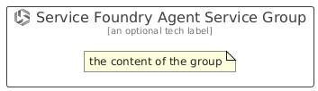

# ServiceFoundryAgentService


```text
azure/Item/AiMachineLearning/ServiceFoundryAgentService
```

```text
include('azure/Item/AiMachineLearning/ServiceFoundryAgentService')
```


| Illustration | ServiceFoundryAgentService | ServiceFoundryAgentServiceCard | ServiceFoundryAgentServiceGroup |
| :---: | :---: | :---: | :---: |
|  |  |  |  |


## Sprites
The item provides the following sriptes:

- `<$ServiceFoundryAgentServiceXs>`
- `<$ServiceFoundryAgentServiceSm>`
- `<$ServiceFoundryAgentServiceMd>`
- `<$ServiceFoundryAgentServiceLg>`


## ServiceFoundryAgentService

### Load remotely
```plantuml
@startuml
' configures the library
!global $LIB_BASE_LOCATION="https://raw.githubusercontent.com/tmorin/plantuml-libs/master/distribution"

' loads the library's bootstrap
!include $LIB_BASE_LOCATION/bootstrap.puml

' loads the package bootstrap
include('azure/bootstrap')

' loads the Item which embeds the element ServiceFoundryAgentService
include('azure/Item/AiMachineLearning/ServiceFoundryAgentService')

' renders the element
ServiceFoundryAgentService('ServiceFoundryAgentService', 'Service Foundry Agent Service', 'an optional tech label', 'an optional description')
@enduml
```

### Load locally
```plantuml
@startuml
' configures the library
!global $INCLUSION_MODE="local"
!global $LIB_BASE_LOCATION="../../.."

' loads the library's bootstrap
!include $LIB_BASE_LOCATION/bootstrap.puml

' loads the package bootstrap
include('azure/bootstrap')

' loads the Item which embeds the element ServiceFoundryAgentService
include('azure/Item/AiMachineLearning/ServiceFoundryAgentService')

' renders the element
ServiceFoundryAgentService('ServiceFoundryAgentService', 'Service Foundry Agent Service', 'an optional tech label', 'an optional description')
@enduml
```

## ServiceFoundryAgentServiceCard

### Load remotely
```plantuml
@startuml
' configures the library
!global $LIB_BASE_LOCATION="https://raw.githubusercontent.com/tmorin/plantuml-libs/master/distribution"

' loads the library's bootstrap
!include $LIB_BASE_LOCATION/bootstrap.puml

' loads the package bootstrap
include('azure/bootstrap')

' loads the Item which embeds the element ServiceFoundryAgentServiceCard
include('azure/Item/AiMachineLearning/ServiceFoundryAgentService')

' renders the element
ServiceFoundryAgentServiceCard('ServiceFoundryAgentServiceCard', 'Service Foundry Agent Service Card', 'an optional description')
@enduml
```

### Load locally
```plantuml
@startuml
' configures the library
!global $INCLUSION_MODE="local"
!global $LIB_BASE_LOCATION="../../.."

' loads the library's bootstrap
!include $LIB_BASE_LOCATION/bootstrap.puml

' loads the package bootstrap
include('azure/bootstrap')

' loads the Item which embeds the element ServiceFoundryAgentServiceCard
include('azure/Item/AiMachineLearning/ServiceFoundryAgentService')

' renders the element
ServiceFoundryAgentServiceCard('ServiceFoundryAgentServiceCard', 'Service Foundry Agent Service Card', 'an optional description')
@enduml
```

## ServiceFoundryAgentServiceGroup

### Load remotely
```plantuml
@startuml
' configures the library
!global $LIB_BASE_LOCATION="https://raw.githubusercontent.com/tmorin/plantuml-libs/master/distribution"

' loads the library's bootstrap
!include $LIB_BASE_LOCATION/bootstrap.puml

' loads the package bootstrap
include('azure/bootstrap')

' loads the Item which embeds the element ServiceFoundryAgentServiceGroup
include('azure/Item/AiMachineLearning/ServiceFoundryAgentService')

' renders the element
ServiceFoundryAgentServiceGroup('ServiceFoundryAgentServiceGroup', 'Service Foundry Agent Service Group', 'an optional tech label') {
    note as note
        the content of the group
    end note
}
@enduml
```

### Load locally
```plantuml
@startuml
' configures the library
!global $INCLUSION_MODE="local"
!global $LIB_BASE_LOCATION="../../.."

' loads the library's bootstrap
!include $LIB_BASE_LOCATION/bootstrap.puml

' loads the package bootstrap
include('azure/bootstrap')

' loads the Item which embeds the element ServiceFoundryAgentServiceGroup
include('azure/Item/AiMachineLearning/ServiceFoundryAgentService')

' renders the element
ServiceFoundryAgentServiceGroup('ServiceFoundryAgentServiceGroup', 'Service Foundry Agent Service Group', 'an optional tech label') {
    note as note
        the content of the group
    end note
}
@enduml
```

