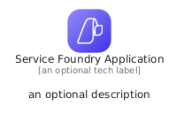
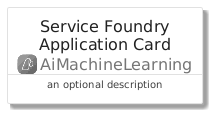
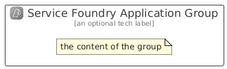

# ServiceFoundryApplication


```text
azure/Item/AiMachineLearning/ServiceFoundryApplication
```

```text
include('azure/Item/AiMachineLearning/ServiceFoundryApplication')
```


| Illustration | ServiceFoundryApplication | ServiceFoundryApplicationCard | ServiceFoundryApplicationGroup |
| :---: | :---: | :---: | :---: |
|  |  |  |  |


## Sprites
The item provides the following sriptes:

- `<$ServiceFoundryApplicationXs>`
- `<$ServiceFoundryApplicationSm>`
- `<$ServiceFoundryApplicationMd>`
- `<$ServiceFoundryApplicationLg>`


## ServiceFoundryApplication

### Load remotely
```plantuml
@startuml
' configures the library
!global $LIB_BASE_LOCATION="https://raw.githubusercontent.com/tmorin/plantuml-libs/master/distribution"

' loads the library's bootstrap
!include $LIB_BASE_LOCATION/bootstrap.puml

' loads the package bootstrap
include('azure/bootstrap')

' loads the Item which embeds the element ServiceFoundryApplication
include('azure/Item/AiMachineLearning/ServiceFoundryApplication')

' renders the element
ServiceFoundryApplication('ServiceFoundryApplication', 'Service Foundry Application', 'an optional tech label', 'an optional description')
@enduml
```

### Load locally
```plantuml
@startuml
' configures the library
!global $INCLUSION_MODE="local"
!global $LIB_BASE_LOCATION="../../.."

' loads the library's bootstrap
!include $LIB_BASE_LOCATION/bootstrap.puml

' loads the package bootstrap
include('azure/bootstrap')

' loads the Item which embeds the element ServiceFoundryApplication
include('azure/Item/AiMachineLearning/ServiceFoundryApplication')

' renders the element
ServiceFoundryApplication('ServiceFoundryApplication', 'Service Foundry Application', 'an optional tech label', 'an optional description')
@enduml
```

## ServiceFoundryApplicationCard

### Load remotely
```plantuml
@startuml
' configures the library
!global $LIB_BASE_LOCATION="https://raw.githubusercontent.com/tmorin/plantuml-libs/master/distribution"

' loads the library's bootstrap
!include $LIB_BASE_LOCATION/bootstrap.puml

' loads the package bootstrap
include('azure/bootstrap')

' loads the Item which embeds the element ServiceFoundryApplicationCard
include('azure/Item/AiMachineLearning/ServiceFoundryApplication')

' renders the element
ServiceFoundryApplicationCard('ServiceFoundryApplicationCard', 'Service Foundry Application Card', 'an optional description')
@enduml
```

### Load locally
```plantuml
@startuml
' configures the library
!global $INCLUSION_MODE="local"
!global $LIB_BASE_LOCATION="../../.."

' loads the library's bootstrap
!include $LIB_BASE_LOCATION/bootstrap.puml

' loads the package bootstrap
include('azure/bootstrap')

' loads the Item which embeds the element ServiceFoundryApplicationCard
include('azure/Item/AiMachineLearning/ServiceFoundryApplication')

' renders the element
ServiceFoundryApplicationCard('ServiceFoundryApplicationCard', 'Service Foundry Application Card', 'an optional description')
@enduml
```

## ServiceFoundryApplicationGroup

### Load remotely
```plantuml
@startuml
' configures the library
!global $LIB_BASE_LOCATION="https://raw.githubusercontent.com/tmorin/plantuml-libs/master/distribution"

' loads the library's bootstrap
!include $LIB_BASE_LOCATION/bootstrap.puml

' loads the package bootstrap
include('azure/bootstrap')

' loads the Item which embeds the element ServiceFoundryApplicationGroup
include('azure/Item/AiMachineLearning/ServiceFoundryApplication')

' renders the element
ServiceFoundryApplicationGroup('ServiceFoundryApplicationGroup', 'Service Foundry Application Group', 'an optional tech label') {
    note as note
        the content of the group
    end note
}
@enduml
```

### Load locally
```plantuml
@startuml
' configures the library
!global $INCLUSION_MODE="local"
!global $LIB_BASE_LOCATION="../../.."

' loads the library's bootstrap
!include $LIB_BASE_LOCATION/bootstrap.puml

' loads the package bootstrap
include('azure/bootstrap')

' loads the Item which embeds the element ServiceFoundryApplicationGroup
include('azure/Item/AiMachineLearning/ServiceFoundryApplication')

' renders the element
ServiceFoundryApplicationGroup('ServiceFoundryApplicationGroup', 'Service Foundry Application Group', 'an optional tech label') {
    note as note
        the content of the group
    end note
}
@enduml
```

