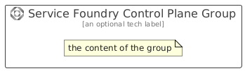

# ServiceFoundryControlPlane


```text
azure/Item/AiMachineLearning/ServiceFoundryControlPlane
```

```text
include('azure/Item/AiMachineLearning/ServiceFoundryControlPlane')
```


| Illustration | ServiceFoundryControlPlane | ServiceFoundryControlPlaneCard | ServiceFoundryControlPlaneGroup |
| :---: | :---: | :---: | :---: |
|  |  |  |  |


## Sprites
The item provides the following sriptes:

- `<$ServiceFoundryControlPlaneXs>`
- `<$ServiceFoundryControlPlaneSm>`
- `<$ServiceFoundryControlPlaneMd>`
- `<$ServiceFoundryControlPlaneLg>`


## ServiceFoundryControlPlane

### Load remotely
```plantuml
@startuml
' configures the library
!global $LIB_BASE_LOCATION="https://raw.githubusercontent.com/tmorin/plantuml-libs/master/distribution"

' loads the library's bootstrap
!include $LIB_BASE_LOCATION/bootstrap.puml

' loads the package bootstrap
include('azure/bootstrap')

' loads the Item which embeds the element ServiceFoundryControlPlane
include('azure/Item/AiMachineLearning/ServiceFoundryControlPlane')

' renders the element
ServiceFoundryControlPlane('ServiceFoundryControlPlane', 'Service Foundry Control Plane', 'an optional tech label', 'an optional description')
@enduml
```

### Load locally
```plantuml
@startuml
' configures the library
!global $INCLUSION_MODE="local"
!global $LIB_BASE_LOCATION="../../.."

' loads the library's bootstrap
!include $LIB_BASE_LOCATION/bootstrap.puml

' loads the package bootstrap
include('azure/bootstrap')

' loads the Item which embeds the element ServiceFoundryControlPlane
include('azure/Item/AiMachineLearning/ServiceFoundryControlPlane')

' renders the element
ServiceFoundryControlPlane('ServiceFoundryControlPlane', 'Service Foundry Control Plane', 'an optional tech label', 'an optional description')
@enduml
```

## ServiceFoundryControlPlaneCard

### Load remotely
```plantuml
@startuml
' configures the library
!global $LIB_BASE_LOCATION="https://raw.githubusercontent.com/tmorin/plantuml-libs/master/distribution"

' loads the library's bootstrap
!include $LIB_BASE_LOCATION/bootstrap.puml

' loads the package bootstrap
include('azure/bootstrap')

' loads the Item which embeds the element ServiceFoundryControlPlaneCard
include('azure/Item/AiMachineLearning/ServiceFoundryControlPlane')

' renders the element
ServiceFoundryControlPlaneCard('ServiceFoundryControlPlaneCard', 'Service Foundry Control Plane Card', 'an optional description')
@enduml
```

### Load locally
```plantuml
@startuml
' configures the library
!global $INCLUSION_MODE="local"
!global $LIB_BASE_LOCATION="../../.."

' loads the library's bootstrap
!include $LIB_BASE_LOCATION/bootstrap.puml

' loads the package bootstrap
include('azure/bootstrap')

' loads the Item which embeds the element ServiceFoundryControlPlaneCard
include('azure/Item/AiMachineLearning/ServiceFoundryControlPlane')

' renders the element
ServiceFoundryControlPlaneCard('ServiceFoundryControlPlaneCard', 'Service Foundry Control Plane Card', 'an optional description')
@enduml
```

## ServiceFoundryControlPlaneGroup

### Load remotely
```plantuml
@startuml
' configures the library
!global $LIB_BASE_LOCATION="https://raw.githubusercontent.com/tmorin/plantuml-libs/master/distribution"

' loads the library's bootstrap
!include $LIB_BASE_LOCATION/bootstrap.puml

' loads the package bootstrap
include('azure/bootstrap')

' loads the Item which embeds the element ServiceFoundryControlPlaneGroup
include('azure/Item/AiMachineLearning/ServiceFoundryControlPlane')

' renders the element
ServiceFoundryControlPlaneGroup('ServiceFoundryControlPlaneGroup', 'Service Foundry Control Plane Group', 'an optional tech label') {
    note as note
        the content of the group
    end note
}
@enduml
```

### Load locally
```plantuml
@startuml
' configures the library
!global $INCLUSION_MODE="local"
!global $LIB_BASE_LOCATION="../../.."

' loads the library's bootstrap
!include $LIB_BASE_LOCATION/bootstrap.puml

' loads the package bootstrap
include('azure/bootstrap')

' loads the Item which embeds the element ServiceFoundryControlPlaneGroup
include('azure/Item/AiMachineLearning/ServiceFoundryControlPlane')

' renders the element
ServiceFoundryControlPlaneGroup('ServiceFoundryControlPlaneGroup', 'Service Foundry Control Plane Group', 'an optional tech label') {
    note as note
        the content of the group
    end note
}
@enduml
```

