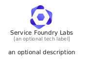
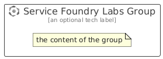

# ServiceFoundryLabs


```text
azure/Item/AiMachineLearning/ServiceFoundryLabs
```

```text
include('azure/Item/AiMachineLearning/ServiceFoundryLabs')
```


| Illustration | ServiceFoundryLabs | ServiceFoundryLabsCard | ServiceFoundryLabsGroup |
| :---: | :---: | :---: | :---: |
|  |  |  |  |


## Sprites
The item provides the following sriptes:

- `<$ServiceFoundryLabsXs>`
- `<$ServiceFoundryLabsSm>`
- `<$ServiceFoundryLabsMd>`
- `<$ServiceFoundryLabsLg>`


## ServiceFoundryLabs

### Load remotely
```plantuml
@startuml
' configures the library
!global $LIB_BASE_LOCATION="https://raw.githubusercontent.com/tmorin/plantuml-libs/master/distribution"

' loads the library's bootstrap
!include $LIB_BASE_LOCATION/bootstrap.puml

' loads the package bootstrap
include('azure/bootstrap')

' loads the Item which embeds the element ServiceFoundryLabs
include('azure/Item/AiMachineLearning/ServiceFoundryLabs')

' renders the element
ServiceFoundryLabs('ServiceFoundryLabs', 'Service Foundry Labs', 'an optional tech label', 'an optional description')
@enduml
```

### Load locally
```plantuml
@startuml
' configures the library
!global $INCLUSION_MODE="local"
!global $LIB_BASE_LOCATION="../../.."

' loads the library's bootstrap
!include $LIB_BASE_LOCATION/bootstrap.puml

' loads the package bootstrap
include('azure/bootstrap')

' loads the Item which embeds the element ServiceFoundryLabs
include('azure/Item/AiMachineLearning/ServiceFoundryLabs')

' renders the element
ServiceFoundryLabs('ServiceFoundryLabs', 'Service Foundry Labs', 'an optional tech label', 'an optional description')
@enduml
```

## ServiceFoundryLabsCard

### Load remotely
```plantuml
@startuml
' configures the library
!global $LIB_BASE_LOCATION="https://raw.githubusercontent.com/tmorin/plantuml-libs/master/distribution"

' loads the library's bootstrap
!include $LIB_BASE_LOCATION/bootstrap.puml

' loads the package bootstrap
include('azure/bootstrap')

' loads the Item which embeds the element ServiceFoundryLabsCard
include('azure/Item/AiMachineLearning/ServiceFoundryLabs')

' renders the element
ServiceFoundryLabsCard('ServiceFoundryLabsCard', 'Service Foundry Labs Card', 'an optional description')
@enduml
```

### Load locally
```plantuml
@startuml
' configures the library
!global $INCLUSION_MODE="local"
!global $LIB_BASE_LOCATION="../../.."

' loads the library's bootstrap
!include $LIB_BASE_LOCATION/bootstrap.puml

' loads the package bootstrap
include('azure/bootstrap')

' loads the Item which embeds the element ServiceFoundryLabsCard
include('azure/Item/AiMachineLearning/ServiceFoundryLabs')

' renders the element
ServiceFoundryLabsCard('ServiceFoundryLabsCard', 'Service Foundry Labs Card', 'an optional description')
@enduml
```

## ServiceFoundryLabsGroup

### Load remotely
```plantuml
@startuml
' configures the library
!global $LIB_BASE_LOCATION="https://raw.githubusercontent.com/tmorin/plantuml-libs/master/distribution"

' loads the library's bootstrap
!include $LIB_BASE_LOCATION/bootstrap.puml

' loads the package bootstrap
include('azure/bootstrap')

' loads the Item which embeds the element ServiceFoundryLabsGroup
include('azure/Item/AiMachineLearning/ServiceFoundryLabs')

' renders the element
ServiceFoundryLabsGroup('ServiceFoundryLabsGroup', 'Service Foundry Labs Group', 'an optional tech label') {
    note as note
        the content of the group
    end note
}
@enduml
```

### Load locally
```plantuml
@startuml
' configures the library
!global $INCLUSION_MODE="local"
!global $LIB_BASE_LOCATION="../../.."

' loads the library's bootstrap
!include $LIB_BASE_LOCATION/bootstrap.puml

' loads the package bootstrap
include('azure/bootstrap')

' loads the Item which embeds the element ServiceFoundryLabsGroup
include('azure/Item/AiMachineLearning/ServiceFoundryLabs')

' renders the element
ServiceFoundryLabsGroup('ServiceFoundryLabsGroup', 'Service Foundry Labs Group', 'an optional tech label') {
    note as note
        the content of the group
    end note
}
@enduml
```

