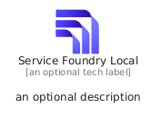
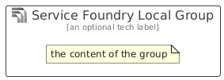

# ServiceFoundryLocal


```text
azure/Item/AiMachineLearning/ServiceFoundryLocal
```

```text
include('azure/Item/AiMachineLearning/ServiceFoundryLocal')
```


| Illustration | ServiceFoundryLocal | ServiceFoundryLocalCard | ServiceFoundryLocalGroup |
| :---: | :---: | :---: | :---: |
|  |  |  |  |


## Sprites
The item provides the following sriptes:

- `<$ServiceFoundryLocalXs>`
- `<$ServiceFoundryLocalSm>`
- `<$ServiceFoundryLocalMd>`
- `<$ServiceFoundryLocalLg>`


## ServiceFoundryLocal

### Load remotely
```plantuml
@startuml
' configures the library
!global $LIB_BASE_LOCATION="https://raw.githubusercontent.com/tmorin/plantuml-libs/master/distribution"

' loads the library's bootstrap
!include $LIB_BASE_LOCATION/bootstrap.puml

' loads the package bootstrap
include('azure/bootstrap')

' loads the Item which embeds the element ServiceFoundryLocal
include('azure/Item/AiMachineLearning/ServiceFoundryLocal')

' renders the element
ServiceFoundryLocal('ServiceFoundryLocal', 'Service Foundry Local', 'an optional tech label', 'an optional description')
@enduml
```

### Load locally
```plantuml
@startuml
' configures the library
!global $INCLUSION_MODE="local"
!global $LIB_BASE_LOCATION="../../.."

' loads the library's bootstrap
!include $LIB_BASE_LOCATION/bootstrap.puml

' loads the package bootstrap
include('azure/bootstrap')

' loads the Item which embeds the element ServiceFoundryLocal
include('azure/Item/AiMachineLearning/ServiceFoundryLocal')

' renders the element
ServiceFoundryLocal('ServiceFoundryLocal', 'Service Foundry Local', 'an optional tech label', 'an optional description')
@enduml
```

## ServiceFoundryLocalCard

### Load remotely
```plantuml
@startuml
' configures the library
!global $LIB_BASE_LOCATION="https://raw.githubusercontent.com/tmorin/plantuml-libs/master/distribution"

' loads the library's bootstrap
!include $LIB_BASE_LOCATION/bootstrap.puml

' loads the package bootstrap
include('azure/bootstrap')

' loads the Item which embeds the element ServiceFoundryLocalCard
include('azure/Item/AiMachineLearning/ServiceFoundryLocal')

' renders the element
ServiceFoundryLocalCard('ServiceFoundryLocalCard', 'Service Foundry Local Card', 'an optional description')
@enduml
```

### Load locally
```plantuml
@startuml
' configures the library
!global $INCLUSION_MODE="local"
!global $LIB_BASE_LOCATION="../../.."

' loads the library's bootstrap
!include $LIB_BASE_LOCATION/bootstrap.puml

' loads the package bootstrap
include('azure/bootstrap')

' loads the Item which embeds the element ServiceFoundryLocalCard
include('azure/Item/AiMachineLearning/ServiceFoundryLocal')

' renders the element
ServiceFoundryLocalCard('ServiceFoundryLocalCard', 'Service Foundry Local Card', 'an optional description')
@enduml
```

## ServiceFoundryLocalGroup

### Load remotely
```plantuml
@startuml
' configures the library
!global $LIB_BASE_LOCATION="https://raw.githubusercontent.com/tmorin/plantuml-libs/master/distribution"

' loads the library's bootstrap
!include $LIB_BASE_LOCATION/bootstrap.puml

' loads the package bootstrap
include('azure/bootstrap')

' loads the Item which embeds the element ServiceFoundryLocalGroup
include('azure/Item/AiMachineLearning/ServiceFoundryLocal')

' renders the element
ServiceFoundryLocalGroup('ServiceFoundryLocalGroup', 'Service Foundry Local Group', 'an optional tech label') {
    note as note
        the content of the group
    end note
}
@enduml
```

### Load locally
```plantuml
@startuml
' configures the library
!global $INCLUSION_MODE="local"
!global $LIB_BASE_LOCATION="../../.."

' loads the library's bootstrap
!include $LIB_BASE_LOCATION/bootstrap.puml

' loads the package bootstrap
include('azure/bootstrap')

' loads the Item which embeds the element ServiceFoundryLocalGroup
include('azure/Item/AiMachineLearning/ServiceFoundryLocal')

' renders the element
ServiceFoundryLocalGroup('ServiceFoundryLocalGroup', 'Service Foundry Local Group', 'an optional tech label') {
    note as note
        the content of the group
    end note
}
@enduml
```

