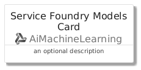
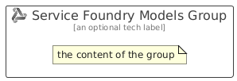

# ServiceFoundryModels


```text
azure/Item/AiMachineLearning/ServiceFoundryModels
```

```text
include('azure/Item/AiMachineLearning/ServiceFoundryModels')
```


| Illustration | ServiceFoundryModels | ServiceFoundryModelsCard | ServiceFoundryModelsGroup |
| :---: | :---: | :---: | :---: |
|  |  |  |  |


## Sprites
The item provides the following sriptes:

- `<$ServiceFoundryModelsXs>`
- `<$ServiceFoundryModelsSm>`
- `<$ServiceFoundryModelsMd>`
- `<$ServiceFoundryModelsLg>`


## ServiceFoundryModels

### Load remotely
```plantuml
@startuml
' configures the library
!global $LIB_BASE_LOCATION="https://raw.githubusercontent.com/tmorin/plantuml-libs/master/distribution"

' loads the library's bootstrap
!include $LIB_BASE_LOCATION/bootstrap.puml

' loads the package bootstrap
include('azure/bootstrap')

' loads the Item which embeds the element ServiceFoundryModels
include('azure/Item/AiMachineLearning/ServiceFoundryModels')

' renders the element
ServiceFoundryModels('ServiceFoundryModels', 'Service Foundry Models', 'an optional tech label', 'an optional description')
@enduml
```

### Load locally
```plantuml
@startuml
' configures the library
!global $INCLUSION_MODE="local"
!global $LIB_BASE_LOCATION="../../.."

' loads the library's bootstrap
!include $LIB_BASE_LOCATION/bootstrap.puml

' loads the package bootstrap
include('azure/bootstrap')

' loads the Item which embeds the element ServiceFoundryModels
include('azure/Item/AiMachineLearning/ServiceFoundryModels')

' renders the element
ServiceFoundryModels('ServiceFoundryModels', 'Service Foundry Models', 'an optional tech label', 'an optional description')
@enduml
```

## ServiceFoundryModelsCard

### Load remotely
```plantuml
@startuml
' configures the library
!global $LIB_BASE_LOCATION="https://raw.githubusercontent.com/tmorin/plantuml-libs/master/distribution"

' loads the library's bootstrap
!include $LIB_BASE_LOCATION/bootstrap.puml

' loads the package bootstrap
include('azure/bootstrap')

' loads the Item which embeds the element ServiceFoundryModelsCard
include('azure/Item/AiMachineLearning/ServiceFoundryModels')

' renders the element
ServiceFoundryModelsCard('ServiceFoundryModelsCard', 'Service Foundry Models Card', 'an optional description')
@enduml
```

### Load locally
```plantuml
@startuml
' configures the library
!global $INCLUSION_MODE="local"
!global $LIB_BASE_LOCATION="../../.."

' loads the library's bootstrap
!include $LIB_BASE_LOCATION/bootstrap.puml

' loads the package bootstrap
include('azure/bootstrap')

' loads the Item which embeds the element ServiceFoundryModelsCard
include('azure/Item/AiMachineLearning/ServiceFoundryModels')

' renders the element
ServiceFoundryModelsCard('ServiceFoundryModelsCard', 'Service Foundry Models Card', 'an optional description')
@enduml
```

## ServiceFoundryModelsGroup

### Load remotely
```plantuml
@startuml
' configures the library
!global $LIB_BASE_LOCATION="https://raw.githubusercontent.com/tmorin/plantuml-libs/master/distribution"

' loads the library's bootstrap
!include $LIB_BASE_LOCATION/bootstrap.puml

' loads the package bootstrap
include('azure/bootstrap')

' loads the Item which embeds the element ServiceFoundryModelsGroup
include('azure/Item/AiMachineLearning/ServiceFoundryModels')

' renders the element
ServiceFoundryModelsGroup('ServiceFoundryModelsGroup', 'Service Foundry Models Group', 'an optional tech label') {
    note as note
        the content of the group
    end note
}
@enduml
```

### Load locally
```plantuml
@startuml
' configures the library
!global $INCLUSION_MODE="local"
!global $LIB_BASE_LOCATION="../../.."

' loads the library's bootstrap
!include $LIB_BASE_LOCATION/bootstrap.puml

' loads the package bootstrap
include('azure/bootstrap')

' loads the Item which embeds the element ServiceFoundryModelsGroup
include('azure/Item/AiMachineLearning/ServiceFoundryModels')

' renders the element
ServiceFoundryModelsGroup('ServiceFoundryModelsGroup', 'Service Foundry Models Group', 'an optional tech label') {
    note as note
        the content of the group
    end note
}
@enduml
```

