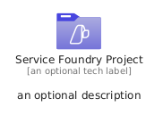
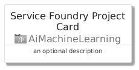
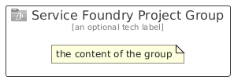

# ServiceFoundryProject


```text
azure/Item/AiMachineLearning/ServiceFoundryProject
```

```text
include('azure/Item/AiMachineLearning/ServiceFoundryProject')
```


| Illustration | ServiceFoundryProject | ServiceFoundryProjectCard | ServiceFoundryProjectGroup |
| :---: | :---: | :---: | :---: |
|  |  |  |  |


## Sprites
The item provides the following sriptes:

- `<$ServiceFoundryProjectXs>`
- `<$ServiceFoundryProjectSm>`
- `<$ServiceFoundryProjectMd>`
- `<$ServiceFoundryProjectLg>`


## ServiceFoundryProject

### Load remotely
```plantuml
@startuml
' configures the library
!global $LIB_BASE_LOCATION="https://raw.githubusercontent.com/tmorin/plantuml-libs/master/distribution"

' loads the library's bootstrap
!include $LIB_BASE_LOCATION/bootstrap.puml

' loads the package bootstrap
include('azure/bootstrap')

' loads the Item which embeds the element ServiceFoundryProject
include('azure/Item/AiMachineLearning/ServiceFoundryProject')

' renders the element
ServiceFoundryProject('ServiceFoundryProject', 'Service Foundry Project', 'an optional tech label', 'an optional description')
@enduml
```

### Load locally
```plantuml
@startuml
' configures the library
!global $INCLUSION_MODE="local"
!global $LIB_BASE_LOCATION="../../.."

' loads the library's bootstrap
!include $LIB_BASE_LOCATION/bootstrap.puml

' loads the package bootstrap
include('azure/bootstrap')

' loads the Item which embeds the element ServiceFoundryProject
include('azure/Item/AiMachineLearning/ServiceFoundryProject')

' renders the element
ServiceFoundryProject('ServiceFoundryProject', 'Service Foundry Project', 'an optional tech label', 'an optional description')
@enduml
```

## ServiceFoundryProjectCard

### Load remotely
```plantuml
@startuml
' configures the library
!global $LIB_BASE_LOCATION="https://raw.githubusercontent.com/tmorin/plantuml-libs/master/distribution"

' loads the library's bootstrap
!include $LIB_BASE_LOCATION/bootstrap.puml

' loads the package bootstrap
include('azure/bootstrap')

' loads the Item which embeds the element ServiceFoundryProjectCard
include('azure/Item/AiMachineLearning/ServiceFoundryProject')

' renders the element
ServiceFoundryProjectCard('ServiceFoundryProjectCard', 'Service Foundry Project Card', 'an optional description')
@enduml
```

### Load locally
```plantuml
@startuml
' configures the library
!global $INCLUSION_MODE="local"
!global $LIB_BASE_LOCATION="../../.."

' loads the library's bootstrap
!include $LIB_BASE_LOCATION/bootstrap.puml

' loads the package bootstrap
include('azure/bootstrap')

' loads the Item which embeds the element ServiceFoundryProjectCard
include('azure/Item/AiMachineLearning/ServiceFoundryProject')

' renders the element
ServiceFoundryProjectCard('ServiceFoundryProjectCard', 'Service Foundry Project Card', 'an optional description')
@enduml
```

## ServiceFoundryProjectGroup

### Load remotely
```plantuml
@startuml
' configures the library
!global $LIB_BASE_LOCATION="https://raw.githubusercontent.com/tmorin/plantuml-libs/master/distribution"

' loads the library's bootstrap
!include $LIB_BASE_LOCATION/bootstrap.puml

' loads the package bootstrap
include('azure/bootstrap')

' loads the Item which embeds the element ServiceFoundryProjectGroup
include('azure/Item/AiMachineLearning/ServiceFoundryProject')

' renders the element
ServiceFoundryProjectGroup('ServiceFoundryProjectGroup', 'Service Foundry Project Group', 'an optional tech label') {
    note as note
        the content of the group
    end note
}
@enduml
```

### Load locally
```plantuml
@startuml
' configures the library
!global $INCLUSION_MODE="local"
!global $LIB_BASE_LOCATION="../../.."

' loads the library's bootstrap
!include $LIB_BASE_LOCATION/bootstrap.puml

' loads the package bootstrap
include('azure/bootstrap')

' loads the Item which embeds the element ServiceFoundryProjectGroup
include('azure/Item/AiMachineLearning/ServiceFoundryProject')

' renders the element
ServiceFoundryProjectGroup('ServiceFoundryProjectGroup', 'Service Foundry Project Group', 'an optional tech label') {
    note as note
        the content of the group
    end note
}
@enduml
```

