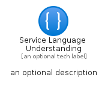
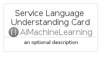
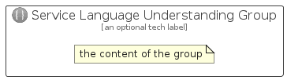

# ServiceLanguageUnderstanding


```text
azure/Item/AiMachineLearning/ServiceLanguageUnderstanding
```

```text
include('azure/Item/AiMachineLearning/ServiceLanguageUnderstanding')
```


| Illustration | ServiceLanguageUnderstanding | ServiceLanguageUnderstandingCard | ServiceLanguageUnderstandingGroup |
| :---: | :---: | :---: | :---: |
|  |  |  |  |


## Sprites
The item provides the following sriptes:

- `<$ServiceLanguageUnderstandingXs>`
- `<$ServiceLanguageUnderstandingSm>`
- `<$ServiceLanguageUnderstandingMd>`
- `<$ServiceLanguageUnderstandingLg>`


## ServiceLanguageUnderstanding

### Load remotely
```plantuml
@startuml
' configures the library
!global $LIB_BASE_LOCATION="https://raw.githubusercontent.com/tmorin/plantuml-libs/master/distribution"

' loads the library's bootstrap
!include $LIB_BASE_LOCATION/bootstrap.puml

' loads the package bootstrap
include('azure/bootstrap')

' loads the Item which embeds the element ServiceLanguageUnderstanding
include('azure/Item/AiMachineLearning/ServiceLanguageUnderstanding')

' renders the element
ServiceLanguageUnderstanding('ServiceLanguageUnderstanding', 'Service Language Understanding', 'an optional tech label', 'an optional description')
@enduml
```

### Load locally
```plantuml
@startuml
' configures the library
!global $INCLUSION_MODE="local"
!global $LIB_BASE_LOCATION="../../.."

' loads the library's bootstrap
!include $LIB_BASE_LOCATION/bootstrap.puml

' loads the package bootstrap
include('azure/bootstrap')

' loads the Item which embeds the element ServiceLanguageUnderstanding
include('azure/Item/AiMachineLearning/ServiceLanguageUnderstanding')

' renders the element
ServiceLanguageUnderstanding('ServiceLanguageUnderstanding', 'Service Language Understanding', 'an optional tech label', 'an optional description')
@enduml
```

## ServiceLanguageUnderstandingCard

### Load remotely
```plantuml
@startuml
' configures the library
!global $LIB_BASE_LOCATION="https://raw.githubusercontent.com/tmorin/plantuml-libs/master/distribution"

' loads the library's bootstrap
!include $LIB_BASE_LOCATION/bootstrap.puml

' loads the package bootstrap
include('azure/bootstrap')

' loads the Item which embeds the element ServiceLanguageUnderstandingCard
include('azure/Item/AiMachineLearning/ServiceLanguageUnderstanding')

' renders the element
ServiceLanguageUnderstandingCard('ServiceLanguageUnderstandingCard', 'Service Language Understanding Card', 'an optional description')
@enduml
```

### Load locally
```plantuml
@startuml
' configures the library
!global $INCLUSION_MODE="local"
!global $LIB_BASE_LOCATION="../../.."

' loads the library's bootstrap
!include $LIB_BASE_LOCATION/bootstrap.puml

' loads the package bootstrap
include('azure/bootstrap')

' loads the Item which embeds the element ServiceLanguageUnderstandingCard
include('azure/Item/AiMachineLearning/ServiceLanguageUnderstanding')

' renders the element
ServiceLanguageUnderstandingCard('ServiceLanguageUnderstandingCard', 'Service Language Understanding Card', 'an optional description')
@enduml
```

## ServiceLanguageUnderstandingGroup

### Load remotely
```plantuml
@startuml
' configures the library
!global $LIB_BASE_LOCATION="https://raw.githubusercontent.com/tmorin/plantuml-libs/master/distribution"

' loads the library's bootstrap
!include $LIB_BASE_LOCATION/bootstrap.puml

' loads the package bootstrap
include('azure/bootstrap')

' loads the Item which embeds the element ServiceLanguageUnderstandingGroup
include('azure/Item/AiMachineLearning/ServiceLanguageUnderstanding')

' renders the element
ServiceLanguageUnderstandingGroup('ServiceLanguageUnderstandingGroup', 'Service Language Understanding Group', 'an optional tech label') {
    note as note
        the content of the group
    end note
}
@enduml
```

### Load locally
```plantuml
@startuml
' configures the library
!global $INCLUSION_MODE="local"
!global $LIB_BASE_LOCATION="../../.."

' loads the library's bootstrap
!include $LIB_BASE_LOCATION/bootstrap.puml

' loads the package bootstrap
include('azure/bootstrap')

' loads the Item which embeds the element ServiceLanguageUnderstandingGroup
include('azure/Item/AiMachineLearning/ServiceLanguageUnderstanding')

' renders the element
ServiceLanguageUnderstandingGroup('ServiceLanguageUnderstandingGroup', 'Service Language Understanding Group', 'an optional tech label') {
    note as note
        the content of the group
    end note
}
@enduml
```

