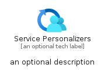
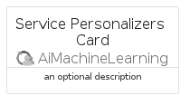
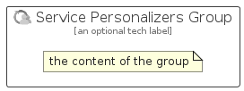

# ServicePersonalizers


```text
azure/Item/AiMachineLearning/ServicePersonalizers
```

```text
include('azure/Item/AiMachineLearning/ServicePersonalizers')
```


| Illustration | ServicePersonalizers | ServicePersonalizersCard | ServicePersonalizersGroup |
| :---: | :---: | :---: | :---: |
|  |  |  |  |


## Sprites
The item provides the following sriptes:

- `<$ServicePersonalizersXs>`
- `<$ServicePersonalizersSm>`
- `<$ServicePersonalizersMd>`
- `<$ServicePersonalizersLg>`


## ServicePersonalizers

### Load remotely
```plantuml
@startuml
' configures the library
!global $LIB_BASE_LOCATION="https://raw.githubusercontent.com/tmorin/plantuml-libs/master/distribution"

' loads the library's bootstrap
!include $LIB_BASE_LOCATION/bootstrap.puml

' loads the package bootstrap
include('azure/bootstrap')

' loads the Item which embeds the element ServicePersonalizers
include('azure/Item/AiMachineLearning/ServicePersonalizers')

' renders the element
ServicePersonalizers('ServicePersonalizers', 'Service Personalizers', 'an optional tech label', 'an optional description')
@enduml
```

### Load locally
```plantuml
@startuml
' configures the library
!global $INCLUSION_MODE="local"
!global $LIB_BASE_LOCATION="../../.."

' loads the library's bootstrap
!include $LIB_BASE_LOCATION/bootstrap.puml

' loads the package bootstrap
include('azure/bootstrap')

' loads the Item which embeds the element ServicePersonalizers
include('azure/Item/AiMachineLearning/ServicePersonalizers')

' renders the element
ServicePersonalizers('ServicePersonalizers', 'Service Personalizers', 'an optional tech label', 'an optional description')
@enduml
```

## ServicePersonalizersCard

### Load remotely
```plantuml
@startuml
' configures the library
!global $LIB_BASE_LOCATION="https://raw.githubusercontent.com/tmorin/plantuml-libs/master/distribution"

' loads the library's bootstrap
!include $LIB_BASE_LOCATION/bootstrap.puml

' loads the package bootstrap
include('azure/bootstrap')

' loads the Item which embeds the element ServicePersonalizersCard
include('azure/Item/AiMachineLearning/ServicePersonalizers')

' renders the element
ServicePersonalizersCard('ServicePersonalizersCard', 'Service Personalizers Card', 'an optional description')
@enduml
```

### Load locally
```plantuml
@startuml
' configures the library
!global $INCLUSION_MODE="local"
!global $LIB_BASE_LOCATION="../../.."

' loads the library's bootstrap
!include $LIB_BASE_LOCATION/bootstrap.puml

' loads the package bootstrap
include('azure/bootstrap')

' loads the Item which embeds the element ServicePersonalizersCard
include('azure/Item/AiMachineLearning/ServicePersonalizers')

' renders the element
ServicePersonalizersCard('ServicePersonalizersCard', 'Service Personalizers Card', 'an optional description')
@enduml
```

## ServicePersonalizersGroup

### Load remotely
```plantuml
@startuml
' configures the library
!global $LIB_BASE_LOCATION="https://raw.githubusercontent.com/tmorin/plantuml-libs/master/distribution"

' loads the library's bootstrap
!include $LIB_BASE_LOCATION/bootstrap.puml

' loads the package bootstrap
include('azure/bootstrap')

' loads the Item which embeds the element ServicePersonalizersGroup
include('azure/Item/AiMachineLearning/ServicePersonalizers')

' renders the element
ServicePersonalizersGroup('ServicePersonalizersGroup', 'Service Personalizers Group', 'an optional tech label') {
    note as note
        the content of the group
    end note
}
@enduml
```

### Load locally
```plantuml
@startuml
' configures the library
!global $INCLUSION_MODE="local"
!global $LIB_BASE_LOCATION="../../.."

' loads the library's bootstrap
!include $LIB_BASE_LOCATION/bootstrap.puml

' loads the package bootstrap
include('azure/bootstrap')

' loads the Item which embeds the element ServicePersonalizersGroup
include('azure/Item/AiMachineLearning/ServicePersonalizers')

' renders the element
ServicePersonalizersGroup('ServicePersonalizersGroup', 'Service Personalizers Group', 'an optional tech label') {
    note as note
        the content of the group
    end note
}
@enduml
```

