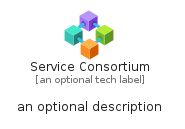
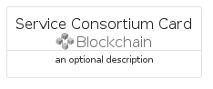
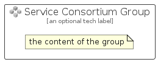

# ServiceConsortium


```text
azure/Item/Blockchain/ServiceConsortium
```

```text
include('azure/Item/Blockchain/ServiceConsortium')
```


| Illustration | ServiceConsortium | ServiceConsortiumCard | ServiceConsortiumGroup |
| :---: | :---: | :---: | :---: |
|  |  |  |  |


## Sprites
The item provides the following sriptes:

- `<$ServiceConsortiumXs>`
- `<$ServiceConsortiumSm>`
- `<$ServiceConsortiumMd>`
- `<$ServiceConsortiumLg>`


## ServiceConsortium

### Load remotely
```plantuml
@startuml
' configures the library
!global $LIB_BASE_LOCATION="https://raw.githubusercontent.com/tmorin/plantuml-libs/master/distribution"

' loads the library's bootstrap
!include $LIB_BASE_LOCATION/bootstrap.puml

' loads the package bootstrap
include('azure/bootstrap')

' loads the Item which embeds the element ServiceConsortium
include('azure/Item/Blockchain/ServiceConsortium')

' renders the element
ServiceConsortium('ServiceConsortium', 'Service Consortium', 'an optional tech label', 'an optional description')
@enduml
```

### Load locally
```plantuml
@startuml
' configures the library
!global $INCLUSION_MODE="local"
!global $LIB_BASE_LOCATION="../../.."

' loads the library's bootstrap
!include $LIB_BASE_LOCATION/bootstrap.puml

' loads the package bootstrap
include('azure/bootstrap')

' loads the Item which embeds the element ServiceConsortium
include('azure/Item/Blockchain/ServiceConsortium')

' renders the element
ServiceConsortium('ServiceConsortium', 'Service Consortium', 'an optional tech label', 'an optional description')
@enduml
```

## ServiceConsortiumCard

### Load remotely
```plantuml
@startuml
' configures the library
!global $LIB_BASE_LOCATION="https://raw.githubusercontent.com/tmorin/plantuml-libs/master/distribution"

' loads the library's bootstrap
!include $LIB_BASE_LOCATION/bootstrap.puml

' loads the package bootstrap
include('azure/bootstrap')

' loads the Item which embeds the element ServiceConsortiumCard
include('azure/Item/Blockchain/ServiceConsortium')

' renders the element
ServiceConsortiumCard('ServiceConsortiumCard', 'Service Consortium Card', 'an optional description')
@enduml
```

### Load locally
```plantuml
@startuml
' configures the library
!global $INCLUSION_MODE="local"
!global $LIB_BASE_LOCATION="../../.."

' loads the library's bootstrap
!include $LIB_BASE_LOCATION/bootstrap.puml

' loads the package bootstrap
include('azure/bootstrap')

' loads the Item which embeds the element ServiceConsortiumCard
include('azure/Item/Blockchain/ServiceConsortium')

' renders the element
ServiceConsortiumCard('ServiceConsortiumCard', 'Service Consortium Card', 'an optional description')
@enduml
```

## ServiceConsortiumGroup

### Load remotely
```plantuml
@startuml
' configures the library
!global $LIB_BASE_LOCATION="https://raw.githubusercontent.com/tmorin/plantuml-libs/master/distribution"

' loads the library's bootstrap
!include $LIB_BASE_LOCATION/bootstrap.puml

' loads the package bootstrap
include('azure/bootstrap')

' loads the Item which embeds the element ServiceConsortiumGroup
include('azure/Item/Blockchain/ServiceConsortium')

' renders the element
ServiceConsortiumGroup('ServiceConsortiumGroup', 'Service Consortium Group', 'an optional tech label') {
    note as note
        the content of the group
    end note
}
@enduml
```

### Load locally
```plantuml
@startuml
' configures the library
!global $INCLUSION_MODE="local"
!global $LIB_BASE_LOCATION="../../.."

' loads the library's bootstrap
!include $LIB_BASE_LOCATION/bootstrap.puml

' loads the package bootstrap
include('azure/bootstrap')

' loads the Item which embeds the element ServiceConsortiumGroup
include('azure/Item/Blockchain/ServiceConsortium')

' renders the element
ServiceConsortiumGroup('ServiceConsortiumGroup', 'Service Consortium Group', 'an optional tech label') {
    note as note
        the content of the group
    end note
}
@enduml
```

