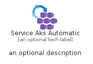
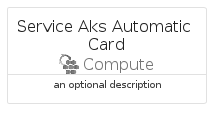
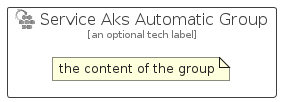

# ServiceAksAutomatic


```text
azure/Item/Compute/ServiceAksAutomatic
```

```text
include('azure/Item/Compute/ServiceAksAutomatic')
```


| Illustration | ServiceAksAutomatic | ServiceAksAutomaticCard | ServiceAksAutomaticGroup |
| :---: | :---: | :---: | :---: |
|  |  |  |  |


## Sprites
The item provides the following sriptes:

- `<$ServiceAksAutomaticXs>`
- `<$ServiceAksAutomaticSm>`
- `<$ServiceAksAutomaticMd>`
- `<$ServiceAksAutomaticLg>`


## ServiceAksAutomatic

### Load remotely
```plantuml
@startuml
' configures the library
!global $LIB_BASE_LOCATION="https://raw.githubusercontent.com/tmorin/plantuml-libs/master/distribution"

' loads the library's bootstrap
!include $LIB_BASE_LOCATION/bootstrap.puml

' loads the package bootstrap
include('azure/bootstrap')

' loads the Item which embeds the element ServiceAksAutomatic
include('azure/Item/Compute/ServiceAksAutomatic')

' renders the element
ServiceAksAutomatic('ServiceAksAutomatic', 'Service Aks Automatic', 'an optional tech label', 'an optional description')
@enduml
```

### Load locally
```plantuml
@startuml
' configures the library
!global $INCLUSION_MODE="local"
!global $LIB_BASE_LOCATION="../../.."

' loads the library's bootstrap
!include $LIB_BASE_LOCATION/bootstrap.puml

' loads the package bootstrap
include('azure/bootstrap')

' loads the Item which embeds the element ServiceAksAutomatic
include('azure/Item/Compute/ServiceAksAutomatic')

' renders the element
ServiceAksAutomatic('ServiceAksAutomatic', 'Service Aks Automatic', 'an optional tech label', 'an optional description')
@enduml
```

## ServiceAksAutomaticCard

### Load remotely
```plantuml
@startuml
' configures the library
!global $LIB_BASE_LOCATION="https://raw.githubusercontent.com/tmorin/plantuml-libs/master/distribution"

' loads the library's bootstrap
!include $LIB_BASE_LOCATION/bootstrap.puml

' loads the package bootstrap
include('azure/bootstrap')

' loads the Item which embeds the element ServiceAksAutomaticCard
include('azure/Item/Compute/ServiceAksAutomatic')

' renders the element
ServiceAksAutomaticCard('ServiceAksAutomaticCard', 'Service Aks Automatic Card', 'an optional description')
@enduml
```

### Load locally
```plantuml
@startuml
' configures the library
!global $INCLUSION_MODE="local"
!global $LIB_BASE_LOCATION="../../.."

' loads the library's bootstrap
!include $LIB_BASE_LOCATION/bootstrap.puml

' loads the package bootstrap
include('azure/bootstrap')

' loads the Item which embeds the element ServiceAksAutomaticCard
include('azure/Item/Compute/ServiceAksAutomatic')

' renders the element
ServiceAksAutomaticCard('ServiceAksAutomaticCard', 'Service Aks Automatic Card', 'an optional description')
@enduml
```

## ServiceAksAutomaticGroup

### Load remotely
```plantuml
@startuml
' configures the library
!global $LIB_BASE_LOCATION="https://raw.githubusercontent.com/tmorin/plantuml-libs/master/distribution"

' loads the library's bootstrap
!include $LIB_BASE_LOCATION/bootstrap.puml

' loads the package bootstrap
include('azure/bootstrap')

' loads the Item which embeds the element ServiceAksAutomaticGroup
include('azure/Item/Compute/ServiceAksAutomatic')

' renders the element
ServiceAksAutomaticGroup('ServiceAksAutomaticGroup', 'Service Aks Automatic Group', 'an optional tech label') {
    note as note
        the content of the group
    end note
}
@enduml
```

### Load locally
```plantuml
@startuml
' configures the library
!global $INCLUSION_MODE="local"
!global $LIB_BASE_LOCATION="../../.."

' loads the library's bootstrap
!include $LIB_BASE_LOCATION/bootstrap.puml

' loads the package bootstrap
include('azure/bootstrap')

' loads the Item which embeds the element ServiceAksAutomaticGroup
include('azure/Item/Compute/ServiceAksAutomatic')

' renders the element
ServiceAksAutomaticGroup('ServiceAksAutomaticGroup', 'Service Aks Automatic Group', 'an optional tech label') {
    note as note
        the content of the group
    end note
}
@enduml
```

