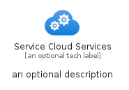
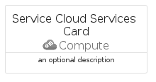
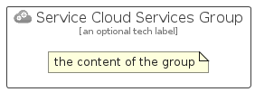

# ServiceCloudServices


```text
azure/Item/Compute/ServiceCloudServices
```

```text
include('azure/Item/Compute/ServiceCloudServices')
```


| Illustration | ServiceCloudServices | ServiceCloudServicesCard | ServiceCloudServicesGroup |
| :---: | :---: | :---: | :---: |
|  |  |  |  |


## Sprites
The item provides the following sriptes:

- `<$ServiceCloudServicesXs>`
- `<$ServiceCloudServicesSm>`
- `<$ServiceCloudServicesMd>`
- `<$ServiceCloudServicesLg>`


## ServiceCloudServices

### Load remotely
```plantuml
@startuml
' configures the library
!global $LIB_BASE_LOCATION="https://raw.githubusercontent.com/tmorin/plantuml-libs/master/distribution"

' loads the library's bootstrap
!include $LIB_BASE_LOCATION/bootstrap.puml

' loads the package bootstrap
include('azure/bootstrap')

' loads the Item which embeds the element ServiceCloudServices
include('azure/Item/Compute/ServiceCloudServices')

' renders the element
ServiceCloudServices('ServiceCloudServices', 'Service Cloud Services', 'an optional tech label', 'an optional description')
@enduml
```

### Load locally
```plantuml
@startuml
' configures the library
!global $INCLUSION_MODE="local"
!global $LIB_BASE_LOCATION="../../.."

' loads the library's bootstrap
!include $LIB_BASE_LOCATION/bootstrap.puml

' loads the package bootstrap
include('azure/bootstrap')

' loads the Item which embeds the element ServiceCloudServices
include('azure/Item/Compute/ServiceCloudServices')

' renders the element
ServiceCloudServices('ServiceCloudServices', 'Service Cloud Services', 'an optional tech label', 'an optional description')
@enduml
```

## ServiceCloudServicesCard

### Load remotely
```plantuml
@startuml
' configures the library
!global $LIB_BASE_LOCATION="https://raw.githubusercontent.com/tmorin/plantuml-libs/master/distribution"

' loads the library's bootstrap
!include $LIB_BASE_LOCATION/bootstrap.puml

' loads the package bootstrap
include('azure/bootstrap')

' loads the Item which embeds the element ServiceCloudServicesCard
include('azure/Item/Compute/ServiceCloudServices')

' renders the element
ServiceCloudServicesCard('ServiceCloudServicesCard', 'Service Cloud Services Card', 'an optional description')
@enduml
```

### Load locally
```plantuml
@startuml
' configures the library
!global $INCLUSION_MODE="local"
!global $LIB_BASE_LOCATION="../../.."

' loads the library's bootstrap
!include $LIB_BASE_LOCATION/bootstrap.puml

' loads the package bootstrap
include('azure/bootstrap')

' loads the Item which embeds the element ServiceCloudServicesCard
include('azure/Item/Compute/ServiceCloudServices')

' renders the element
ServiceCloudServicesCard('ServiceCloudServicesCard', 'Service Cloud Services Card', 'an optional description')
@enduml
```

## ServiceCloudServicesGroup

### Load remotely
```plantuml
@startuml
' configures the library
!global $LIB_BASE_LOCATION="https://raw.githubusercontent.com/tmorin/plantuml-libs/master/distribution"

' loads the library's bootstrap
!include $LIB_BASE_LOCATION/bootstrap.puml

' loads the package bootstrap
include('azure/bootstrap')

' loads the Item which embeds the element ServiceCloudServicesGroup
include('azure/Item/Compute/ServiceCloudServices')

' renders the element
ServiceCloudServicesGroup('ServiceCloudServicesGroup', 'Service Cloud Services Group', 'an optional tech label') {
    note as note
        the content of the group
    end note
}
@enduml
```

### Load locally
```plantuml
@startuml
' configures the library
!global $INCLUSION_MODE="local"
!global $LIB_BASE_LOCATION="../../.."

' loads the library's bootstrap
!include $LIB_BASE_LOCATION/bootstrap.puml

' loads the package bootstrap
include('azure/bootstrap')

' loads the Item which embeds the element ServiceCloudServicesGroup
include('azure/Item/Compute/ServiceCloudServices')

' renders the element
ServiceCloudServicesGroup('ServiceCloudServicesGroup', 'Service Cloud Services Group', 'an optional tech label') {
    note as note
        the content of the group
    end note
}
@enduml
```

