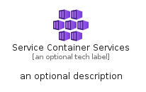
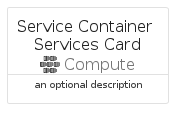
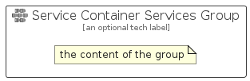

# ServiceContainerServices


```text
azure/Item/Compute/ServiceContainerServices
```

```text
include('azure/Item/Compute/ServiceContainerServices')
```


| Illustration | ServiceContainerServices | ServiceContainerServicesCard | ServiceContainerServicesGroup |
| :---: | :---: | :---: | :---: |
|  |  |  |  |


## Sprites
The item provides the following sriptes:

- `<$ServiceContainerServicesXs>`
- `<$ServiceContainerServicesSm>`
- `<$ServiceContainerServicesMd>`
- `<$ServiceContainerServicesLg>`


## ServiceContainerServices

### Load remotely
```plantuml
@startuml
' configures the library
!global $LIB_BASE_LOCATION="https://raw.githubusercontent.com/tmorin/plantuml-libs/master/distribution"

' loads the library's bootstrap
!include $LIB_BASE_LOCATION/bootstrap.puml

' loads the package bootstrap
include('azure/bootstrap')

' loads the Item which embeds the element ServiceContainerServices
include('azure/Item/Compute/ServiceContainerServices')

' renders the element
ServiceContainerServices('ServiceContainerServices', 'Service Container Services', 'an optional tech label', 'an optional description')
@enduml
```

### Load locally
```plantuml
@startuml
' configures the library
!global $INCLUSION_MODE="local"
!global $LIB_BASE_LOCATION="../../.."

' loads the library's bootstrap
!include $LIB_BASE_LOCATION/bootstrap.puml

' loads the package bootstrap
include('azure/bootstrap')

' loads the Item which embeds the element ServiceContainerServices
include('azure/Item/Compute/ServiceContainerServices')

' renders the element
ServiceContainerServices('ServiceContainerServices', 'Service Container Services', 'an optional tech label', 'an optional description')
@enduml
```

## ServiceContainerServicesCard

### Load remotely
```plantuml
@startuml
' configures the library
!global $LIB_BASE_LOCATION="https://raw.githubusercontent.com/tmorin/plantuml-libs/master/distribution"

' loads the library's bootstrap
!include $LIB_BASE_LOCATION/bootstrap.puml

' loads the package bootstrap
include('azure/bootstrap')

' loads the Item which embeds the element ServiceContainerServicesCard
include('azure/Item/Compute/ServiceContainerServices')

' renders the element
ServiceContainerServicesCard('ServiceContainerServicesCard', 'Service Container Services Card', 'an optional description')
@enduml
```

### Load locally
```plantuml
@startuml
' configures the library
!global $INCLUSION_MODE="local"
!global $LIB_BASE_LOCATION="../../.."

' loads the library's bootstrap
!include $LIB_BASE_LOCATION/bootstrap.puml

' loads the package bootstrap
include('azure/bootstrap')

' loads the Item which embeds the element ServiceContainerServicesCard
include('azure/Item/Compute/ServiceContainerServices')

' renders the element
ServiceContainerServicesCard('ServiceContainerServicesCard', 'Service Container Services Card', 'an optional description')
@enduml
```

## ServiceContainerServicesGroup

### Load remotely
```plantuml
@startuml
' configures the library
!global $LIB_BASE_LOCATION="https://raw.githubusercontent.com/tmorin/plantuml-libs/master/distribution"

' loads the library's bootstrap
!include $LIB_BASE_LOCATION/bootstrap.puml

' loads the package bootstrap
include('azure/bootstrap')

' loads the Item which embeds the element ServiceContainerServicesGroup
include('azure/Item/Compute/ServiceContainerServices')

' renders the element
ServiceContainerServicesGroup('ServiceContainerServicesGroup', 'Service Container Services Group', 'an optional tech label') {
    note as note
        the content of the group
    end note
}
@enduml
```

### Load locally
```plantuml
@startuml
' configures the library
!global $INCLUSION_MODE="local"
!global $LIB_BASE_LOCATION="../../.."

' loads the library's bootstrap
!include $LIB_BASE_LOCATION/bootstrap.puml

' loads the package bootstrap
include('azure/bootstrap')

' loads the Item which embeds the element ServiceContainerServicesGroup
include('azure/Item/Compute/ServiceContainerServices')

' renders the element
ServiceContainerServicesGroup('ServiceContainerServicesGroup', 'Service Container Services Group', 'an optional tech label') {
    note as note
        the content of the group
    end note
}
@enduml
```

