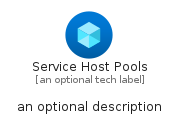
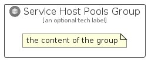

# ServiceHostPools


```text
azure/Item/Compute/ServiceHostPools
```

```text
include('azure/Item/Compute/ServiceHostPools')
```


| Illustration | ServiceHostPools | ServiceHostPoolsCard | ServiceHostPoolsGroup |
| :---: | :---: | :---: | :---: |
|  |  |  |  |


## Sprites
The item provides the following sriptes:

- `<$ServiceHostPoolsXs>`
- `<$ServiceHostPoolsSm>`
- `<$ServiceHostPoolsMd>`
- `<$ServiceHostPoolsLg>`


## ServiceHostPools

### Load remotely
```plantuml
@startuml
' configures the library
!global $LIB_BASE_LOCATION="https://raw.githubusercontent.com/tmorin/plantuml-libs/master/distribution"

' loads the library's bootstrap
!include $LIB_BASE_LOCATION/bootstrap.puml

' loads the package bootstrap
include('azure/bootstrap')

' loads the Item which embeds the element ServiceHostPools
include('azure/Item/Compute/ServiceHostPools')

' renders the element
ServiceHostPools('ServiceHostPools', 'Service Host Pools', 'an optional tech label', 'an optional description')
@enduml
```

### Load locally
```plantuml
@startuml
' configures the library
!global $INCLUSION_MODE="local"
!global $LIB_BASE_LOCATION="../../.."

' loads the library's bootstrap
!include $LIB_BASE_LOCATION/bootstrap.puml

' loads the package bootstrap
include('azure/bootstrap')

' loads the Item which embeds the element ServiceHostPools
include('azure/Item/Compute/ServiceHostPools')

' renders the element
ServiceHostPools('ServiceHostPools', 'Service Host Pools', 'an optional tech label', 'an optional description')
@enduml
```

## ServiceHostPoolsCard

### Load remotely
```plantuml
@startuml
' configures the library
!global $LIB_BASE_LOCATION="https://raw.githubusercontent.com/tmorin/plantuml-libs/master/distribution"

' loads the library's bootstrap
!include $LIB_BASE_LOCATION/bootstrap.puml

' loads the package bootstrap
include('azure/bootstrap')

' loads the Item which embeds the element ServiceHostPoolsCard
include('azure/Item/Compute/ServiceHostPools')

' renders the element
ServiceHostPoolsCard('ServiceHostPoolsCard', 'Service Host Pools Card', 'an optional description')
@enduml
```

### Load locally
```plantuml
@startuml
' configures the library
!global $INCLUSION_MODE="local"
!global $LIB_BASE_LOCATION="../../.."

' loads the library's bootstrap
!include $LIB_BASE_LOCATION/bootstrap.puml

' loads the package bootstrap
include('azure/bootstrap')

' loads the Item which embeds the element ServiceHostPoolsCard
include('azure/Item/Compute/ServiceHostPools')

' renders the element
ServiceHostPoolsCard('ServiceHostPoolsCard', 'Service Host Pools Card', 'an optional description')
@enduml
```

## ServiceHostPoolsGroup

### Load remotely
```plantuml
@startuml
' configures the library
!global $LIB_BASE_LOCATION="https://raw.githubusercontent.com/tmorin/plantuml-libs/master/distribution"

' loads the library's bootstrap
!include $LIB_BASE_LOCATION/bootstrap.puml

' loads the package bootstrap
include('azure/bootstrap')

' loads the Item which embeds the element ServiceHostPoolsGroup
include('azure/Item/Compute/ServiceHostPools')

' renders the element
ServiceHostPoolsGroup('ServiceHostPoolsGroup', 'Service Host Pools Group', 'an optional tech label') {
    note as note
        the content of the group
    end note
}
@enduml
```

### Load locally
```plantuml
@startuml
' configures the library
!global $INCLUSION_MODE="local"
!global $LIB_BASE_LOCATION="../../.."

' loads the library's bootstrap
!include $LIB_BASE_LOCATION/bootstrap.puml

' loads the package bootstrap
include('azure/bootstrap')

' loads the Item which embeds the element ServiceHostPoolsGroup
include('azure/Item/Compute/ServiceHostPools')

' renders the element
ServiceHostPoolsGroup('ServiceHostPoolsGroup', 'Service Host Pools Group', 'an optional tech label') {
    note as note
        the content of the group
    end note
}
@enduml
```

