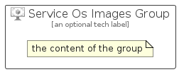

# ServiceOsImages


```text
azure/Item/Compute/ServiceOsImages
```

```text
include('azure/Item/Compute/ServiceOsImages')
```


| Illustration | ServiceOsImages | ServiceOsImagesCard | ServiceOsImagesGroup |
| :---: | :---: | :---: | :---: |
|  |  |  |  |


## Sprites
The item provides the following sriptes:

- `<$ServiceOsImagesXs>`
- `<$ServiceOsImagesSm>`
- `<$ServiceOsImagesMd>`
- `<$ServiceOsImagesLg>`


## ServiceOsImages

### Load remotely
```plantuml
@startuml
' configures the library
!global $LIB_BASE_LOCATION="https://raw.githubusercontent.com/tmorin/plantuml-libs/master/distribution"

' loads the library's bootstrap
!include $LIB_BASE_LOCATION/bootstrap.puml

' loads the package bootstrap
include('azure/bootstrap')

' loads the Item which embeds the element ServiceOsImages
include('azure/Item/Compute/ServiceOsImages')

' renders the element
ServiceOsImages('ServiceOsImages', 'Service Os Images', 'an optional tech label', 'an optional description')
@enduml
```

### Load locally
```plantuml
@startuml
' configures the library
!global $INCLUSION_MODE="local"
!global $LIB_BASE_LOCATION="../../.."

' loads the library's bootstrap
!include $LIB_BASE_LOCATION/bootstrap.puml

' loads the package bootstrap
include('azure/bootstrap')

' loads the Item which embeds the element ServiceOsImages
include('azure/Item/Compute/ServiceOsImages')

' renders the element
ServiceOsImages('ServiceOsImages', 'Service Os Images', 'an optional tech label', 'an optional description')
@enduml
```

## ServiceOsImagesCard

### Load remotely
```plantuml
@startuml
' configures the library
!global $LIB_BASE_LOCATION="https://raw.githubusercontent.com/tmorin/plantuml-libs/master/distribution"

' loads the library's bootstrap
!include $LIB_BASE_LOCATION/bootstrap.puml

' loads the package bootstrap
include('azure/bootstrap')

' loads the Item which embeds the element ServiceOsImagesCard
include('azure/Item/Compute/ServiceOsImages')

' renders the element
ServiceOsImagesCard('ServiceOsImagesCard', 'Service Os Images Card', 'an optional description')
@enduml
```

### Load locally
```plantuml
@startuml
' configures the library
!global $INCLUSION_MODE="local"
!global $LIB_BASE_LOCATION="../../.."

' loads the library's bootstrap
!include $LIB_BASE_LOCATION/bootstrap.puml

' loads the package bootstrap
include('azure/bootstrap')

' loads the Item which embeds the element ServiceOsImagesCard
include('azure/Item/Compute/ServiceOsImages')

' renders the element
ServiceOsImagesCard('ServiceOsImagesCard', 'Service Os Images Card', 'an optional description')
@enduml
```

## ServiceOsImagesGroup

### Load remotely
```plantuml
@startuml
' configures the library
!global $LIB_BASE_LOCATION="https://raw.githubusercontent.com/tmorin/plantuml-libs/master/distribution"

' loads the library's bootstrap
!include $LIB_BASE_LOCATION/bootstrap.puml

' loads the package bootstrap
include('azure/bootstrap')

' loads the Item which embeds the element ServiceOsImagesGroup
include('azure/Item/Compute/ServiceOsImages')

' renders the element
ServiceOsImagesGroup('ServiceOsImagesGroup', 'Service Os Images Group', 'an optional tech label') {
    note as note
        the content of the group
    end note
}
@enduml
```

### Load locally
```plantuml
@startuml
' configures the library
!global $INCLUSION_MODE="local"
!global $LIB_BASE_LOCATION="../../.."

' loads the library's bootstrap
!include $LIB_BASE_LOCATION/bootstrap.puml

' loads the package bootstrap
include('azure/bootstrap')

' loads the Item which embeds the element ServiceOsImagesGroup
include('azure/Item/Compute/ServiceOsImages')

' renders the element
ServiceOsImagesGroup('ServiceOsImagesGroup', 'Service Os Images Group', 'an optional tech label') {
    note as note
        the content of the group
    end note
}
@enduml
```

