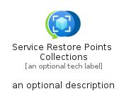
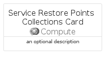
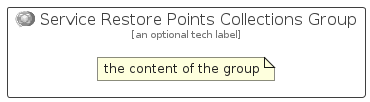

# ServiceRestorePointsCollections


```text
azure/Item/Compute/ServiceRestorePointsCollections
```

```text
include('azure/Item/Compute/ServiceRestorePointsCollections')
```


| Illustration | ServiceRestorePointsCollections | ServiceRestorePointsCollectionsCard | ServiceRestorePointsCollectionsGroup |
| :---: | :---: | :---: | :---: |
|  |  |  |  |


## Sprites
The item provides the following sriptes:

- `<$ServiceRestorePointsCollectionsXs>`
- `<$ServiceRestorePointsCollectionsSm>`
- `<$ServiceRestorePointsCollectionsMd>`
- `<$ServiceRestorePointsCollectionsLg>`


## ServiceRestorePointsCollections

### Load remotely
```plantuml
@startuml
' configures the library
!global $LIB_BASE_LOCATION="https://raw.githubusercontent.com/tmorin/plantuml-libs/master/distribution"

' loads the library's bootstrap
!include $LIB_BASE_LOCATION/bootstrap.puml

' loads the package bootstrap
include('azure/bootstrap')

' loads the Item which embeds the element ServiceRestorePointsCollections
include('azure/Item/Compute/ServiceRestorePointsCollections')

' renders the element
ServiceRestorePointsCollections('ServiceRestorePointsCollections', 'Service Restore Points Collections', 'an optional tech label', 'an optional description')
@enduml
```

### Load locally
```plantuml
@startuml
' configures the library
!global $INCLUSION_MODE="local"
!global $LIB_BASE_LOCATION="../../.."

' loads the library's bootstrap
!include $LIB_BASE_LOCATION/bootstrap.puml

' loads the package bootstrap
include('azure/bootstrap')

' loads the Item which embeds the element ServiceRestorePointsCollections
include('azure/Item/Compute/ServiceRestorePointsCollections')

' renders the element
ServiceRestorePointsCollections('ServiceRestorePointsCollections', 'Service Restore Points Collections', 'an optional tech label', 'an optional description')
@enduml
```

## ServiceRestorePointsCollectionsCard

### Load remotely
```plantuml
@startuml
' configures the library
!global $LIB_BASE_LOCATION="https://raw.githubusercontent.com/tmorin/plantuml-libs/master/distribution"

' loads the library's bootstrap
!include $LIB_BASE_LOCATION/bootstrap.puml

' loads the package bootstrap
include('azure/bootstrap')

' loads the Item which embeds the element ServiceRestorePointsCollectionsCard
include('azure/Item/Compute/ServiceRestorePointsCollections')

' renders the element
ServiceRestorePointsCollectionsCard('ServiceRestorePointsCollectionsCard', 'Service Restore Points Collections Card', 'an optional description')
@enduml
```

### Load locally
```plantuml
@startuml
' configures the library
!global $INCLUSION_MODE="local"
!global $LIB_BASE_LOCATION="../../.."

' loads the library's bootstrap
!include $LIB_BASE_LOCATION/bootstrap.puml

' loads the package bootstrap
include('azure/bootstrap')

' loads the Item which embeds the element ServiceRestorePointsCollectionsCard
include('azure/Item/Compute/ServiceRestorePointsCollections')

' renders the element
ServiceRestorePointsCollectionsCard('ServiceRestorePointsCollectionsCard', 'Service Restore Points Collections Card', 'an optional description')
@enduml
```

## ServiceRestorePointsCollectionsGroup

### Load remotely
```plantuml
@startuml
' configures the library
!global $LIB_BASE_LOCATION="https://raw.githubusercontent.com/tmorin/plantuml-libs/master/distribution"

' loads the library's bootstrap
!include $LIB_BASE_LOCATION/bootstrap.puml

' loads the package bootstrap
include('azure/bootstrap')

' loads the Item which embeds the element ServiceRestorePointsCollectionsGroup
include('azure/Item/Compute/ServiceRestorePointsCollections')

' renders the element
ServiceRestorePointsCollectionsGroup('ServiceRestorePointsCollectionsGroup', 'Service Restore Points Collections Group', 'an optional tech label') {
    note as note
        the content of the group
    end note
}
@enduml
```

### Load locally
```plantuml
@startuml
' configures the library
!global $INCLUSION_MODE="local"
!global $LIB_BASE_LOCATION="../../.."

' loads the library's bootstrap
!include $LIB_BASE_LOCATION/bootstrap.puml

' loads the package bootstrap
include('azure/bootstrap')

' loads the Item which embeds the element ServiceRestorePointsCollectionsGroup
include('azure/Item/Compute/ServiceRestorePointsCollections')

' renders the element
ServiceRestorePointsCollectionsGroup('ServiceRestorePointsCollectionsGroup', 'Service Restore Points Collections Group', 'an optional tech label') {
    note as note
        the content of the group
    end note
}
@enduml
```

