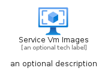
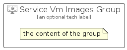

# ServiceVmImages


```text
azure/Item/Compute/ServiceVmImages
```

```text
include('azure/Item/Compute/ServiceVmImages')
```


| Illustration | ServiceVmImages | ServiceVmImagesCard | ServiceVmImagesGroup |
| :---: | :---: | :---: | :---: |
|  |  |  |  |


## Sprites
The item provides the following sriptes:

- `<$ServiceVmImagesXs>`
- `<$ServiceVmImagesSm>`
- `<$ServiceVmImagesMd>`
- `<$ServiceVmImagesLg>`


## ServiceVmImages

### Load remotely
```plantuml
@startuml
' configures the library
!global $LIB_BASE_LOCATION="https://raw.githubusercontent.com/tmorin/plantuml-libs/master/distribution"

' loads the library's bootstrap
!include $LIB_BASE_LOCATION/bootstrap.puml

' loads the package bootstrap
include('azure/bootstrap')

' loads the Item which embeds the element ServiceVmImages
include('azure/Item/Compute/ServiceVmImages')

' renders the element
ServiceVmImages('ServiceVmImages', 'Service Vm Images', 'an optional tech label', 'an optional description')
@enduml
```

### Load locally
```plantuml
@startuml
' configures the library
!global $INCLUSION_MODE="local"
!global $LIB_BASE_LOCATION="../../.."

' loads the library's bootstrap
!include $LIB_BASE_LOCATION/bootstrap.puml

' loads the package bootstrap
include('azure/bootstrap')

' loads the Item which embeds the element ServiceVmImages
include('azure/Item/Compute/ServiceVmImages')

' renders the element
ServiceVmImages('ServiceVmImages', 'Service Vm Images', 'an optional tech label', 'an optional description')
@enduml
```

## ServiceVmImagesCard

### Load remotely
```plantuml
@startuml
' configures the library
!global $LIB_BASE_LOCATION="https://raw.githubusercontent.com/tmorin/plantuml-libs/master/distribution"

' loads the library's bootstrap
!include $LIB_BASE_LOCATION/bootstrap.puml

' loads the package bootstrap
include('azure/bootstrap')

' loads the Item which embeds the element ServiceVmImagesCard
include('azure/Item/Compute/ServiceVmImages')

' renders the element
ServiceVmImagesCard('ServiceVmImagesCard', 'Service Vm Images Card', 'an optional description')
@enduml
```

### Load locally
```plantuml
@startuml
' configures the library
!global $INCLUSION_MODE="local"
!global $LIB_BASE_LOCATION="../../.."

' loads the library's bootstrap
!include $LIB_BASE_LOCATION/bootstrap.puml

' loads the package bootstrap
include('azure/bootstrap')

' loads the Item which embeds the element ServiceVmImagesCard
include('azure/Item/Compute/ServiceVmImages')

' renders the element
ServiceVmImagesCard('ServiceVmImagesCard', 'Service Vm Images Card', 'an optional description')
@enduml
```

## ServiceVmImagesGroup

### Load remotely
```plantuml
@startuml
' configures the library
!global $LIB_BASE_LOCATION="https://raw.githubusercontent.com/tmorin/plantuml-libs/master/distribution"

' loads the library's bootstrap
!include $LIB_BASE_LOCATION/bootstrap.puml

' loads the package bootstrap
include('azure/bootstrap')

' loads the Item which embeds the element ServiceVmImagesGroup
include('azure/Item/Compute/ServiceVmImages')

' renders the element
ServiceVmImagesGroup('ServiceVmImagesGroup', 'Service Vm Images Group', 'an optional tech label') {
    note as note
        the content of the group
    end note
}
@enduml
```

### Load locally
```plantuml
@startuml
' configures the library
!global $INCLUSION_MODE="local"
!global $LIB_BASE_LOCATION="../../.."

' loads the library's bootstrap
!include $LIB_BASE_LOCATION/bootstrap.puml

' loads the package bootstrap
include('azure/bootstrap')

' loads the Item which embeds the element ServiceVmImagesGroup
include('azure/Item/Compute/ServiceVmImages')

' renders the element
ServiceVmImagesGroup('ServiceVmImagesGroup', 'Service Vm Images Group', 'an optional tech label') {
    note as note
        the content of the group
    end note
}
@enduml
```

