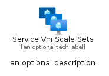
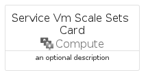
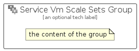

# ServiceVmScaleSets


```text
azure/Item/Compute/ServiceVmScaleSets
```

```text
include('azure/Item/Compute/ServiceVmScaleSets')
```


| Illustration | ServiceVmScaleSets | ServiceVmScaleSetsCard | ServiceVmScaleSetsGroup |
| :---: | :---: | :---: | :---: |
|  |  |  |  |


## Sprites
The item provides the following sriptes:

- `<$ServiceVmScaleSetsXs>`
- `<$ServiceVmScaleSetsSm>`
- `<$ServiceVmScaleSetsMd>`
- `<$ServiceVmScaleSetsLg>`


## ServiceVmScaleSets

### Load remotely
```plantuml
@startuml
' configures the library
!global $LIB_BASE_LOCATION="https://raw.githubusercontent.com/tmorin/plantuml-libs/master/distribution"

' loads the library's bootstrap
!include $LIB_BASE_LOCATION/bootstrap.puml

' loads the package bootstrap
include('azure/bootstrap')

' loads the Item which embeds the element ServiceVmScaleSets
include('azure/Item/Compute/ServiceVmScaleSets')

' renders the element
ServiceVmScaleSets('ServiceVmScaleSets', 'Service Vm Scale Sets', 'an optional tech label', 'an optional description')
@enduml
```

### Load locally
```plantuml
@startuml
' configures the library
!global $INCLUSION_MODE="local"
!global $LIB_BASE_LOCATION="../../.."

' loads the library's bootstrap
!include $LIB_BASE_LOCATION/bootstrap.puml

' loads the package bootstrap
include('azure/bootstrap')

' loads the Item which embeds the element ServiceVmScaleSets
include('azure/Item/Compute/ServiceVmScaleSets')

' renders the element
ServiceVmScaleSets('ServiceVmScaleSets', 'Service Vm Scale Sets', 'an optional tech label', 'an optional description')
@enduml
```

## ServiceVmScaleSetsCard

### Load remotely
```plantuml
@startuml
' configures the library
!global $LIB_BASE_LOCATION="https://raw.githubusercontent.com/tmorin/plantuml-libs/master/distribution"

' loads the library's bootstrap
!include $LIB_BASE_LOCATION/bootstrap.puml

' loads the package bootstrap
include('azure/bootstrap')

' loads the Item which embeds the element ServiceVmScaleSetsCard
include('azure/Item/Compute/ServiceVmScaleSets')

' renders the element
ServiceVmScaleSetsCard('ServiceVmScaleSetsCard', 'Service Vm Scale Sets Card', 'an optional description')
@enduml
```

### Load locally
```plantuml
@startuml
' configures the library
!global $INCLUSION_MODE="local"
!global $LIB_BASE_LOCATION="../../.."

' loads the library's bootstrap
!include $LIB_BASE_LOCATION/bootstrap.puml

' loads the package bootstrap
include('azure/bootstrap')

' loads the Item which embeds the element ServiceVmScaleSetsCard
include('azure/Item/Compute/ServiceVmScaleSets')

' renders the element
ServiceVmScaleSetsCard('ServiceVmScaleSetsCard', 'Service Vm Scale Sets Card', 'an optional description')
@enduml
```

## ServiceVmScaleSetsGroup

### Load remotely
```plantuml
@startuml
' configures the library
!global $LIB_BASE_LOCATION="https://raw.githubusercontent.com/tmorin/plantuml-libs/master/distribution"

' loads the library's bootstrap
!include $LIB_BASE_LOCATION/bootstrap.puml

' loads the package bootstrap
include('azure/bootstrap')

' loads the Item which embeds the element ServiceVmScaleSetsGroup
include('azure/Item/Compute/ServiceVmScaleSets')

' renders the element
ServiceVmScaleSetsGroup('ServiceVmScaleSetsGroup', 'Service Vm Scale Sets Group', 'an optional tech label') {
    note as note
        the content of the group
    end note
}
@enduml
```

### Load locally
```plantuml
@startuml
' configures the library
!global $INCLUSION_MODE="local"
!global $LIB_BASE_LOCATION="../../.."

' loads the library's bootstrap
!include $LIB_BASE_LOCATION/bootstrap.puml

' loads the package bootstrap
include('azure/bootstrap')

' loads the Item which embeds the element ServiceVmScaleSetsGroup
include('azure/Item/Compute/ServiceVmScaleSets')

' renders the element
ServiceVmScaleSetsGroup('ServiceVmScaleSetsGroup', 'Service Vm Scale Sets Group', 'an optional tech label') {
    note as note
        the content of the group
    end note
}
@enduml
```

