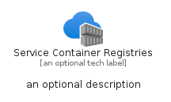
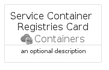
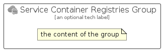

# ServiceContainerRegistries


```text
azure/Item/Containers/ServiceContainerRegistries
```

```text
include('azure/Item/Containers/ServiceContainerRegistries')
```


| Illustration | ServiceContainerRegistries | ServiceContainerRegistriesCard | ServiceContainerRegistriesGroup |
| :---: | :---: | :---: | :---: |
|  |  |  |  |


## Sprites
The item provides the following sriptes:

- `<$ServiceContainerRegistriesXs>`
- `<$ServiceContainerRegistriesSm>`
- `<$ServiceContainerRegistriesMd>`
- `<$ServiceContainerRegistriesLg>`


## ServiceContainerRegistries

### Load remotely
```plantuml
@startuml
' configures the library
!global $LIB_BASE_LOCATION="https://raw.githubusercontent.com/tmorin/plantuml-libs/master/distribution"

' loads the library's bootstrap
!include $LIB_BASE_LOCATION/bootstrap.puml

' loads the package bootstrap
include('azure/bootstrap')

' loads the Item which embeds the element ServiceContainerRegistries
include('azure/Item/Containers/ServiceContainerRegistries')

' renders the element
ServiceContainerRegistries('ServiceContainerRegistries', 'Service Container Registries', 'an optional tech label', 'an optional description')
@enduml
```

### Load locally
```plantuml
@startuml
' configures the library
!global $INCLUSION_MODE="local"
!global $LIB_BASE_LOCATION="../../.."

' loads the library's bootstrap
!include $LIB_BASE_LOCATION/bootstrap.puml

' loads the package bootstrap
include('azure/bootstrap')

' loads the Item which embeds the element ServiceContainerRegistries
include('azure/Item/Containers/ServiceContainerRegistries')

' renders the element
ServiceContainerRegistries('ServiceContainerRegistries', 'Service Container Registries', 'an optional tech label', 'an optional description')
@enduml
```

## ServiceContainerRegistriesCard

### Load remotely
```plantuml
@startuml
' configures the library
!global $LIB_BASE_LOCATION="https://raw.githubusercontent.com/tmorin/plantuml-libs/master/distribution"

' loads the library's bootstrap
!include $LIB_BASE_LOCATION/bootstrap.puml

' loads the package bootstrap
include('azure/bootstrap')

' loads the Item which embeds the element ServiceContainerRegistriesCard
include('azure/Item/Containers/ServiceContainerRegistries')

' renders the element
ServiceContainerRegistriesCard('ServiceContainerRegistriesCard', 'Service Container Registries Card', 'an optional description')
@enduml
```

### Load locally
```plantuml
@startuml
' configures the library
!global $INCLUSION_MODE="local"
!global $LIB_BASE_LOCATION="../../.."

' loads the library's bootstrap
!include $LIB_BASE_LOCATION/bootstrap.puml

' loads the package bootstrap
include('azure/bootstrap')

' loads the Item which embeds the element ServiceContainerRegistriesCard
include('azure/Item/Containers/ServiceContainerRegistries')

' renders the element
ServiceContainerRegistriesCard('ServiceContainerRegistriesCard', 'Service Container Registries Card', 'an optional description')
@enduml
```

## ServiceContainerRegistriesGroup

### Load remotely
```plantuml
@startuml
' configures the library
!global $LIB_BASE_LOCATION="https://raw.githubusercontent.com/tmorin/plantuml-libs/master/distribution"

' loads the library's bootstrap
!include $LIB_BASE_LOCATION/bootstrap.puml

' loads the package bootstrap
include('azure/bootstrap')

' loads the Item which embeds the element ServiceContainerRegistriesGroup
include('azure/Item/Containers/ServiceContainerRegistries')

' renders the element
ServiceContainerRegistriesGroup('ServiceContainerRegistriesGroup', 'Service Container Registries Group', 'an optional tech label') {
    note as note
        the content of the group
    end note
}
@enduml
```

### Load locally
```plantuml
@startuml
' configures the library
!global $INCLUSION_MODE="local"
!global $LIB_BASE_LOCATION="../../.."

' loads the library's bootstrap
!include $LIB_BASE_LOCATION/bootstrap.puml

' loads the package bootstrap
include('azure/bootstrap')

' loads the Item which embeds the element ServiceContainerRegistriesGroup
include('azure/Item/Containers/ServiceContainerRegistries')

' renders the element
ServiceContainerRegistriesGroup('ServiceContainerRegistriesGroup', 'Service Container Registries Group', 'an optional tech label') {
    note as note
        the content of the group
    end note
}
@enduml
```

