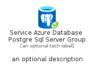
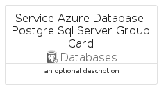
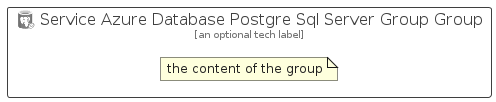

# ServiceAzureDatabasePostgreSqlServerGroup


```text
azure/Item/Databases/ServiceAzureDatabasePostgreSqlServerGroup
```

```text
include('azure/Item/Databases/ServiceAzureDatabasePostgreSqlServerGroup')
```


| Illustration | ServiceAzureDatabasePostgreSqlServerGroup | ServiceAzureDatabasePostgreSqlServerGroupCard | ServiceAzureDatabasePostgreSqlServerGroupGroup |
| :---: | :---: | :---: | :---: |
|  |  |  |  |


## Sprites
The item provides the following sriptes:

- `<$ServiceAzureDatabasePostgreSqlServerGroupXs>`
- `<$ServiceAzureDatabasePostgreSqlServerGroupSm>`
- `<$ServiceAzureDatabasePostgreSqlServerGroupMd>`
- `<$ServiceAzureDatabasePostgreSqlServerGroupLg>`


## ServiceAzureDatabasePostgreSqlServerGroup

### Load remotely
```plantuml
@startuml
' configures the library
!global $LIB_BASE_LOCATION="https://raw.githubusercontent.com/tmorin/plantuml-libs/master/distribution"

' loads the library's bootstrap
!include $LIB_BASE_LOCATION/bootstrap.puml

' loads the package bootstrap
include('azure/bootstrap')

' loads the Item which embeds the element ServiceAzureDatabasePostgreSqlServerGroup
include('azure/Item/Databases/ServiceAzureDatabasePostgreSqlServerGroup')

' renders the element
ServiceAzureDatabasePostgreSqlServerGroup('ServiceAzureDatabasePostgreSqlServerGroup', 'Service Azure Database Postgre Sql Server Group', 'an optional tech label', 'an optional description')
@enduml
```

### Load locally
```plantuml
@startuml
' configures the library
!global $INCLUSION_MODE="local"
!global $LIB_BASE_LOCATION="../../.."

' loads the library's bootstrap
!include $LIB_BASE_LOCATION/bootstrap.puml

' loads the package bootstrap
include('azure/bootstrap')

' loads the Item which embeds the element ServiceAzureDatabasePostgreSqlServerGroup
include('azure/Item/Databases/ServiceAzureDatabasePostgreSqlServerGroup')

' renders the element
ServiceAzureDatabasePostgreSqlServerGroup('ServiceAzureDatabasePostgreSqlServerGroup', 'Service Azure Database Postgre Sql Server Group', 'an optional tech label', 'an optional description')
@enduml
```

## ServiceAzureDatabasePostgreSqlServerGroupCard

### Load remotely
```plantuml
@startuml
' configures the library
!global $LIB_BASE_LOCATION="https://raw.githubusercontent.com/tmorin/plantuml-libs/master/distribution"

' loads the library's bootstrap
!include $LIB_BASE_LOCATION/bootstrap.puml

' loads the package bootstrap
include('azure/bootstrap')

' loads the Item which embeds the element ServiceAzureDatabasePostgreSqlServerGroupCard
include('azure/Item/Databases/ServiceAzureDatabasePostgreSqlServerGroup')

' renders the element
ServiceAzureDatabasePostgreSqlServerGroupCard('ServiceAzureDatabasePostgreSqlServerGroupCard', 'Service Azure Database Postgre Sql Server Group Card', 'an optional description')
@enduml
```

### Load locally
```plantuml
@startuml
' configures the library
!global $INCLUSION_MODE="local"
!global $LIB_BASE_LOCATION="../../.."

' loads the library's bootstrap
!include $LIB_BASE_LOCATION/bootstrap.puml

' loads the package bootstrap
include('azure/bootstrap')

' loads the Item which embeds the element ServiceAzureDatabasePostgreSqlServerGroupCard
include('azure/Item/Databases/ServiceAzureDatabasePostgreSqlServerGroup')

' renders the element
ServiceAzureDatabasePostgreSqlServerGroupCard('ServiceAzureDatabasePostgreSqlServerGroupCard', 'Service Azure Database Postgre Sql Server Group Card', 'an optional description')
@enduml
```

## ServiceAzureDatabasePostgreSqlServerGroupGroup

### Load remotely
```plantuml
@startuml
' configures the library
!global $LIB_BASE_LOCATION="https://raw.githubusercontent.com/tmorin/plantuml-libs/master/distribution"

' loads the library's bootstrap
!include $LIB_BASE_LOCATION/bootstrap.puml

' loads the package bootstrap
include('azure/bootstrap')

' loads the Item which embeds the element ServiceAzureDatabasePostgreSqlServerGroupGroup
include('azure/Item/Databases/ServiceAzureDatabasePostgreSqlServerGroup')

' renders the element
ServiceAzureDatabasePostgreSqlServerGroupGroup('ServiceAzureDatabasePostgreSqlServerGroupGroup', 'Service Azure Database Postgre Sql Server Group Group', 'an optional tech label') {
    note as note
        the content of the group
    end note
}
@enduml
```

### Load locally
```plantuml
@startuml
' configures the library
!global $INCLUSION_MODE="local"
!global $LIB_BASE_LOCATION="../../.."

' loads the library's bootstrap
!include $LIB_BASE_LOCATION/bootstrap.puml

' loads the package bootstrap
include('azure/bootstrap')

' loads the Item which embeds the element ServiceAzureDatabasePostgreSqlServerGroupGroup
include('azure/Item/Databases/ServiceAzureDatabasePostgreSqlServerGroup')

' renders the element
ServiceAzureDatabasePostgreSqlServerGroupGroup('ServiceAzureDatabasePostgreSqlServerGroupGroup', 'Service Azure Database Postgre Sql Server Group Group', 'an optional tech label') {
    note as note
        the content of the group
    end note
}
@enduml
```

