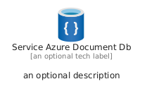
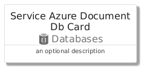
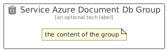

# ServiceAzureDocumentDb


```text
azure/Item/Databases/ServiceAzureDocumentDb
```

```text
include('azure/Item/Databases/ServiceAzureDocumentDb')
```


| Illustration | ServiceAzureDocumentDb | ServiceAzureDocumentDbCard | ServiceAzureDocumentDbGroup |
| :---: | :---: | :---: | :---: |
|  |  |  |  |


## Sprites
The item provides the following sriptes:

- `<$ServiceAzureDocumentDbXs>`
- `<$ServiceAzureDocumentDbSm>`
- `<$ServiceAzureDocumentDbMd>`
- `<$ServiceAzureDocumentDbLg>`


## ServiceAzureDocumentDb

### Load remotely
```plantuml
@startuml
' configures the library
!global $LIB_BASE_LOCATION="https://raw.githubusercontent.com/tmorin/plantuml-libs/master/distribution"

' loads the library's bootstrap
!include $LIB_BASE_LOCATION/bootstrap.puml

' loads the package bootstrap
include('azure/bootstrap')

' loads the Item which embeds the element ServiceAzureDocumentDb
include('azure/Item/Databases/ServiceAzureDocumentDb')

' renders the element
ServiceAzureDocumentDb('ServiceAzureDocumentDb', 'Service Azure Document Db', 'an optional tech label', 'an optional description')
@enduml
```

### Load locally
```plantuml
@startuml
' configures the library
!global $INCLUSION_MODE="local"
!global $LIB_BASE_LOCATION="../../.."

' loads the library's bootstrap
!include $LIB_BASE_LOCATION/bootstrap.puml

' loads the package bootstrap
include('azure/bootstrap')

' loads the Item which embeds the element ServiceAzureDocumentDb
include('azure/Item/Databases/ServiceAzureDocumentDb')

' renders the element
ServiceAzureDocumentDb('ServiceAzureDocumentDb', 'Service Azure Document Db', 'an optional tech label', 'an optional description')
@enduml
```

## ServiceAzureDocumentDbCard

### Load remotely
```plantuml
@startuml
' configures the library
!global $LIB_BASE_LOCATION="https://raw.githubusercontent.com/tmorin/plantuml-libs/master/distribution"

' loads the library's bootstrap
!include $LIB_BASE_LOCATION/bootstrap.puml

' loads the package bootstrap
include('azure/bootstrap')

' loads the Item which embeds the element ServiceAzureDocumentDbCard
include('azure/Item/Databases/ServiceAzureDocumentDb')

' renders the element
ServiceAzureDocumentDbCard('ServiceAzureDocumentDbCard', 'Service Azure Document Db Card', 'an optional description')
@enduml
```

### Load locally
```plantuml
@startuml
' configures the library
!global $INCLUSION_MODE="local"
!global $LIB_BASE_LOCATION="../../.."

' loads the library's bootstrap
!include $LIB_BASE_LOCATION/bootstrap.puml

' loads the package bootstrap
include('azure/bootstrap')

' loads the Item which embeds the element ServiceAzureDocumentDbCard
include('azure/Item/Databases/ServiceAzureDocumentDb')

' renders the element
ServiceAzureDocumentDbCard('ServiceAzureDocumentDbCard', 'Service Azure Document Db Card', 'an optional description')
@enduml
```

## ServiceAzureDocumentDbGroup

### Load remotely
```plantuml
@startuml
' configures the library
!global $LIB_BASE_LOCATION="https://raw.githubusercontent.com/tmorin/plantuml-libs/master/distribution"

' loads the library's bootstrap
!include $LIB_BASE_LOCATION/bootstrap.puml

' loads the package bootstrap
include('azure/bootstrap')

' loads the Item which embeds the element ServiceAzureDocumentDbGroup
include('azure/Item/Databases/ServiceAzureDocumentDb')

' renders the element
ServiceAzureDocumentDbGroup('ServiceAzureDocumentDbGroup', 'Service Azure Document Db Group', 'an optional tech label') {
    note as note
        the content of the group
    end note
}
@enduml
```

### Load locally
```plantuml
@startuml
' configures the library
!global $INCLUSION_MODE="local"
!global $LIB_BASE_LOCATION="../../.."

' loads the library's bootstrap
!include $LIB_BASE_LOCATION/bootstrap.puml

' loads the package bootstrap
include('azure/bootstrap')

' loads the Item which embeds the element ServiceAzureDocumentDbGroup
include('azure/Item/Databases/ServiceAzureDocumentDb')

' renders the element
ServiceAzureDocumentDbGroup('ServiceAzureDocumentDbGroup', 'Service Azure Document Db Group', 'an optional tech label') {
    note as note
        the content of the group
    end note
}
@enduml
```

