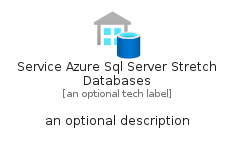
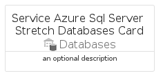
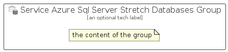

# ServiceAzureSqlServerStretchDatabases


```text
azure/Item/Databases/ServiceAzureSqlServerStretchDatabases
```

```text
include('azure/Item/Databases/ServiceAzureSqlServerStretchDatabases')
```


| Illustration | ServiceAzureSqlServerStretchDatabases | ServiceAzureSqlServerStretchDatabasesCard | ServiceAzureSqlServerStretchDatabasesGroup |
| :---: | :---: | :---: | :---: |
|  |  |  |  |


## Sprites
The item provides the following sriptes:

- `<$ServiceAzureSqlServerStretchDatabasesXs>`
- `<$ServiceAzureSqlServerStretchDatabasesSm>`
- `<$ServiceAzureSqlServerStretchDatabasesMd>`
- `<$ServiceAzureSqlServerStretchDatabasesLg>`


## ServiceAzureSqlServerStretchDatabases

### Load remotely
```plantuml
@startuml
' configures the library
!global $LIB_BASE_LOCATION="https://raw.githubusercontent.com/tmorin/plantuml-libs/master/distribution"

' loads the library's bootstrap
!include $LIB_BASE_LOCATION/bootstrap.puml

' loads the package bootstrap
include('azure/bootstrap')

' loads the Item which embeds the element ServiceAzureSqlServerStretchDatabases
include('azure/Item/Databases/ServiceAzureSqlServerStretchDatabases')

' renders the element
ServiceAzureSqlServerStretchDatabases('ServiceAzureSqlServerStretchDatabases', 'Service Azure Sql Server Stretch Databases', 'an optional tech label', 'an optional description')
@enduml
```

### Load locally
```plantuml
@startuml
' configures the library
!global $INCLUSION_MODE="local"
!global $LIB_BASE_LOCATION="../../.."

' loads the library's bootstrap
!include $LIB_BASE_LOCATION/bootstrap.puml

' loads the package bootstrap
include('azure/bootstrap')

' loads the Item which embeds the element ServiceAzureSqlServerStretchDatabases
include('azure/Item/Databases/ServiceAzureSqlServerStretchDatabases')

' renders the element
ServiceAzureSqlServerStretchDatabases('ServiceAzureSqlServerStretchDatabases', 'Service Azure Sql Server Stretch Databases', 'an optional tech label', 'an optional description')
@enduml
```

## ServiceAzureSqlServerStretchDatabasesCard

### Load remotely
```plantuml
@startuml
' configures the library
!global $LIB_BASE_LOCATION="https://raw.githubusercontent.com/tmorin/plantuml-libs/master/distribution"

' loads the library's bootstrap
!include $LIB_BASE_LOCATION/bootstrap.puml

' loads the package bootstrap
include('azure/bootstrap')

' loads the Item which embeds the element ServiceAzureSqlServerStretchDatabasesCard
include('azure/Item/Databases/ServiceAzureSqlServerStretchDatabases')

' renders the element
ServiceAzureSqlServerStretchDatabasesCard('ServiceAzureSqlServerStretchDatabasesCard', 'Service Azure Sql Server Stretch Databases Card', 'an optional description')
@enduml
```

### Load locally
```plantuml
@startuml
' configures the library
!global $INCLUSION_MODE="local"
!global $LIB_BASE_LOCATION="../../.."

' loads the library's bootstrap
!include $LIB_BASE_LOCATION/bootstrap.puml

' loads the package bootstrap
include('azure/bootstrap')

' loads the Item which embeds the element ServiceAzureSqlServerStretchDatabasesCard
include('azure/Item/Databases/ServiceAzureSqlServerStretchDatabases')

' renders the element
ServiceAzureSqlServerStretchDatabasesCard('ServiceAzureSqlServerStretchDatabasesCard', 'Service Azure Sql Server Stretch Databases Card', 'an optional description')
@enduml
```

## ServiceAzureSqlServerStretchDatabasesGroup

### Load remotely
```plantuml
@startuml
' configures the library
!global $LIB_BASE_LOCATION="https://raw.githubusercontent.com/tmorin/plantuml-libs/master/distribution"

' loads the library's bootstrap
!include $LIB_BASE_LOCATION/bootstrap.puml

' loads the package bootstrap
include('azure/bootstrap')

' loads the Item which embeds the element ServiceAzureSqlServerStretchDatabasesGroup
include('azure/Item/Databases/ServiceAzureSqlServerStretchDatabases')

' renders the element
ServiceAzureSqlServerStretchDatabasesGroup('ServiceAzureSqlServerStretchDatabasesGroup', 'Service Azure Sql Server Stretch Databases Group', 'an optional tech label') {
    note as note
        the content of the group
    end note
}
@enduml
```

### Load locally
```plantuml
@startuml
' configures the library
!global $INCLUSION_MODE="local"
!global $LIB_BASE_LOCATION="../../.."

' loads the library's bootstrap
!include $LIB_BASE_LOCATION/bootstrap.puml

' loads the package bootstrap
include('azure/bootstrap')

' loads the Item which embeds the element ServiceAzureSqlServerStretchDatabasesGroup
include('azure/Item/Databases/ServiceAzureSqlServerStretchDatabases')

' renders the element
ServiceAzureSqlServerStretchDatabasesGroup('ServiceAzureSqlServerStretchDatabasesGroup', 'Service Azure Sql Server Stretch Databases Group', 'an optional tech label') {
    note as note
        the content of the group
    end note
}
@enduml
```

