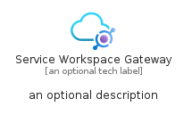
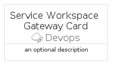
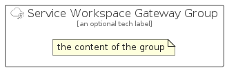

# ServiceWorkspaceGateway


```text
azure/Item/Devops/ServiceWorkspaceGateway
```

```text
include('azure/Item/Devops/ServiceWorkspaceGateway')
```


| Illustration | ServiceWorkspaceGateway | ServiceWorkspaceGatewayCard | ServiceWorkspaceGatewayGroup |
| :---: | :---: | :---: | :---: |
|  |  |  |  |


## Sprites
The item provides the following sriptes:

- `<$ServiceWorkspaceGatewayXs>`
- `<$ServiceWorkspaceGatewaySm>`
- `<$ServiceWorkspaceGatewayMd>`
- `<$ServiceWorkspaceGatewayLg>`


## ServiceWorkspaceGateway

### Load remotely
```plantuml
@startuml
' configures the library
!global $LIB_BASE_LOCATION="https://raw.githubusercontent.com/tmorin/plantuml-libs/master/distribution"

' loads the library's bootstrap
!include $LIB_BASE_LOCATION/bootstrap.puml

' loads the package bootstrap
include('azure/bootstrap')

' loads the Item which embeds the element ServiceWorkspaceGateway
include('azure/Item/Devops/ServiceWorkspaceGateway')

' renders the element
ServiceWorkspaceGateway('ServiceWorkspaceGateway', 'Service Workspace Gateway', 'an optional tech label', 'an optional description')
@enduml
```

### Load locally
```plantuml
@startuml
' configures the library
!global $INCLUSION_MODE="local"
!global $LIB_BASE_LOCATION="../../.."

' loads the library's bootstrap
!include $LIB_BASE_LOCATION/bootstrap.puml

' loads the package bootstrap
include('azure/bootstrap')

' loads the Item which embeds the element ServiceWorkspaceGateway
include('azure/Item/Devops/ServiceWorkspaceGateway')

' renders the element
ServiceWorkspaceGateway('ServiceWorkspaceGateway', 'Service Workspace Gateway', 'an optional tech label', 'an optional description')
@enduml
```

## ServiceWorkspaceGatewayCard

### Load remotely
```plantuml
@startuml
' configures the library
!global $LIB_BASE_LOCATION="https://raw.githubusercontent.com/tmorin/plantuml-libs/master/distribution"

' loads the library's bootstrap
!include $LIB_BASE_LOCATION/bootstrap.puml

' loads the package bootstrap
include('azure/bootstrap')

' loads the Item which embeds the element ServiceWorkspaceGatewayCard
include('azure/Item/Devops/ServiceWorkspaceGateway')

' renders the element
ServiceWorkspaceGatewayCard('ServiceWorkspaceGatewayCard', 'Service Workspace Gateway Card', 'an optional description')
@enduml
```

### Load locally
```plantuml
@startuml
' configures the library
!global $INCLUSION_MODE="local"
!global $LIB_BASE_LOCATION="../../.."

' loads the library's bootstrap
!include $LIB_BASE_LOCATION/bootstrap.puml

' loads the package bootstrap
include('azure/bootstrap')

' loads the Item which embeds the element ServiceWorkspaceGatewayCard
include('azure/Item/Devops/ServiceWorkspaceGateway')

' renders the element
ServiceWorkspaceGatewayCard('ServiceWorkspaceGatewayCard', 'Service Workspace Gateway Card', 'an optional description')
@enduml
```

## ServiceWorkspaceGatewayGroup

### Load remotely
```plantuml
@startuml
' configures the library
!global $LIB_BASE_LOCATION="https://raw.githubusercontent.com/tmorin/plantuml-libs/master/distribution"

' loads the library's bootstrap
!include $LIB_BASE_LOCATION/bootstrap.puml

' loads the package bootstrap
include('azure/bootstrap')

' loads the Item which embeds the element ServiceWorkspaceGatewayGroup
include('azure/Item/Devops/ServiceWorkspaceGateway')

' renders the element
ServiceWorkspaceGatewayGroup('ServiceWorkspaceGatewayGroup', 'Service Workspace Gateway Group', 'an optional tech label') {
    note as note
        the content of the group
    end note
}
@enduml
```

### Load locally
```plantuml
@startuml
' configures the library
!global $INCLUSION_MODE="local"
!global $LIB_BASE_LOCATION="../../.."

' loads the library's bootstrap
!include $LIB_BASE_LOCATION/bootstrap.puml

' loads the package bootstrap
include('azure/bootstrap')

' loads the Item which embeds the element ServiceWorkspaceGatewayGroup
include('azure/Item/Devops/ServiceWorkspaceGateway')

' renders the element
ServiceWorkspaceGatewayGroup('ServiceWorkspaceGatewayGroup', 'Service Workspace Gateway Group', 'an optional tech label') {
    note as note
        the content of the group
    end note
}
@enduml
```

