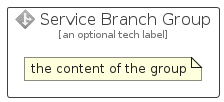

# ServiceBranch


```text
azure/Item/General/ServiceBranch
```

```text
include('azure/Item/General/ServiceBranch')
```


| Illustration | ServiceBranch | ServiceBranchCard | ServiceBranchGroup |
| :---: | :---: | :---: | :---: |
|  |  |  |  |


## Sprites
The item provides the following sriptes:

- `<$ServiceBranchXs>`
- `<$ServiceBranchSm>`
- `<$ServiceBranchMd>`
- `<$ServiceBranchLg>`


## ServiceBranch

### Load remotely
```plantuml
@startuml
' configures the library
!global $LIB_BASE_LOCATION="https://raw.githubusercontent.com/tmorin/plantuml-libs/master/distribution"

' loads the library's bootstrap
!include $LIB_BASE_LOCATION/bootstrap.puml

' loads the package bootstrap
include('azure/bootstrap')

' loads the Item which embeds the element ServiceBranch
include('azure/Item/General/ServiceBranch')

' renders the element
ServiceBranch('ServiceBranch', 'Service Branch', 'an optional tech label', 'an optional description')
@enduml
```

### Load locally
```plantuml
@startuml
' configures the library
!global $INCLUSION_MODE="local"
!global $LIB_BASE_LOCATION="../../.."

' loads the library's bootstrap
!include $LIB_BASE_LOCATION/bootstrap.puml

' loads the package bootstrap
include('azure/bootstrap')

' loads the Item which embeds the element ServiceBranch
include('azure/Item/General/ServiceBranch')

' renders the element
ServiceBranch('ServiceBranch', 'Service Branch', 'an optional tech label', 'an optional description')
@enduml
```

## ServiceBranchCard

### Load remotely
```plantuml
@startuml
' configures the library
!global $LIB_BASE_LOCATION="https://raw.githubusercontent.com/tmorin/plantuml-libs/master/distribution"

' loads the library's bootstrap
!include $LIB_BASE_LOCATION/bootstrap.puml

' loads the package bootstrap
include('azure/bootstrap')

' loads the Item which embeds the element ServiceBranchCard
include('azure/Item/General/ServiceBranch')

' renders the element
ServiceBranchCard('ServiceBranchCard', 'Service Branch Card', 'an optional description')
@enduml
```

### Load locally
```plantuml
@startuml
' configures the library
!global $INCLUSION_MODE="local"
!global $LIB_BASE_LOCATION="../../.."

' loads the library's bootstrap
!include $LIB_BASE_LOCATION/bootstrap.puml

' loads the package bootstrap
include('azure/bootstrap')

' loads the Item which embeds the element ServiceBranchCard
include('azure/Item/General/ServiceBranch')

' renders the element
ServiceBranchCard('ServiceBranchCard', 'Service Branch Card', 'an optional description')
@enduml
```

## ServiceBranchGroup

### Load remotely
```plantuml
@startuml
' configures the library
!global $LIB_BASE_LOCATION="https://raw.githubusercontent.com/tmorin/plantuml-libs/master/distribution"

' loads the library's bootstrap
!include $LIB_BASE_LOCATION/bootstrap.puml

' loads the package bootstrap
include('azure/bootstrap')

' loads the Item which embeds the element ServiceBranchGroup
include('azure/Item/General/ServiceBranch')

' renders the element
ServiceBranchGroup('ServiceBranchGroup', 'Service Branch Group', 'an optional tech label') {
    note as note
        the content of the group
    end note
}
@enduml
```

### Load locally
```plantuml
@startuml
' configures the library
!global $INCLUSION_MODE="local"
!global $LIB_BASE_LOCATION="../../.."

' loads the library's bootstrap
!include $LIB_BASE_LOCATION/bootstrap.puml

' loads the package bootstrap
include('azure/bootstrap')

' loads the Item which embeds the element ServiceBranchGroup
include('azure/Item/General/ServiceBranch')

' renders the element
ServiceBranchGroup('ServiceBranchGroup', 'Service Branch Group', 'an optional tech label') {
    note as note
        the content of the group
    end note
}
@enduml
```

