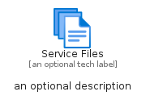
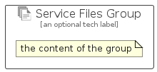

# ServiceFiles


```text
azure/Item/General/ServiceFiles
```

```text
include('azure/Item/General/ServiceFiles')
```


| Illustration | ServiceFiles | ServiceFilesCard | ServiceFilesGroup |
| :---: | :---: | :---: | :---: |
|  |  |  |  |


## Sprites
The item provides the following sriptes:

- `<$ServiceFilesXs>`
- `<$ServiceFilesSm>`
- `<$ServiceFilesMd>`
- `<$ServiceFilesLg>`


## ServiceFiles

### Load remotely
```plantuml
@startuml
' configures the library
!global $LIB_BASE_LOCATION="https://raw.githubusercontent.com/tmorin/plantuml-libs/master/distribution"

' loads the library's bootstrap
!include $LIB_BASE_LOCATION/bootstrap.puml

' loads the package bootstrap
include('azure/bootstrap')

' loads the Item which embeds the element ServiceFiles
include('azure/Item/General/ServiceFiles')

' renders the element
ServiceFiles('ServiceFiles', 'Service Files', 'an optional tech label', 'an optional description')
@enduml
```

### Load locally
```plantuml
@startuml
' configures the library
!global $INCLUSION_MODE="local"
!global $LIB_BASE_LOCATION="../../.."

' loads the library's bootstrap
!include $LIB_BASE_LOCATION/bootstrap.puml

' loads the package bootstrap
include('azure/bootstrap')

' loads the Item which embeds the element ServiceFiles
include('azure/Item/General/ServiceFiles')

' renders the element
ServiceFiles('ServiceFiles', 'Service Files', 'an optional tech label', 'an optional description')
@enduml
```

## ServiceFilesCard

### Load remotely
```plantuml
@startuml
' configures the library
!global $LIB_BASE_LOCATION="https://raw.githubusercontent.com/tmorin/plantuml-libs/master/distribution"

' loads the library's bootstrap
!include $LIB_BASE_LOCATION/bootstrap.puml

' loads the package bootstrap
include('azure/bootstrap')

' loads the Item which embeds the element ServiceFilesCard
include('azure/Item/General/ServiceFiles')

' renders the element
ServiceFilesCard('ServiceFilesCard', 'Service Files Card', 'an optional description')
@enduml
```

### Load locally
```plantuml
@startuml
' configures the library
!global $INCLUSION_MODE="local"
!global $LIB_BASE_LOCATION="../../.."

' loads the library's bootstrap
!include $LIB_BASE_LOCATION/bootstrap.puml

' loads the package bootstrap
include('azure/bootstrap')

' loads the Item which embeds the element ServiceFilesCard
include('azure/Item/General/ServiceFiles')

' renders the element
ServiceFilesCard('ServiceFilesCard', 'Service Files Card', 'an optional description')
@enduml
```

## ServiceFilesGroup

### Load remotely
```plantuml
@startuml
' configures the library
!global $LIB_BASE_LOCATION="https://raw.githubusercontent.com/tmorin/plantuml-libs/master/distribution"

' loads the library's bootstrap
!include $LIB_BASE_LOCATION/bootstrap.puml

' loads the package bootstrap
include('azure/bootstrap')

' loads the Item which embeds the element ServiceFilesGroup
include('azure/Item/General/ServiceFiles')

' renders the element
ServiceFilesGroup('ServiceFilesGroup', 'Service Files Group', 'an optional tech label') {
    note as note
        the content of the group
    end note
}
@enduml
```

### Load locally
```plantuml
@startuml
' configures the library
!global $INCLUSION_MODE="local"
!global $LIB_BASE_LOCATION="../../.."

' loads the library's bootstrap
!include $LIB_BASE_LOCATION/bootstrap.puml

' loads the package bootstrap
include('azure/bootstrap')

' loads the Item which embeds the element ServiceFilesGroup
include('azure/Item/General/ServiceFiles')

' renders the element
ServiceFilesGroup('ServiceFilesGroup', 'Service Files Group', 'an optional tech label') {
    note as note
        the content of the group
    end note
}
@enduml
```

