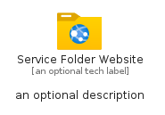
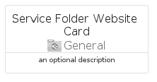
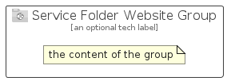

# ServiceFolderWebsite


```text
azure/Item/General/ServiceFolderWebsite
```

```text
include('azure/Item/General/ServiceFolderWebsite')
```


| Illustration | ServiceFolderWebsite | ServiceFolderWebsiteCard | ServiceFolderWebsiteGroup |
| :---: | :---: | :---: | :---: |
|  |  |  |  |


## Sprites
The item provides the following sriptes:

- `<$ServiceFolderWebsiteXs>`
- `<$ServiceFolderWebsiteSm>`
- `<$ServiceFolderWebsiteMd>`
- `<$ServiceFolderWebsiteLg>`


## ServiceFolderWebsite

### Load remotely
```plantuml
@startuml
' configures the library
!global $LIB_BASE_LOCATION="https://raw.githubusercontent.com/tmorin/plantuml-libs/master/distribution"

' loads the library's bootstrap
!include $LIB_BASE_LOCATION/bootstrap.puml

' loads the package bootstrap
include('azure/bootstrap')

' loads the Item which embeds the element ServiceFolderWebsite
include('azure/Item/General/ServiceFolderWebsite')

' renders the element
ServiceFolderWebsite('ServiceFolderWebsite', 'Service Folder Website', 'an optional tech label', 'an optional description')
@enduml
```

### Load locally
```plantuml
@startuml
' configures the library
!global $INCLUSION_MODE="local"
!global $LIB_BASE_LOCATION="../../.."

' loads the library's bootstrap
!include $LIB_BASE_LOCATION/bootstrap.puml

' loads the package bootstrap
include('azure/bootstrap')

' loads the Item which embeds the element ServiceFolderWebsite
include('azure/Item/General/ServiceFolderWebsite')

' renders the element
ServiceFolderWebsite('ServiceFolderWebsite', 'Service Folder Website', 'an optional tech label', 'an optional description')
@enduml
```

## ServiceFolderWebsiteCard

### Load remotely
```plantuml
@startuml
' configures the library
!global $LIB_BASE_LOCATION="https://raw.githubusercontent.com/tmorin/plantuml-libs/master/distribution"

' loads the library's bootstrap
!include $LIB_BASE_LOCATION/bootstrap.puml

' loads the package bootstrap
include('azure/bootstrap')

' loads the Item which embeds the element ServiceFolderWebsiteCard
include('azure/Item/General/ServiceFolderWebsite')

' renders the element
ServiceFolderWebsiteCard('ServiceFolderWebsiteCard', 'Service Folder Website Card', 'an optional description')
@enduml
```

### Load locally
```plantuml
@startuml
' configures the library
!global $INCLUSION_MODE="local"
!global $LIB_BASE_LOCATION="../../.."

' loads the library's bootstrap
!include $LIB_BASE_LOCATION/bootstrap.puml

' loads the package bootstrap
include('azure/bootstrap')

' loads the Item which embeds the element ServiceFolderWebsiteCard
include('azure/Item/General/ServiceFolderWebsite')

' renders the element
ServiceFolderWebsiteCard('ServiceFolderWebsiteCard', 'Service Folder Website Card', 'an optional description')
@enduml
```

## ServiceFolderWebsiteGroup

### Load remotely
```plantuml
@startuml
' configures the library
!global $LIB_BASE_LOCATION="https://raw.githubusercontent.com/tmorin/plantuml-libs/master/distribution"

' loads the library's bootstrap
!include $LIB_BASE_LOCATION/bootstrap.puml

' loads the package bootstrap
include('azure/bootstrap')

' loads the Item which embeds the element ServiceFolderWebsiteGroup
include('azure/Item/General/ServiceFolderWebsite')

' renders the element
ServiceFolderWebsiteGroup('ServiceFolderWebsiteGroup', 'Service Folder Website Group', 'an optional tech label') {
    note as note
        the content of the group
    end note
}
@enduml
```

### Load locally
```plantuml
@startuml
' configures the library
!global $INCLUSION_MODE="local"
!global $LIB_BASE_LOCATION="../../.."

' loads the library's bootstrap
!include $LIB_BASE_LOCATION/bootstrap.puml

' loads the package bootstrap
include('azure/bootstrap')

' loads the Item which embeds the element ServiceFolderWebsiteGroup
include('azure/Item/General/ServiceFolderWebsite')

' renders the element
ServiceFolderWebsiteGroup('ServiceFolderWebsiteGroup', 'Service Folder Website Group', 'an optional tech label') {
    note as note
        the content of the group
    end note
}
@enduml
```

